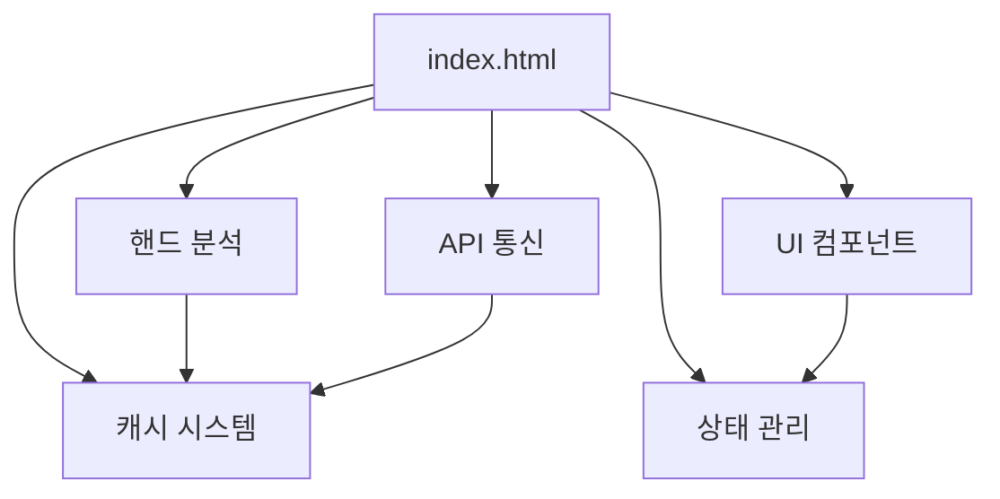
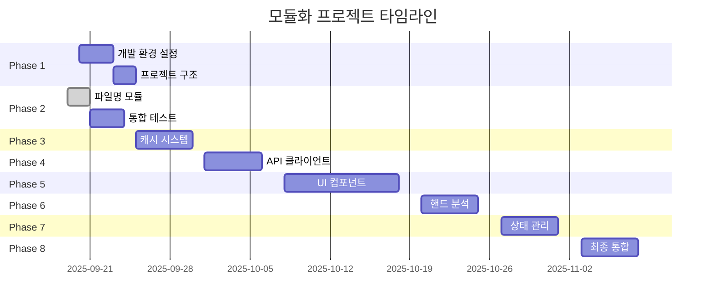

# 📦 Virtual Table DB 모듈화 마스터 플랜 v1.0

## 🎯 모듈화 비전 및 목표

### 비전
단일 파일(index.html) 9,300줄의 모놀리식 구조를 모던하고 유지보수 가능한 모듈 기반 아키텍처로 전환

### 핵심 목표
1. **성능**: O(n) → O(1) 알고리즘 개선
2. **유지보수성**: 코드 분리로 관리 용이성 향상
3. **테스트 가능성**: 단위 테스트 커버리지 80%
4. **재사용성**: 독립적인 모듈로 재사용 가능
5. **점진적 마이그레이션**: 서비스 중단 없는 단계적 전환

## 📊 현재 상태 분석

### 코드 구조 현황
```
index.html (9,300줄)
├── 파일명 관리 (300줄)
├── 캐시 시스템 (500줄)
├── API 통신 (400줄)
├── UI 컴포넌트 (2,000줄)
├── 핸드 분석 (800줄)
├── 상태 관리 (600줄)
├── 유틸리티 (400줄)
└── 메인 로직 (4,300줄)
```

### 의존성 관계


## 🏗️ 모듈화 아키텍처 설계

### 목표 구조
```
virtual_table_db/
├── index.html (1,000줄) - 메인 진입점
├── src/
│   ├── core/
│   │   ├── app.js - 애플리케이션 초기화
│   │   └── config.js - 설정 관리
│   ├── modules/
│   │   ├── filename-manager.js ✅
│   │   ├── cache-manager.js
│   │   ├── api-client.js
│   │   ├── hand-analyzer.js
│   │   └── state-manager.js
│   ├── components/
│   │   ├── dashboard.js
│   │   ├── hand-card.js
│   │   ├── settings-modal.js
│   │   └── notification.js
│   ├── utils/
│   │   ├── date-utils.js
│   │   ├── csv-parser.js
│   │   └── validators.js
│   └── adapters/
│       ├── filename-adapter.js ✅
│       ├── cache-adapter.js
│       └── api-adapter.js
```

## 📋 단계별 구현 계획

### 🔷 Phase 1: 기초 준비 (1주차)

#### 1.1 개발 환경 설정
- [ ] 모듈 로더 선택 (ES6 Modules vs RequireJS)
- [ ] 빌드 도구 설정 (Webpack/Rollup 검토)
- [ ] 테스트 환경 구축 (Jest/Mocha)
- [ ] 린터 설정 (ESLint)

#### 1.2 프로젝트 구조 생성
```bash
# 디렉토리 구조 생성 스크립트
mkdir -p src/{core,modules,components,utils,adapters}
mkdir -p tests/{unit,integration,e2e}
mkdir -p docs/modules
```

#### 1.3 기본 설정 파일
- [ ] package.json 생성
- [ ] .eslintrc.js 설정
- [ ] jsconfig.json 설정
- [ ] .gitignore 업데이트

### 🔷 Phase 2: 파일명 모듈 (현재 진행중)

#### 2.1 모듈 개발 ✅ 완료
- [x] filename-manager.js 구현
- [x] filename-adapter.js 구현
- [x] 문서화 완료

#### 2.2 통합 및 테스트
- [ ] index.html에 스크립트 태그 추가
- [ ] 기존 함수 비활성화
- [ ] 통합 테스트 실행
- [ ] 성능 벤치마크

#### 2.3 마이그레이션
- [ ] 기존 코드 주석 처리
- [ ] 1주일 모니터링
- [ ] 문제 없을 시 기존 코드 삭제

### 🔷 Phase 3: 캐시 시스템 (2주차)

#### 3.1 캐시 모듈 설계
```javascript
// cache-manager.js 구조
class CacheManager {
  constructor(options) {
    this.ttl = options.ttl || 300000; // 5분
    this.maxSize = options.maxSize || 1000;
    this.storage = new Map();
  }

  get(key) { /* O(1) 조회 */ }
  set(key, value) { /* LRU 정책 */ }
  clear() { /* 캐시 초기화 */ }
  getStats() { /* 통계 정보 */ }
}
```

#### 3.2 구현 체크리스트
- [ ] CacheManager 클래스 개발
- [ ] TTL 및 LRU 정책 구현
- [ ] localStorage 동기화
- [ ] 캐시 어댑터 작성

#### 3.3 테스트 계획
- [ ] 단위 테스트 (20개)
- [ ] 성능 테스트 (10,000건)
- [ ] 메모리 누수 테스트

### 🔷 Phase 4: API 클라이언트 (3주차)

#### 4.1 API 모듈 설계
```javascript
// api-client.js 구조
class APIClient {
  constructor(config) {
    this.baseURL = config.baseURL;
    this.timeout = config.timeout || 5000;
    this.retryCount = config.retryCount || 3;
  }

  async request(options) { /* 통합 요청 처리 */ }
  async batchRequest(requests) { /* 일괄 처리 */ }
  handleError(error) { /* 에러 처리 */ }
}
```

#### 4.2 구현 기능
- [ ] Google Apps Script 통신
- [ ] Gemini API 통신
- [ ] 재시도 로직
- [ ] 에러 핸들링
- [ ] 요청 큐 관리

### 🔷 Phase 5: UI 컴포넌트 (4-5주차)

#### 5.1 컴포넌트 분리 계획
| 컴포넌트 | 현재 줄 수 | 예상 줄 수 | 우선순위 |
|---------|-----------|-----------|---------|
| Dashboard | 800 | 200 | 높음 |
| HandCard | 600 | 150 | 높음 |
| SettingsModal | 400 | 100 | 중간 |
| Notification | 200 | 50 | 낮음 |

#### 5.2 컴포넌트 아키텍처
```javascript
// Base Component
class Component {
  constructor(element, options) {
    this.element = element;
    this.options = options;
    this.state = {};
  }

  render() { /* 렌더링 */ }
  update(newState) { /* 상태 업데이트 */ }
  destroy() { /* 정리 */ }
}
```

### 🔷 Phase 6: 핸드 분석 엔진 (6주차)

#### 6.1 분석 모듈 구조
```javascript
// hand-analyzer.js
class HandAnalyzer {
  analyzeHand(handData) { /* 핸드 분석 */ }
  extractKeywords(actions) { /* 키워드 추출 */ }
  calculateComplexity(hand) { /* 복잡도 계산 */ }
  generateSummary(analysis) { /* 요약 생성 */ }
}
```

#### 6.2 AI 통합
- [ ] Gemini API 연동
- [ ] 프롬프트 최적화
- [ ] 캐싱 전략

### 🔷 Phase 7: 상태 관리 (7주차)

#### 7.1 상태 관리자 설계
```javascript
// state-manager.js
class StateManager {
  constructor() {
    this.state = {};
    this.subscribers = new Map();
  }

  getState(key) { /* 상태 조회 */ }
  setState(key, value) { /* 상태 업데이트 */ }
  subscribe(key, callback) { /* 구독 */ }
  notify(key) { /* 알림 */ }
}
```

### 🔷 Phase 8: 최종 통합 (8주차)

#### 8.1 통합 체크리스트
- [ ] 모든 모듈 통합
- [ ] 레거시 코드 제거
- [ ] 번들링 최적화
- [ ] 성능 최적화

#### 8.2 배포 준비
- [ ] 프로덕션 빌드
- [ ] 소스맵 생성
- [ ] 문서 업데이트
- [ ] 배포 스크립트

## 📈 성능 목표 및 측정

### 주요 메트릭
| 메트릭 | 현재 | 목표 | 측정 방법 |
|-------|-----|-----|----------|
| 초기 로드 | 5초 | 2초 | Lighthouse |
| 핸드 클릭 | 100ms | 10ms | Performance API |
| 메모리 사용 | 100MB | 50MB | Chrome DevTools |
| 번들 크기 | 400KB | 200KB | Webpack Analyzer |
| 코드 커버리지 | 0% | 80% | Jest Coverage |

### 벤치마크 코드
```javascript
// performance-benchmark.js
function benchmark(name, fn) {
  const start = performance.now();
  const result = fn();
  const end = performance.now();
  console.log(`${name}: ${(end - start).toFixed(2)}ms`);
  return result;
}

// 사용 예시
benchmark('Filename Generation', () => {
  FilenameManager.generateFilename(142);
});
```

## 🧪 테스트 전략

### 테스트 피라미드
```
        E2E (10%)
       /    \
    통합 (30%)
   /        \
단위 테스트 (60%)
```

### 테스트 커버리지 목표
- 단위 테스트: 80%
- 통합 테스트: 60%
- E2E 테스트: 핵심 시나리오 100%

## ⚠️ 리스크 관리

### 주요 리스크 및 대응 방안

| 리스크 | 영향도 | 발생 가능성 | 대응 방안 |
|-------|-------|-----------|----------|
| 레거시 코드 충돌 | 높음 | 중간 | 어댑터 패턴 사용 |
| 성능 저하 | 높음 | 낮음 | 점진적 롤백 전략 |
| 브라우저 호환성 | 중간 | 중간 | 폴리필 적용 |
| 팀 학습 곡선 | 중간 | 높음 | 문서화 및 교육 |

## 📅 타임라인



## 🎯 성공 지표 (KPIs)

### 기술적 KPIs
- [ ] 코드 라인 수 50% 감소 (9,300 → 4,650)
- [ ] 성능 개선 80% (평균 응답 시간)
- [ ] 테스트 커버리지 80% 달성
- [ ] 번들 크기 50% 감소

### 비즈니스 KPIs
- [ ] 버그 발생률 70% 감소
- [ ] 개발 속도 2배 향상
- [ ] 유지보수 시간 60% 단축
- [ ] 코드 리뷰 시간 50% 단축

## 📚 참고 자료

### 문서
- [FILENAME_MODULE_MIGRATION.md](docs/FILENAME_MODULE_MIGRATION.md)
- [JavaScript 모듈 시스템 가이드](https://developer.mozilla.org/ko/docs/Web/JavaScript/Guide/Modules)
- [웹팩 공식 문서](https://webpack.js.org/)

### 도구
- [Webpack Bundle Analyzer](https://github.com/webpack-contrib/webpack-bundle-analyzer)
- [Lighthouse CI](https://github.com/GoogleChrome/lighthouse-ci)
- [Jest Testing Framework](https://jestjs.io/)

---

**작성일**: 2025-09-19
**버전**: 1.0
**담당**: Development Team
**다음 리뷰**: 2025-09-26