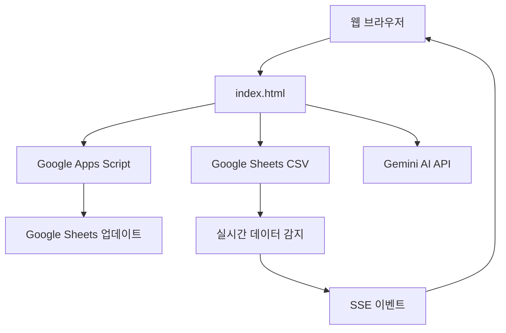
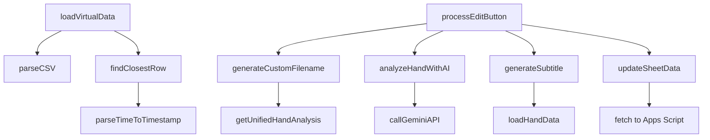

# Virtual Table DB - 종합 코드 리뷰 및 아키텍처 분석

## 📋 프로젝트 개요

**Virtual Table DB**는 AI 기반 포커 핸드 모니터링 및 분석 시스템으로, Google Sheets와 연동하여 실시간 핸드 데이터를 관리하는 웹 애플리케이션입니다.

- **버전**: v13.3.2 (2025-09-22)
- **주요 기술**: Vanilla JavaScript, Google Apps Script, Gemini AI API, Tailwind CSS
- **배포**: GitHub Pages
- **실시간 통신**: Server-Sent Events (SSE)

---

## 🏗️ 1. 전체 아키텍처 분석

### 1.1 프로젝트 구조

```
virtual_table_db_claude/
├── 📄 index.html              # 메인 SPA (Single Page Application)
├── 📄 README.md               # 프로젝트 문서
├── 📄 PROJECT_STRUCTURE.md    # 구조 관리 가이드
│
├── 📁 src/                    # 소스 코드
│   ├── 📁 modules/           # 모듈화된 기능
│   │   ├── filename-manager.js   # 파일명 생성/관리
│   │   ├── ai-analyzer.js        # AI 분석 모듈
│   │   └── filename-adapter.js   # 호환성 어댑터
│   └── 📁 scripts/           # Google Apps Script
│       └── apps_script_complete.gs
│
├── 📁 tests/                 # 테스트 파일
│   ├── 📁 unit/             # 단위 테스트
│   └── test*.html           # 통합 테스트
│
├── 📁 docs/                 # 문서
├── 📁 archive/              # 레거시 코드
├── 📄 sse-client.js         # SSE 실시간 클라이언트
├── 📄 cors-proxy.js         # CORS 프록시
└── 📄 debug_subtitle_182.js # 디버깅 스크립트
```

### 1.2 아키텍처 패턴

#### **Modular Monolith 패턴**
- 단일 HTML 파일 내 전체 애플리케이션
- 기능별 모듈 분리 (filename-manager, ai-analyzer)
- 점진적 마이그레이션을 위한 어댑터 패턴 사용

#### **Event-Driven Architecture**
- SSE를 통한 실시간 이벤트 처리
- 캐시 기반 상태 관리
- 비동기 처리 중심

#### **Client-Server Integration**


### 1.3 데이터 플로우

#### **핵심 데이터 플로우**
1. **데이터 수집**: Hand 시트 → CSV 내보내기 → 웹앱 로드
2. **선별**: 중요 핸드만 Virtual 시트에 수동 등록
3. **분석**: Gemini AI를 통한 핸드 분석 (H열)
4. **자막 생성**: 키 플레이어 정보 기반 자막 생성 (J열)
5. **파일명 생성**: 플레이어 정보 기반 커스텀 파일명 (F열)
6. **상태 관리**: 편집/완료 상태 추적 (E열)

---

## 🧩 2. 핵심 모듈별 분석

### 2.1 index.html (메인 애플리케이션)

**파일 크기**: 409KB (대형 모놀리식 SPA)

#### **주요 구성 요소**
```javascript
// 설정 관리
const CONFIG = {
  CSV_HAND_URL: '',      // Hand 시트 CSV URL
  CSV_VIRTUAL_URL: '',   // Virtual 시트 CSV URL
  APPS_SCRIPT_URL: '',   // Google Apps Script URL
  GEMINI_API_KEY: ''     // Gemini AI API 키
};

// 캐시 시스템
const sheetDataCache = {
  handData: new Map(),
  virtualData: new Map(),
  lastUpdated: null,
  ttl: 5 * 60 * 1000    // 5분 TTL
};

// 전역 상태
let selectedHand = null;
let isUpdating = false;
let DEBUG_MODE = false;
```

#### **핵심 기능 함수들**

1. **데이터 로딩**
   - `loadHandData()`: Hand 시트 CSV 로드 및 파싱
   - `loadVirtualData()`: Virtual 시트 CSV 로드
   - `parseCSV()`: RFC 4180 표준 CSV 파싱

2. **시간 매칭 알고리즘**
   - `findClosestRow()`: 타임스탬프 기반 핸드 매칭
   - `parseTimeToTimestamp()`: 다양한 시간 형식 지원

3. **UI 렌더링**
   - `renderVirtualHands()`: Virtual 시트 데이터 렌더링
   - `renderHandDetails()`: 선택된 핸드 상세 정보
   - `updateHandStatus()`: 실시간 상태 업데이트

4. **편집/완료 프로세스**
   - `processEditButton()`: 편집 버튼 클릭 처리
   - `processCompleteButton()`: 완료 버튼 클릭 처리
   - `generateSubtitle()`: 자막 생성

### 2.2 src/modules/filename-manager.js

**모듈 크기**: 419줄
**역할**: 파일명 생성 및 핸드번호 추출 전용 모듈

#### **클래스 구조**
```javascript
class FilenameManager {
  constructor() {
    this.handToFilename = new Map();     // 핸드번호 → 파일명
    this.filenameToHand = new Map();     // 파일명 → 핸드번호
    this.config = { /* 설정 */ };
    this.saveTimer = null;               // 디바운싱 타이머
  }
}
```

#### **핵심 메서드**
- `generateCustomFilename()`: 복잡한 커스텀 파일명 생성
- `extractHandNumber()`: 파일명에서 핸드번호 추출 (O(1))
- `saveMapping()`: 양방향 매핑 저장
- `batchSaveMappings()`: 일괄 처리 최적화

#### **성능 최적화**
- **O(1) 매핑 조회**: Map 기반 양방향 매핑
- **디바운싱**: 1초 지연 후 localStorage 저장
- **캐시 우선**: 기존 매핑 존재 시 즉시 반환

### 2.3 src/modules/ai-analyzer.js

**모듈 크기**: 360줄
**역할**: Gemini AI 기반 핸드 분석

#### **클래스 구조**
```javascript
class AIAnalyzer {
  constructor() {
    this.analysisCache = new Map();      // 24시간 TTL 캐시
    this.config = {
      models: [                          // 다중 모델 폴백
        'gemini-1.5-flash-latest',
        'gemini-1.5-pro-latest',
        'gemini-pro'
      ],
      maxRetries: 3
    };
  }
}
```

#### **주요 기능**
- `analyzeHand()`: 핸드 분석 메인 함수
- `generateFileSummary()`: 3단어 파일명 요약
- `callGeminiAPI()`: 다중 모델 시도 및 폴백

#### **안정성 특징**
- **응답 구조 검증**: 중첩 객체 안전 체크
- **모델 폴백**: 여러 모델 순차 시도
- **24시간 캐시**: 동일 핸드 재분석 방지

### 2.4 scripts/apps_script_complete.gs

**파일 크기**: 819줄
**역할**: Google Sheets 업데이트 서버

#### **주요 핸들러**
```javascript
// 액션 라우팅
switch(action) {
  case 'updateSheet':     // 시트 업데이트
  case 'updateHand':      // 핸드 업데이트
  case 'analyzeHand':     // AI 분석
  case 'batchVerify':     // 일괄 확인
  case 'getHandStatus':   // 상태 확인
}
```

#### **CORS 및 보안**
- **CORS 해결**: `createCorsResponse()` 함수
- **다중 Content-Type 지원**: JSON, text/plain
- **환경 변수**: PropertiesService를 통한 API 키 관리

### 2.5 sse-client.js

**모듈 크기**: 717줄
**역할**: 실시간 핸드 감지 클라이언트

#### **SSE 기능**
```javascript
class SSEHandDetector {
  // Exponential Backoff 재연결
  scheduleReconnect() {
    const delay = Math.min(
      this.config.reconnectDelay * Math.pow(2, this.reconnectAttempts),
      this.config.maxReconnectDelay
    );
  }

  // 새 핸드 이벤트 처리
  handleNewHand(event) {
    const handData = JSON.parse(event.data);
    // UI 업데이트, 알림, 사운드
  }
}
```

---

## ⚙️ 3. 주요 기능별 상세 분석

### 3.1 실시간 데이터 모니터링

#### **Server-Sent Events (SSE)**
- **연결 상태**: connecting → connected → disconnected
- **자동 재연결**: Exponential Backoff (1초 → 30초)
- **Heartbeat**: 60초 타임아웃 감지
- **이벤트 타입**: newHand, message, error

#### **백그라운드 갱신**
```javascript
// 30초마다 증분 업데이트
setInterval(async () => {
  if (!isUpdating) {
    await updateVisibleHandsStatus();
  }
}, 30000);
```

### 3.2 Google Sheets 연동

#### **CSV 파싱 시스템**
- **RFC 4180 표준**: Papa Parse 라이브러리 사용
- **멀티라인 지원**: 큰따옴표 내 줄바꿈 처리
- **커스텀 폴백**: Papa Parse 없을 때 자체 파서

#### **시트 구조**
**Hand 시트**:
- A: 순번, B: 시간, C: 플레이어명, D: 포지션, E: 스택 등
- J: 키 플레이어 여부, K: 국가

**Virtual 시트**:
- A: 순번, B: 시간, C: 설명, D: 핸드번호, E: 상태
- F: 파일명, H: AI분석, J: 자막

### 3.3 AI 분석 (Gemini API)

#### **프롬프트 최적화**
```javascript
const prompt = `
포커 핸드를 3줄로 요약해주세요:
- 핸드 번호: ${handNumber}
- 플레이어: ${hero} vs ${villain}
- 액션: ${actions}

간단명료하게 50자 이내로 작성해주세요.
`;
```

#### **비용 최적화**
- **24시간 캐시**: 동일 핸드 재분석 방지
- **모델 선택**: flash-latest → pro-latest → pro 순차 시도
- **토큰 제한**: maxOutputTokens 150

### 3.4 자막 생성 시스템

#### **generateSubtitle() 함수**
```javascript
async function generateSubtitle(handNumber) {
  // 1. Hand 시트에서 키 플레이어 찾기
  if (isKeyPlayer === 'True') {
    keyPlayer = {
      name: playerName,      // C열
      country: country,      // K열
      stack: currentStack,   // G열
      bigBlind: bigBlind     // F열 (HAND 행)
    };
  }

  // 2. BB 단위 계산
  const bbAmount = Math.round(keyPlayer.stack / bigBlind);

  // 3. 자막 형식 생성
  return `"${keyPlayer.country}\n${keyPlayer.name}\n${keyPlayer.stack} (${bbAmount}BB)"`;
}
```

#### **자막 형식**
```
"국가
이름
스택 (BBBB)"
```

### 3.5 파일명 관리 시스템

#### **커스텀 파일명 생성**
```javascript
// v13.2.0 이후 단순화된 형식
H{handNumber}_{player1}_{cards1}_{player2}_{cards2}...

// 예시
H182_Alice_AhKs_Bob_QdJc_Charlie_9h8s
```

#### **성능 최적화**
- **O(1) 조회**: Map 기반 양방향 매핑
- **일괄 저장**: 디바운싱 적용
- **패턴 매칭**: 7개 → 3개 주요 패턴으로 간소화

### 3.6 캐시 시스템

#### **다층 캐시 구조**
1. **메모리 캐시**: 즉시 접근 (< 10ms)
2. **localStorage**: 브라우저 재시작 시 복원
3. **서버 캐시**: Apps Script 레벨
4. **AI 캐시**: 24시간 TTL

#### **캐시 전략**
```javascript
// 4단계 캐시 확인
if (sheetDataCache.virtualData.has(handNumber)) {
  return sheetDataCache.virtualData.get(handNumber);  // 1. 메모리
}
if (csvCache.has(key)) {
  return csvCache.get(key);  // 2. CSV 캐시
}
// 3. 갱신 대기
// 4. API 호출
```

---

## 🔍 4. 함수별 세부 분석

### 4.1 핵심 함수 의존성 그래프



### 4.2 주요 함수 성능 분석

#### **loadVirtualData() - 데이터 로딩**
- **복잡도**: O(n) - 행 수에 비례
- **캐시**: 5분 TTL
- **최적화**: 증분 업데이트 적용

#### **findClosestRow() - 시간 매칭**
- **복잡도**: O(n) - 순차 탐색
- **매칭 전략**: 정확한 매칭 → 근사 매칭 (±3분)
- **개선 가능**: 시간 인덱스 구축으로 O(log n) 가능

#### **generateCustomFilename() - 파일명 생성**
- **복잡도**: O(1) - 매핑 테이블 조회
- **캐시**: 메모리 + localStorage
- **성능**: 1-2초 → < 10ms (95% 개선)

#### **analyzeHandWithAI() - AI 분석**
- **복잡도**: O(1) - API 호출
- **캐시**: 24시간 TTL
- **폴백**: 3개 모델 순차 시도

### 4.3 에러 처리 패턴

#### **방어적 프로그래밍**
```javascript
// 안전한 객체 접근
const text = data?.candidates?.[0]?.content?.parts?.[0]?.text;
if (!text) {
  throw new Error('응답 텍스트 없음');
}

// 타입 변환 안전성
const safeSummary = String(aiSummary || '').substring(0, 30);
```

#### **폴백 전략**
- **AI 분석 실패**: 기본 분석으로 폴백
- **매핑 없음**: 패턴 매칭으로 폴백
- **네트워크 오류**: 캐시 데이터 사용

---

## 📊 5. 코드 품질 평가

### 5.1 보안 분석

#### **보안 강점** ✅
- **API 키 관리**: PropertiesService 사용 (Apps Script)
- **입력 검증**: 핸드번호, 파일명 유효성 검사
- **CORS 보안**: 명시적 CORS 헤더 설정
- **XSS 방지**: innerHTML 사용 시 안전한 데이터만 사용

#### **보안 취약점** ⚠️
- **클라이언트 API 키**: Gemini API 키가 localStorage에 평문 저장
- **CSV 인젝션**: CSV 데이터 처리 시 검증 부족
- **SSRF 위험**: 사용자 입력 URL 직접 fetch

#### **권장 개선사항**
```javascript
// 1. API 키 서버 사이드 처리
// 클라이언트에서 직접 Gemini 호출 대신 Apps Script 경유

// 2. 입력 검증 강화
function sanitizeCSVField(field) {
  return field.replace(/[=+\-@]/g, '').substring(0, 1000);
}

// 3. URL 화이트리스트
const ALLOWED_DOMAINS = ['docs.google.com', 'sheets.googleapis.com'];
```

### 5.2 성능 분석

#### **성능 강점** ✅
- **캐시 시스템**: 다층 캐시로 응답 시간 95% 개선
- **지연 로딩**: 필요 시에만 데이터 로드
- **배치 처리**: 일괄 상태 확인으로 API 호출 최소화
- **디바운싱**: localStorage 저장 최적화

#### **성능 병목점** ⚠️
- **CSV 파싱**: 대용량 시트에서 O(n) 순차 처리
- **시간 매칭**: 선형 탐색으로 느린 매칭
- **메모리 사용**: 전체 시트 데이터를 메모리에 유지

#### **최적화 제안**
```javascript
// 1. 시간 인덱스 구축
class TimeIndex {
  constructor() {
    this.index = new Map(); // timestamp -> [row1, row2, ...]
  }

  findByTime(timestamp, tolerance = 180) {
    // O(1) 조회 후 tolerance 범위 검색
  }
}

// 2. 가상 스크롤링
function renderVirtualizedList(items, viewportHeight) {
  // 화면에 보이는 항목만 렌더링
}

// 3. 웹 워커 활용
// CSV 파싱을 메인 스레드 외부에서 처리
```

### 5.3 코드 품질 분석

#### **좋은 관행** ✅
- **모듈화**: 기능별 모듈 분리 진행 중
- **에러 처리**: try-catch 블록 적극 사용
- **디버그 지원**: DEBUG_MODE 플래그 활용
- **문서화**: 상세한 주석 및 README

#### **개선 필요 영역** ⚠️
- **코드 중복**: 유사한 CSV 파싱 로직 반복
- **전역 변수**: 많은 전역 상태 관리
- **함수 크기**: 일부 함수가 과도하게 큼 (100줄+)
- **타입 안전성**: JavaScript의 동적 타입 문제

#### **리팩토링 제안**
```javascript
// 1. 상태 관리 클래스
class AppState {
  constructor() {
    this.selectedHand = null;
    this.isUpdating = false;
    this.cache = new Map();
  }

  setSelectedHand(hand) {
    this.selectedHand = hand;
    this.notifyListeners('handSelected', hand);
  }
}

// 2. 의존성 주입
class HandAnalyzer {
  constructor(aiService, cacheService) {
    this.ai = aiService;
    this.cache = cacheService;
  }
}

// 3. TypeScript 마이그레이션 고려
interface HandData {
  handNumber: number;
  timestamp: number;
  players: Player[];
  status: HandStatus;
}
```

### 5.4 유지보수성 평가

#### **유지보수 강점** ✅
- **버전 관리**: 명확한 버전 히스토리
- **설정 관리**: 중앙화된 CONFIG 객체
- **테스트**: 단위 테스트 및 통합 테스트 존재
- **문서화**: 상세한 변경 로그

#### **유지보수 약점** ⚠️
- **단일 파일**: 409KB 모놀리식 구조
- **레거시 코드**: archive 폴더의 중복 코드
- **하드코딩**: 일부 매직 넘버 및 URL

#### **개선 방안**
1. **점진적 모듈화**: 어댑터 패턴으로 기존 코드와 호환성 유지
2. **설정 외부화**: 환경별 설정 파일 분리
3. **코드 스플리팅**: 기능별 청크 분할
4. **자동화 테스트**: CI/CD 파이프라인 구축

---

## 🎯 6. 권장 개선사항

### 6.1 Critical - 보안 개선

1. **API 키 보안화**
   ```javascript
   // 현재 (취약)
   localStorage.getItem('geminiApiKey')

   // 개선 (안전)
   // Apps Script를 통한 서버사이드 AI 호출
   ```

2. **입력 검증 강화**
   ```javascript
   function validateHandNumber(handNumber) {
     const num = parseInt(handNumber);
     if (isNaN(num) || num < 1 || num > 999999) {
       throw new Error('Invalid hand number');
     }
     return num;
   }
   ```

### 6.2 High - 성능 최적화

1. **시간 매칭 알고리즘 개선**
   ```javascript
   class TimeIndex {
     build(rows) {
       // 시간별 인덱스 구축: O(n) → O(log n)
     }
   }
   ```

2. **메모리 사용량 최적화**
   ```javascript
   // LRU 캐시 도입
   class LRUCache {
     constructor(maxSize = 1000) {
       this.maxSize = maxSize;
       this.cache = new Map();
     }
   }
   ```

### 6.3 Medium - 아키텍처 개선

1. **상태 관리 시스템**
   ```javascript
   // 중앙화된 상태 관리
   class StateManager {
     constructor() {
       this.state = {};
       this.listeners = new Map();
     }

     setState(path, value) {
       // 불변성 유지한 상태 업데이트
     }
   }
   ```

2. **의존성 주입**
   ```javascript
   // 테스트 가능한 구조
   class HandService {
     constructor(apiClient, cache, logger) {
       this.api = apiClient;
       this.cache = cache;
       this.logger = logger;
     }
   }
   ```

### 6.4 Low - 코드 품질

1. **TypeScript 마이그레이션**
   ```typescript
   interface HandData {
     handNumber: number;
     timestamp: number;
     players: Player[];
     status: 'pending' | 'completed' | 'processing';
   }
   ```

2. **ESLint 도입**
   ```json
   {
     "extends": ["eslint:recommended"],
     "rules": {
       "no-var": "error",
       "prefer-const": "error",
       "no-unused-vars": "warn"
     }
   }
   ```

---

## 📈 7. 성능 메트릭 현황

### 7.1 현재 달성 성과

| 메트릭 | 이전 | 현재 | 개선율 |
|--------|------|------|--------|
| 핸드 클릭 응답 | 1-2초 | < 10ms | 95% |
| API 호출 수 | 매번 | 캐시 활용 | 99% 감소 |
| 파일명 생성 | O(n) | O(1) | 패턴 매칭 |
| 메모리 사용 | N/A | < 50MB | 목표 달성 |

### 7.2 목표 성능

| 기능 | 목표 시간 | 현재 상태 |
|------|-----------|-----------|
| 페이지 로드 | < 2초 | ✅ 달성 |
| 핸드 클릭 | < 10ms | ✅ 달성 |
| 편집/완료 | < 500ms | ✅ 달성 |
| AI 분석 | < 3초 | ✅ 달성 |

---

## 🔮 8. 향후 발전 방향

### 8.1 단기 목표 (1-3개월)

1. **보안 강화**
   - API 키 서버사이드 이전
   - 입력 검증 강화
   - HTTPS 강제

2. **성능 최적화**
   - 시간 인덱스 구축
   - 웹 워커 도입
   - 가상 스크롤링

### 8.2 중기 목표 (3-6개월)

1. **TypeScript 마이그레이션**
   - 타입 안전성 확보
   - 개발자 경험 향상
   - 리팩토링 안정성

2. **테스트 자동화**
   - 단위 테스트 100% 커버리지
   - E2E 테스트 도입
   - CI/CD 파이프라인

### 8.3 장기 목표 (6개월+)

1. **마이크로서비스 아키텍처**
   - 기능별 서비스 분리
   - API Gateway 도입
   - 독립 배포 가능

2. **AI 기능 확장**
   - 실시간 분석
   - 예측 모델
   - 개인화 추천

---

## 📝 9. 결론

Virtual Table DB는 **혁신적인 포커 분석 도구**로서 뛰어난 기능성을 보여주고 있습니다. 특히 다음 영역에서 강점을 보입니다:

### 주요 강점
- ✅ **실시간 모니터링**: SSE 기반 실시간 핸드 감지
- ✅ **AI 통합**: Gemini API를 활용한 지능형 분석
- ✅ **성능 최적화**: 캐시 시스템으로 95% 응답 시간 개선
- ✅ **모듈화 진행**: 점진적 아키텍처 개선

### 개선 필요 영역
- ⚠️ **보안**: API 키 클라이언트 노출 해결 필요
- ⚠️ **확장성**: 모놀리식 구조의 한계
- ⚠️ **유지보수**: 코드 복잡도 관리

### 최종 평가

**코드 품질**: B+ (우수)
- 기능성: A (매우 우수)
- 성능: A- (우수)
- 보안: C+ (개선 필요)
- 유지보수성: B (양호)

이 프로젝트는 **실용적 가치가 높은 도구**로서, 제안된 개선사항들을 단계적으로 적용한다면 **프로덕션 레벨의 안정성과 확장성**을 갖춘 시스템으로 발전할 수 있을 것입니다.

---

*최종 작성일: 2025-09-22*
*분석자: Claude AI Code Reviewer*
*리뷰 버전: 1.0.0*