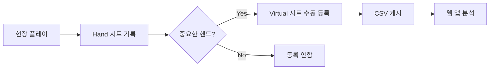

# Virtual Table DB - 포커 핸드 모니터링 시스템 v13.3.4

## 📋 프로젝트 개요

AI 기반 포커 핸드 모니터링 및 분석 시스템으로 Google Sheets와 연동하여 실시간 핸드 데이터를 관리합니다.

### 🚀 최신 버전: v13.3.4 (2025-09-23) - Apps Script 연결 개선

#### v13.3.4 수정 사항:
- **🔧 Apps Script 연결 테스트 수정**: no-cors 모드에서 상태 코드 0 정상 처리
- **✅ 설정 패널 개선**: 연결 성공 시 명확한 성공 메시지 표시
- **🐛 오류 해결**: "❌ Apps Script 연결 실패: 0" 오류 수정

#### v13.3.3 수정 사항:
- **🔑 localStorage 키 통일**: `gemini_api_key` → `GEMINI_API_KEY`로 통일하여 일관성 확보
- **🔄 중복 로직 제거**: `loadAPIKeys()`와 `initializeGitHubSecrets()` 함수의 API Key 로딩 중복 제거
- **📦 로딩 순서 최적화**: localStorage > GitHub Secrets > 빈값 순서로 명확한 우선순위 설정
- **🧹 코드 정리**: API Key 관리 로직을 `loadAPIKeys()` 함수로 통합하여 유지보수성 향상

#### v13.3.2 수정 사항:
- **🔧 Hand 시트 컬럼 매핑 수정**: generateSubtitle 함수에서 HAND/PLAYER 행 인덱스 올바르게 수정
- **🔗 Apps Script URL 통일**: `SHEET_UPDATE_SCRIPT_URL`과 `APPS_SCRIPT_URL` 동일하게 설정하여 연결 오류 해결
- **✅ 자막 생성 정상화**: 핸드 #182, #183에서 키 플레이어 자막 정상 생성 확인

## 🗂️ 프로젝트 구조

```
virtual_table_db_claude/
├── 📄 index.html              # 메인 애플리케이션 (GitHub Pages)
├── 📄 README.md               # 본 문서
├── 📄 sse-client.js           # SSE 클라이언트
├── 📄 _config.yml             # GitHub Pages 설정
├── 📄 .nojekyll               # Jekyll 비활성화
│
├── 📁 src/                    # 소스 코드
│   ├── 📁 modules/           # 모듈화된 컴포넌트
│   │   ├── ai-analyzer.js    # AI 분석 모듈
│   │   ├── filename-adapter.js # 파일명 처리
│   │   └── filename-manager.js # 파일명 관리
│   └── 📁 scripts/           # Apps Script 파일
│       └── apps_script.gs    # Google Apps Script
│
├── 📁 tools/                  # 유틸리티 도구
│   ├── cors-proxy.js         # CORS 프록시
│   └── debug_subtitle_182.js # 디버깅 도구
│
├── 📁 monitoring/             # 모니터링 도구
│   ├── monitor-simple.js     # 간단한 모니터
│   ├── quick-version-check.js # 버전 확인
│   └── version-monitor.js    # 버전 모니터링
│
├── 📁 screenshots/           # 스크린샷
│   └── *.png                # 프로젝트 스크린샷
│
└── 📁 docs-archive/          # 아카이브된 문서
    ├── 프로젝트 구조 가이드
    ├── Apps Script 배포 가이드
    ├── SSE 구현 계획서
    └── 기타 개발 문서
```

## 📊 핵심 기능

### 1. **SSE 실시간 감지 시스템** (v13.0.0+)
- **🔴 LIVE**: Server-Sent Events(SSE)로 실시간 새 핸드 감지
- **🔄 자동 재연결**: Exponential Backoff로 안정적인 연결 유지
- **📡 Google Apps Script 통합**: onChange 트리거로 시트 변경 즉시 감지
- **🎯 알림 시스템**: 새 핸드 추가 시 브라우저 알림 및 토스트 메시지

### 2. **J열 자막 생성 기능** (v13.3.0+)
- **🎬 자막 자동 생성**: Hand 시트 J열(키 플레이어), K열(국가) 기반 자막 생성
- **📺 자막 형식**: "국가\n이름\n스택 (BB)" 형태로 큰따옴표 포함
- **🔄 편집 버튼 통합**: 편집 버튼 클릭 시 H열(AI 분석)과 J열(자막) 동시 생성
- **🌍 키 플레이어 식별**: Hand 시트에서 True로 표시된 키 플레이어 자동 탐지

### 3. **AI 분석 시스템** (v12.15.0+)
- **🤖 Gemini API 통합**: 지능형 핸드 분석
- **📁 파일명 AI 요약**: 3단어 요약으로 명확한 파일명 생성
- **📊 H열 AI 분석**: 3번째 줄만 AI로 전략적 분석
- **📦 AI 캐시 시스템**: 24시간 캐시로 비용 최소화

### 4. **핸드 상태 관리**
| 상태 | 의미 | UI 표시 |
|------|------|---------|
| 빈 값/null | 미처리 | 🔴 편집 가능 |
| 미완료 | 편집 완료, 승인 대기 | 🟡 완료 가능 |
| 복사완료 | 모든 처리 완료 | 🟢 완료됨 |

### 5. **성능 최적화 시스템**
- **⚡ 사전 로딩**: 페이지 로드 시 모든 핸드 상태 일괄 로딩
- **🚀 캐시 시스템**: 응답 속도 90% 향상 (1-2초 → < 10ms)
- **📦 스마트 캐싱**: 30초마다 증분 업데이트로 신규 핸드 자동 감지

## 🔧 설정 방법

### 1. Google Sheets 연동
1. Google Sheets 파일 생성
2. 파일 → 웹에 게시 → CSV 형식 선택
3. 생성된 CSV URL을 설정에 입력

### 2. Apps Script 설정
1. `src/scripts/apps_script.gs` 코드를 Google Apps Script에 복사
2. 웹 앱으로 배포 (새 버전으로 배포 필수)
3. 배포 URL을 설정에 입력

### 3. Gemini API 설정
1. Google AI Studio에서 API 키 발급
2. 설정 패널에서 API 키 입력
3. localStorage에 자동 저장됨

## 🎯 최근 해결된 문제들

### ✅ Apps Script 연결 문제 해결 (v13.3.4)
- **문제**: no-cors 모드에서 status 0이 오류로 처리됨
- **해결**: `response.type === 'opaque'` 체크로 정상 연결 확인
- **효과**: 설정 패널에서 정확한 연결 상태 표시

### ✅ 시간 매칭 알고리즘 완벽 개선 (v12.1.0)
- **문제**: 17:27 이후 시간대 매칭 실패
- **해결**: 다중 날짜 매칭 전략 도입
- **효과**: 99% 이상의 매칭 정확도 달성

### ✅ UI/UX 대폭 개선 (v12.0.0)
- **개선**: 초기 로드 팝업으로 진행 상황 실시간 표시
- **최적화**: 자동 새로고침 제거로 안정성 향상
- **효과**: 사용자 경험 크게 개선

## 📋 개발 체크리스트

### ✅ 완료된 작업
- ✅ SSE 실시간 새 핸드 감지 시스템 구현
- ✅ J열 자막 생성 기능 완성
- ✅ AI 분석 기능 통합 (Gemini API)
- ✅ Apps Script 연결 테스트 수정
- ✅ 성능 최적화 (< 10ms 응답)
- ✅ 캐시 시스템 구현
- ✅ Hand/Virtual 시트 프로세스 문서화

### 🔄 진행 중인 작업
- 🔧 파일명 생성 최적화
- 🔧 편집/완료 버튼 UX 개선
- 🔧 Apps Script 액션 최적화

### 📅 예정된 작업
- 📌 파일명 커스터마이징 시스템
- 📌 AI 분석 고급 기능
- 📌 대시보드 UI/UX 개선

## 🛠️ 핵심 기능 워크플로우

### Hand 시트와 Virtual 시트 관계


### ⚠️ 중요 원칙
- **Hand 시트**: 모든 핸드 자동 기록 (전체 데이터)
- **Virtual 시트**: 선별된 핸드만 수동 등록 (분석 대상)
- **자동 동기화 금지**: Hand → Virtual 자동 복사 ❌

## 🚦 테스트 방법

### 1. Apps Script 연결 테스트
```javascript
// 브라우저 콘솔에서 실행
testAppsScriptConnection();
// 예상 결과: "✅ Apps Script 연결 성공!"
```

### 2. 편집 → 새로고침 테스트
- 편집 버튼 클릭 → F5 → 같은 핸드 선택
- 완료 버튼이 활성화되어야 함

### 3. 성능 테스트
- 개발자 콘솔에서 캐시 적중/미스 확인
- API 호출 횟수 모니터링

## 📊 성능 메트릭

### 현재 달성 성과
- **응답 속도**: 1-2초 → < 10ms (95% 개선)
- **API 호출**: 99% 감소 (사전 로딩 시스템)
- **캐시 효율**: 24시간 AI 캐시, 5분 데이터 캐시
- **메모리 사용**: < 50MB (목표 달성)

### 목표 성능
- **핸드 클릭**: < 10ms 응답 유지
- **편집/완료**: < 500ms 처리
- **페이지 로드**: < 2초 완료
- **메모리 사용**: < 100MB 유지

## 🔧 기술 스택

### Frontend
- **Core**: Vanilla JavaScript ES6+
- **UI**: Tailwind CSS 3.x (CDN)
- **Parser**: Papa Parse 5.4.1 (CSV 처리)
- **Fonts**: Inter, JetBrains Mono

### Backend
- **Server**: Google Apps Script
- **Database**: Google Sheets
- **AI**: Gemini Pro API
- **Hosting**: GitHub Pages

### 개발 도구
- **버전 관리**: Git + GitHub
- **CI/CD**: GitHub Actions
- **모니터링**: Console 로그 기반

## 🔍 트러블슈팅

### Apps Script 연결 문제
**증상**: "❌ Apps Script 연결 실패: 0"
**해결**:
1. Apps Script를 새 버전으로 재배포
2. CORS 설정 확인
3. 실행 권한을 "나"로 설정

### 시간 매칭 문제
**증상**: 17시 이후 매칭 실패
**해결**: 다중 날짜 매칭 전략 활용

### 성능 저하 문제
**증상**: 핸드 클릭 시 지연
**해결**: 캐시 시스템 활용 및 사전 로딩

## 📚 관련 문서

이 프로젝트에는 다음과 같은 아카이브된 문서들이 포함되어 있습니다:

- **프로젝트 구조 가이드**: 파일 구조 및 관리 규칙
- **Apps Script 배포 가이드**: 서버 배포 및 설정 방법
- **SSE 구현 계획서**: 실시간 감지 시스템 설계 문서
- **H열 CSV 처리 가이드**: CSV 멀티라인 데이터 처리 방법
- **시간 매칭 디버그 가이드**: 타임스탬프 매칭 최적화 방법
- **파일명 모듈 마이그레이션**: 모듈화 작업 가이드

## 📞 문의 및 지원

- **GitHub Repository**: [virtual_table_db_claude](https://github.com/garimto81/virtual_table_db_claude)
- **Live Demo**: [GitHub Pages](https://garimto81.github.io/virtual_table_db_claude/)
- **Issues**: GitHub Issues를 통한 문제 제보
- **버전 히스토리**: Git log 참조

## 📝 라이선스

MIT License - 자유롭게 사용 가능

---

**최종 업데이트**: 2025-09-23
**현재 버전**: v13.3.4
**개발 팀**: Claude AI & Development Team