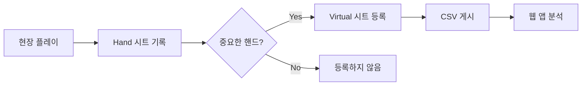

# 📊 Hand 시트와 Virtual 시트 프로세스 가이드

## 🎯 핵심 개념

### Hand 시트 (전체 데이터)
- **목적**: 현장에서 발생한 모든 핸드 기록
- **데이터**: 모든 포커 핸드 (선별 전)
- **특징**: 자동 기록, 전체 보관

### Virtual 시트 (선별 데이터)
- **목적**: 분석이 필요한 핸드만 등록
- **데이터**: 중요한 핸드만 (선별 후)
- **특징**: 수동 등록, 부분 보관

## ⚠️ 중요 원칙

### ❌ 하면 안 되는 것:
- Hand → Virtual 자동 동기화
- 모든 Hand 데이터를 Virtual로 복사
- Virtual 시트 자동 생성

### ✅ 올바른 프로세스:
1. Hand 시트에 데이터 기록 (현장)
2. 중요한 핸드 선별 (수동)
3. Virtual 시트 등록 (선택적)
4. 웹 앱에서 분석

## 🔍 17시 이후 데이터 처리

### 문제 상황:
- Hand 시트: 17:00-23:59 데이터 존재
- Virtual 시트: 16:00까지만 존재
- 원인: 아직 선별/등록하지 않음

### 해결 방법:

#### 1. 수동 등록 (권장)
```
1. Hand 시트 열기
2. 17시 이후 핸드 검토
3. 중요한 핸드 선별
4. Virtual 시트에 복사
   - A열: 핸드 번호
   - B열: 시간
   - E열: 상태 (빈 값)
5. CSV 재게시
```

#### 2. 선별적 등록 스크립트
```javascript
// 특정 핸드 번호만 Virtual 시트에 추가
function addSelectedHandsToVirtual(handNumbers) {
  // handNumbers: [139, 140, 145, ...]
  // 선별된 핸드만 등록
}
```

## 📱 웹 애플리케이션 동작

### 현재 로직:
1. Virtual 시트 우선 확인
2. 없으면 오류 표시

### 개선된 로직:
1. Virtual 시트 확인
2. 없으면 Hand 시트 확인
3. Hand 시트에만 있으면 "미등록" 표시
4. 필요시 Virtual 등록 제안

## 💡 운영 팁

### Virtual 시트 등록 기준:
- 큰 팟 핸드
- 올인 상황
- 블러프 의심
- 분석이 필요한 플레이
- 특이한 베팅 패턴

### 등록하지 않는 핸드:
- 프리플랍 폴드
- 작은 팟
- 일반적인 플레이
- 분석 불필요한 핸드

## 🚨 주의사항

1. **Virtual 시트는 선별된 데이터만 포함**
   - 모든 Hand가 Virtual에 있지 않음
   - 이것은 의도된 설계

2. **자동화 금지**
   - Hand → Virtual 자동 동기화 ❌
   - 선별 과정은 반드시 수동

3. **데이터 무결성**
   - Virtual 시트 수정 시 신중
   - 잘못된 데이터 등록 주의

## 📊 데이터 플로우



## 🔧 문제 해결

### Q: 17시 이후 데이터가 안 보여요
**A**: Virtual 시트에 아직 등록하지 않았습니다. Hand 시트에서 필요한 핸드를 선별하여 Virtual 시트에 수동 등록하세요.

### Q: 모든 핸드를 분석하고 싶어요
**A**: Virtual 시트는 선별된 데이터용입니다. 전체 분석이 필요하면 Hand 시트를 직접 사용하세요.

### Q: Virtual 시트 자동화가 필요해요
**A**: 선별 과정은 인간의 판단이 필요하므로 자동화하면 안 됩니다.

---

**작성일**: 2025-09-18
**중요도**: ⭐⭐⭐⭐⭐