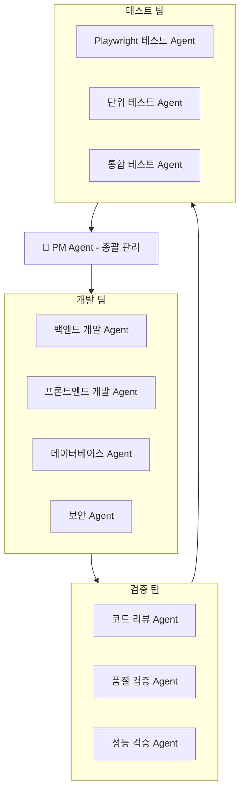

# 🤖 멀티 에이전트 개발 시스템 설계

> 작성일: 2025-09-23
> 목적: 자동화된 개발-검증-테스트 파이프라인 구축

---

## 🏗️ 시스템 아키텍처



---

## 📋 Phase별 에이전트 역할 분담

### Phase 1: 보안 강화 (예시)

#### 1️⃣ **Step 1: 작업 할당** (PM Agent)
```yaml
PM Agent 작업:
  - 작업 분해 및 할당
  - 타임라인 설정
  - 의존성 관리
  - 진행 상황 추적

할당 예시:
  Task_001:
    담당: security-auditor
    작업: "JWT 인증 시스템 구현"
    기한: "2일"
    검증: code-reviewer
    테스트: playwright-engineer
```

#### 2️⃣ **Step 2: 개발 실행** (Development Agents)
```typescript
// security-auditor Agent 실행
const securityTask = {
  id: "TASK_001",
  type: "JWT_IMPLEMENTATION",
  requirements: [
    "JWT 토큰 생성 로직",
    "토큰 검증 미들웨어",
    "리프레시 토큰 구현",
    "토큰 블랙리스트 관리"
  ],
  output: {
    files: ["src/auth/jwt.ts", "src/middleware/auth.ts"],
    tests: ["tests/auth.test.ts"],
    docs: ["docs/AUTH.md"]
  }
};

// Agent 호출
await Task({
  subagent_type: "security-auditor",
  prompt: `
    JWT 인증 시스템을 구현하세요.
    요구사항: ${JSON.stringify(securityTask.requirements)}
    테스트 코드도 함께 작성하세요.
  `,
  description: "JWT 인증 구현"
});
```

#### 3️⃣ **Step 3: 코드 검증** (Validation Agents)
```typescript
// code-reviewer Agent 실행
const reviewTask = {
  id: "REVIEW_001",
  target: "TASK_001",
  checklist: [
    "보안 취약점 검사",
    "코드 품질 검사",
    "테스트 커버리지 확인",
    "문서화 확인"
  ],
  severity_levels: {
    critical: "보안 취약점, 데이터 누출",
    high: "성능 문제, 메모리 누수",
    medium: "코드 스타일, 중복 코드",
    low: "주석, 네이밍"
  }
};

// Agent 호출
const reviewResult = await Task({
  subagent_type: "code-reviewer",
  prompt: `
    다음 코드를 엄격하게 검토하세요:
    파일: ${securityTask.output.files}
    체크리스트: ${JSON.stringify(reviewTask.checklist)}

    문제점 발견 시 severity level과 함께 보고하세요.
    PASS/FAIL 판정을 내려주세요.
  `,
  description: "코드 리뷰"
});
```

#### 4️⃣ **Step 4: 자동 테스트** (Testing Agents)
```typescript
// playwright-engineer Agent 실행
const e2eTest = {
  id: "E2E_001",
  scenarios: [
    {
      name: "로그인 플로우",
      steps: [
        "로그인 페이지 접속",
        "유효한 자격증명 입력",
        "JWT 토큰 발급 확인",
        "보호된 페이지 접근 확인"
      ]
    },
    {
      name: "토큰 만료 처리",
      steps: [
        "만료된 토큰으로 요청",
        "401 에러 확인",
        "리프레시 토큰으로 재발급",
        "정상 접근 확인"
      ]
    }
  ]
};

// Agent 호출
const testResult = await Task({
  subagent_type: "playwright-engineer",
  prompt: `
    Playwright로 다음 E2E 테스트를 실행하세요:
    ${JSON.stringify(e2eTest.scenarios)}

    각 시나리오별로 PASS/FAIL 결과를 보고하세요.
    실패 시 스크린샷과 상세 로그를 제공하세요.
  `,
  description: "E2E 테스트 실행"
});
```

#### 5️⃣ **Step 5: 최종 검증 및 보고** (PM Agent)
```typescript
// PM Agent가 모든 결과 수집 및 판단
const finalReport = {
  phase: "Phase 1 - 보안 강화",
  task: "JWT 인증 시스템",
  results: {
    development: "COMPLETED",
    code_review: reviewResult.status,
    testing: testResult.status,
    coverage: "85%",
    performance: "응답시간 < 100ms"
  },
  issues: [
    /* 발견된 이슈 목록 */
  ],
  decision: "APPROVED" // or "NEEDS_REVISION"
};
```

---

## 🔄 실행 워크플로우

### 1. 순차적 실행 모델
```javascript
async function executePhase(phaseId) {
  const pm = new PMAgent();

  // 1. 작업 계획 수립
  const plan = await pm.createPlan(phaseId);

  // 2. 각 작업별 실행
  for (const task of plan.tasks) {
    // 개발
    const devResult = await executeDevAgent(task);

    // 검증
    const reviewResult = await executeReviewAgent(devResult);

    if (reviewResult.status === 'FAIL') {
      // 수정 요청
      await requestRevision(task, reviewResult.issues);
      continue;
    }

    // 테스트
    const testResult = await executeTestAgent(devResult);

    if (testResult.status === 'FAIL') {
      // 수정 요청
      await requestRevision(task, testResult.issues);
      continue;
    }

    // 승인
    await pm.approveTask(task);
  }

  // 3. 최종 보고
  return await pm.generateFinalReport(phaseId);
}
```

### 2. 병렬 실행 모델 (독립적 작업)
```javascript
async function executeParallelTasks(tasks) {
  const results = await Promise.all(
    tasks.map(async (task) => {
      // 각 작업을 독립적으로 실행
      const pipeline = [
        () => executeDevelopment(task),
        (devResult) => executeValidation(devResult),
        (valResult) => executeTesting(valResult)
      ];

      let result = task;
      for (const stage of pipeline) {
        result = await stage(result);
        if (result.status === 'FAIL') {
          return { task, status: 'FAILED', stage };
        }
      }

      return { task, status: 'SUCCESS' };
    })
  );

  return results;
}
```

---

## 🎭 에이전트별 상세 역할

### 1. PM Agent (프로젝트 관리자)
```yaml
역할:
  - 전체 프로젝트 조율
  - 작업 분배 및 일정 관리
  - 진행 상황 모니터링
  - 이슈 에스컬레이션
  - 최종 승인 및 보고

명령 예시:
  "Phase 1의 모든 보안 작업을 시작하세요.
   각 작업별로 개발-검증-테스트 파이프라인을 실행하고,
   완료되면 종합 보고서를 작성하세요."
```

### 2. Development Agents (개발팀)
```yaml
backend-architect:
  - API 설계 및 구현
  - 데이터베이스 스키마 설계
  - 비즈니스 로직 구현

frontend-developer:
  - UI 컴포넌트 개발
  - 상태 관리 구현
  - 사용자 인터랙션 처리

security-auditor:
  - 보안 기능 구현
  - 취약점 패치
  - 암호화 로직 구현

database-optimizer:
  - 쿼리 최적화
  - 인덱스 설계
  - 마이그레이션 스크립트
```

### 3. Validation Agents (검증팀)
```yaml
code-reviewer:
  검증 항목:
    - 코드 품질 (복잡도, 중복)
    - 보안 취약점
    - 성능 이슈
    - 베스트 프랙티스 준수

  판정 기준:
    - PASS: 모든 critical/high 이슈 없음
    - CONDITIONAL: medium 이슈만 존재
    - FAIL: critical/high 이슈 발견

debugger:
  - 버그 원인 분석
  - 메모리 누수 탐지
  - 성능 병목 발견
```

### 4. Testing Agents (테스트팀)
```yaml
playwright-engineer:
  테스트 범위:
    - E2E 시나리오
    - 크로스 브라우저
    - 반응형 테스트
    - 접근성 테스트

  결과 보고:
    - 스크린샷/비디오
    - 성능 메트릭
    - 에러 로그

test-automator:
  - 단위 테스트 작성
  - 통합 테스트 구현
  - 테스트 커버리지 측정
```

---

## 📊 보고 체계

### 1. 작업별 상태 보고
```json
{
  "taskId": "SEC-001",
  "title": "JWT 인증 구현",
  "status": "IN_REVIEW",
  "progress": {
    "development": "COMPLETED",
    "review": "IN_PROGRESS",
    "testing": "PENDING"
  },
  "issues": [],
  "assignee": "security-auditor",
  "reviewer": "code-reviewer",
  "tester": "playwright-engineer"
}
```

### 2. 일일 진행 보고
```markdown
# Daily Progress Report - 2025-09-23

## 완료된 작업
- [x] JWT 토큰 생성 로직 (SEC-001)
- [x] 리프레시 토큰 구현 (SEC-002)

## 진행 중
- [ ] OAuth 2.0 통합 (SEC-003) - 70% 완료
- [ ] RBAC 구현 (SEC-004) - 리뷰 중

## 이슈
- 🔴 Critical: 없음
- 🟡 High: 토큰 만료 시간 조정 필요
- 🟢 Low: 코드 리팩토링 제안 2건

## 내일 계획
- OAuth 2.0 통합 완료
- 보안 테스트 실행
```

### 3. Phase 완료 보고
```markdown
# Phase 1 Completion Report

## 요약
- **Phase**: 보안 강화
- **기간**: 2025-10-01 ~ 2025-10-14
- **상태**: ✅ COMPLETED

## 주요 성과
1. JWT 인증 시스템 구현 완료
2. OAuth 2.0 통합 완료
3. RBAC 시스템 구축
4. 보안 모니터링 대시보드 구현

## 품질 지표
- 코드 커버리지: 92%
- 보안 취약점: 0개
- 성능: 모든 API < 100ms
- E2E 테스트: 100% 통과

## 검증 결과
- Code Review: PASSED (15개 PR 모두 승인)
- Security Audit: PASSED (OWASP Top 10 검증)
- Performance Test: PASSED (부하 테스트 통과)
- E2E Test: PASSED (전체 시나리오 성공)

## 다음 단계
Phase 2 (성능 최적화) 준비 완료
예정일: 2025-10-15 시작
```

---

## 💡 실행 전략

### Step 1: 파일럿 테스트
```bash
# 작은 작업으로 시스템 테스트
npm run agent:pilot -- --task "단순 CRUD API 구현"

# 파이프라인 검증
- 개발 Agent 실행 → 코드 생성
- Review Agent 실행 → 코드 검토
- Test Agent 실행 → 테스트 실행
- PM Agent → 최종 보고
```

### Step 2: 점진적 확대
```yaml
Week 1: 단일 Agent 테스트
  - 각 Agent별 개별 테스트
  - 역할 명확화

Week 2: 파이프라인 테스트
  - 2-3개 Agent 연계
  - 통신 프로토콜 확립

Week 3: 전체 시스템 테스트
  - 모든 Agent 통합
  - Phase 1 일부 실행

Week 4: 본격 운영
  - Phase 1 전체 실행
  - 피드백 반영
```

### Step 3: 자동화 스크립트
```javascript
// agent-orchestrator.js
class AgentOrchestrator {
  async runPhase(phaseConfig) {
    const pm = new PMAgent();
    const tasks = await pm.decomposeTasks(phaseConfig);

    for (const task of tasks) {
      const result = await this.runPipeline(task);

      if (result.needsRevision) {
        await this.handleRevision(task, result);
      }

      await pm.updateProgress(task, result);
    }

    return await pm.generateReport();
  }

  async runPipeline(task) {
    // 개발 → 검증 → 테스트 파이프라인
    const stages = [
      { agent: 'developer', action: 'implement' },
      { agent: 'reviewer', action: 'review' },
      { agent: 'tester', action: 'test' }
    ];

    let result = task;
    for (const stage of stages) {
      result = await this.executeStage(stage, result);

      if (result.status === 'FAIL') {
        return { needsRevision: true, stage, issues: result.issues };
      }
    }

    return { success: true, results: result };
  }
}
```

---

## 🎯 성공 기준

### 1. 시스템 레벨
- **자동화율**: 80% 이상의 작업 자동 처리
- **정확도**: 95% 이상의 검증 정확도
- **속도**: 수동 대비 3배 이상 빠른 처리

### 2. 품질 레벨
- **버그 감소**: 프로덕션 버그 50% 감소
- **코드 품질**: 모든 코드 리뷰 통과
- **테스트 커버리지**: 85% 이상

### 3. 프로세스 레벨
- **투명성**: 모든 작업 추적 가능
- **일관성**: 표준화된 개발 프로세스
- **확장성**: 새로운 Agent 쉽게 추가

---

## 🚀 구현 로드맵

### Phase A: 기반 구축 (Week 1-2)
- [ ] Agent 통신 프로토콜 정의
- [ ] 작업 분배 시스템 구축
- [ ] 결과 수집 메커니즘 구현

### Phase B: Agent 구현 (Week 3-4)
- [ ] 각 Agent별 역할 구현
- [ ] 검증 로직 구현
- [ ] 테스트 자동화 구현

### Phase C: 통합 (Week 5-6)
- [ ] 파이프라인 통합
- [ ] 보고 시스템 구현
- [ ] 대시보드 구축

### Phase D: 운영 (Week 7+)
- [ ] 실제 프로젝트 적용
- [ ] 피드백 수집 및 개선
- [ ] 지속적 최적화

---

**작성자**: Claude AI Assistant
**버전**: v1.0.0
**최종 수정일**: 2025-09-23