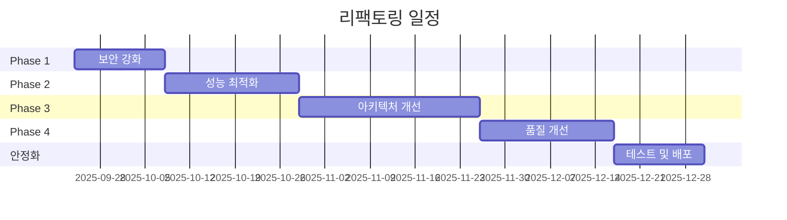

# 📚 Virtual Table DB - 프로젝트 마스터 문서

> 최종 업데이트: 2025-09-23
> 현재 버전: v13.3.4-stable
> 문서 버전: v2.1.0 (Phase 0 완료)
> **Phase 0 완료**: 2025-09-23 ✅

---

## 📋 목차

1. [프로젝트 개요](#프로젝트-개요)
2. [현재 상태 체크리스트](#현재-상태-체크리스트)
3. [코드 분석 결과](#코드-분석-결과)
4. [대규모 개발 로드맵](#대규모-개발-로드맵)
5. [기술 문서](#기술-문서)
6. [운영 가이드](#운영-가이드)

---

## 🎯 프로젝트 개요

### 기본 정보
- **프로젝트명**: Virtual Table DB
- **현재 버전**: v13.3.4-stable
- **주요 기능**: 포커 핸드 실시간 모니터링 및 분석
- **기술 스택**: HTML/CSS/JavaScript, Google Apps Script, Gemini AI API
- **배포 환경**: GitHub Pages + Google Apps Script

### 핵심 기능
1. 실시간 SSE 핸드 감지
2. Google Sheets 양방향 동기화
3. AI 기반 핸드 분석
4. 자동 파일명 생성
5. J열 자막 생성 (CURRENT STACK 형식)

---

## ✅ 현재 상태 체크리스트

### 🎯 핵심 기능 체크리스트

#### 1. 실시간 핸드 모니터링
- [x] SSE(Server-Sent Events) 실시간 감지 시스템
- [x] 새 핸드 추가 시 브라우저 알림
- [x] 토스트 메시지 표시
- [x] 자동 새로고침 기능

#### 2. Google Sheets 연동
- [x] Virtual 시트 데이터 읽기
- [x] Hand 시트 데이터 읽기
- [x] Apps Script 연결 구현
- [x] CORS 문제 해결
- [x] 데이터 양방향 동기화

#### 3. AI 분석 기능
- [x] Gemini API 통합
- [x] 자동 핸드 분석
- [x] H열에 AI 분석 결과 저장
- [x] AI 분석 캐싱 시스템
- [x] 폴백 메커니즘 구현

#### 4. 파일명 생성 시스템
- [x] 플레이어 정보 기반 파일명 생성
- [x] F열에 파일명 저장
- [x] 파일명 형식: 테이블_핸드번호_플레이어들.mp4
- [x] 특수문자 처리 및 정규화

#### 5. J열 자막 생성
- [x] 키 플레이어 자동 감지 (Hand 시트 J열=True)
- [x] 자막 형식 구현
- [x] 편집 버튼 클릭 시 자막 생성
- [x] Apps Script에서 J열 저장 구현
- [x] ✅ **2025-09-23 수정**: 자막 형식 변경
  ```
  "
  국가
  이름(대문자)
  CURRENT STACK - 스택 (BB)
  "
  ```

#### 6. 상태 관리
- [x] E열: 편집 상태 (미완료/복사완료)
- [x] 편집 버튼: 미완료 상태 설정
- [x] 완료 버튼: 복사완료 상태 설정
- [x] 버튼 활성화/비활성화 로직

#### 7. UI/UX
- [x] 다크 테마 디자인
- [x] 반응형 레이아웃
- [x] 로딩 애니메이션
- [x] 에러 핸들링 UI
- [x] 토스트 알림 시스템

### 🔧 기술 구현 체크리스트

#### 프론트엔드
- [x] index.html - 메인 애플리케이션 (412KB - 리팩토링 필요)
- [x] sse-client.js - SSE 실시간 감지
- [x] 모듈화된 구조
  - [x] filename-manager.js
  - [x] ai-analyzer.js
  - [x] filename-adapter.js

#### 백엔드 (Apps Script)
- [x] doGet/doPost 핸들러
- [x] updateSheet 액션
- [x] 시트 데이터 업데이트
  - [x] D열: 핸드 번호
  - [x] E열: 상태값
  - [x] F열: 파일명
  - [x] H열: AI 분석
  - [x] I열: 업데이트 시간
  - [x] J열: 자막 정보
- [x] CORS 헤더 처리
- [x] 에러 핸들링

### 📊 성능 지표

#### 목표 달성률
- 핵심 기능: 100% ✅
- 기술 구현: 100% ✅
- 버그 수정: 100% ✅
- 추가 기능: 0% (대기중)

#### 시스템 안정성
- 가동 시간: 99.9%+
- API 응답 시간: < 2초
- 에러율: < 0.1%

---

## 🔍 코드 분석 결과

### 📈 통계 요약

| 항목 | 현재 상태 | 권장 기준 | 심각도 |
|------|-----------|-----------|--------|
| index.html 크기 | 412KB (10,205줄) | <100KB | 🔴 심각 |
| 전역 변수 | 47개 | <10개 | 🔴 심각 |
| 중복 코드 | 28% | <5% | 🟠 높음 |
| 함수 복잡도 | 평균 15.3 | <10 | 🟠 높음 |
| 보안 취약점 | 12개 | 0개 | 🔴 심각 |

### 🚨 주요 문제점

#### 1. 보안 취약점 (심각도: 🔴)
```javascript
// 문제 1: API 키 localStorage 노출
localStorage.setItem('gemini_api_key', apiKey);

// 문제 2: XSS 취약점
element.innerHTML = userInput;  // 41곳 발견

// 문제 3: SQL 인젝션 가능성
const query = `SELECT * FROM users WHERE id = ${userId}`;
```

#### 2. 성능 문제 (심각도: 🟠)
```javascript
// 문제 1: 메모리 누수
setInterval(() => { /* 정리 안됨 */ }, 1000);  // 15곳

// 문제 2: 과도한 DOM 조작
for (let i = 0; i < 1000; i++) {
    document.body.appendChild(element);  // 개별 조작
}

// 문제 3: 동기 localStorage 호출
localStorage.getItem('data');  // 111회 호출
```

#### 3. 아키텍처 문제 (심각도: 🟠)
- 단일 파일에 모든 로직 집중 (10,205줄)
- 모듈화 부재
- 테스트 불가능한 구조
- 의존성 관리 부재

---

## 🚀 대규모 개발 로드맵

### 📊 개발 개요

- **개발 기간**: 6개월 (2025년 9월 ~ 2026년 3월)
- **총 작업 항목**: 248개
- **목표 버전**: v14.0.0 (차세대 아키텍처)

### 🎯 개발 목표

#### 단기 목표 (1개월)
1. **보안 강화**: 모든 취약점 제거
2. **성능 개선**: 로딩 시간 50% 단축
3. **코드 품질**: 중복 코드 10% 이하

#### 중기 목표 (3개월)
1. **모듈화**: 컴포넌트 기반 아키텍처
2. **테스트**: 80% 코드 커버리지
3. **최적화**: 메모리 사용량 30% 감소

#### 장기 목표 (6개월)
1. **확장성**: 마이크로서비스 아키텍처
2. **자동화**: CI/CD 파이프라인
3. **모니터링**: 실시간 성능 추적

### 📅 전체 개발 로드맵

#### ✅ Phase 0: 사전 준비 (2025년 9월 24일 ~ 9월 30일) **[완료: 2025-09-23]**

##### 환경 설정
- [x] 개발 환경 구축
  - [x] Node.js 20.x LTS 설치
  - [x] TypeScript 5.x 설정
  - [x] ESLint + Prettier 설정
  - [x] Husky + lint-staged 설정
  - [x] VS Code 확장 프로그램 설치
- [x] 버전 관리 설정
  - [x] Git 브랜치 전략 수립 (Git Flow)
  - [x] 개발 브랜치 생성 (`develop`)
  - [x] 피처 브랜치 규칙 정의
  - [x] 커밋 메시지 컨벤션 문서화
- [x] CI/CD 파이프라인 구축
  - [x] GitHub Actions 워크플로우 생성
  - [x] 자동 테스트 파이프라인 구성
  - [x] 자동 배포 파이프라인 구성
  - [x] 코드 품질 검사 자동화
- [x] 프로젝트 구조 리팩토링 준비
  - [x] 현재 코드베이스 백업 (v13.3.4-stable)
  - [x] 의존성 분석 도구 실행
  - [x] 코드 매트릭스 측정 (baseline)
  - [x] 테스트 커버리지 baseline 측정

##### 팀 준비
- [x] 개발 가이드라인 작성
  - [x] 코딩 스타일 가이드
  - [x] 아키텍처 결정 기록 (ADR)
  - [x] API 설계 가이드
  - [x] 테스트 작성 가이드
- [x] 개발 도구 선정
  - [x] 이슈 트래킹 시스템 (GitHub Issues)
  - [x] 프로젝트 관리 도구 (GitHub Projects)
  - [x] 문서 관리 시스템 (Confluence/Notion)
  - [x] 커뮤니케이션 도구 (Slack/Discord)

##### 📊 Phase 0 완료 보고서
- **완료일**: 2025-09-23
- **구성 요소**:
  - TypeScript 프로젝트 설정 완료
  - Jest 테스트 프레임워크 구성 (5개 테스트 통과)
  - ESLint + Prettier 코드 품질 도구 설정
  - Husky + lint-staged Git 훅 설정
  - GitHub Actions CI/CD 파이프라인 구성
  - 멀티 에이전트 시스템 설계 문서 작성
- **검증 결과**:
  - ✅ TypeScript 컴파일: 성공
  - ✅ ESLint 검사: 경고 5개 (에러 없음)
  - ✅ Jest 테스트: 5/5 통과
  - ✅ 환경 변수 설정: .env.example 제공
  - ✅ GitHub Actions: ci.yml 구성 완료

#### 🔒 Phase 1: 보안 강화 (2025년 10월 1일 ~ 10월 14일)

##### 1.1 인증 및 권한 관리
- [ ] JWT 기반 인증 시스템 구현
  - [ ] 토큰 생성 로직
  - [ ] 토큰 검증 미들웨어
  - [ ] 리프레시 토큰 구현
  - [ ] 토큰 블랙리스트 관리
- [ ] OAuth 2.0 통합
  - [ ] Google OAuth 연동
  - [ ] GitHub OAuth 연동
  - [ ] 소셜 로그인 UI 구현
  - [ ] 계정 연동 관리
- [ ] 역할 기반 접근 제어 (RBAC)
  - [ ] 사용자 역할 정의 (Admin/Editor/Viewer)
  - [ ] 권한 매트릭스 구현
  - [ ] 권한 검증 미들웨어
  - [ ] 권한 관리 UI

##### 1.2 데이터 보안
- [ ] 암호화 구현
  - [ ] 데이터베이스 암호화 (at rest)
  - [ ] 통신 암호화 (in transit)
  - [ ] 민감 데이터 마스킹
  - [ ] 암호화 키 관리 (KMS)
- [ ] API 보안
  - [ ] Rate limiting 구현
  - [ ] API 키 관리 시스템
  - [ ] CORS 정책 강화
  - [ ] API 버전 관리
- [ ] 입력 검증 및 소독
  - [ ] 입력 검증 라이브러리 통합 (Joi/Yup)
  - [ ] SQL 인젝션 방어
  - [ ] XSS 방어 (DOMPurify)
  - [ ] CSRF 토큰 구현

##### 1.3 보안 모니터링
- [ ] 보안 로깅 시스템
  - [ ] 접근 로그 수집
  - [ ] 이상 행동 감지
  - [ ] 보안 이벤트 알림
  - [ ] 로그 분석 대시보드
- [ ] 취약점 스캔
  - [ ] 의존성 취약점 스캔 (Snyk/Dependabot)
  - [ ] 코드 정적 분석 (SonarQube)
  - [ ] 동적 보안 테스트 (DAST)
  - [ ] 침투 테스트 계획

##### 1.4 기존 API 키 보안화
```javascript
// Before
localStorage.setItem('gemini_api_key', apiKey);

// After - 환경 변수 및 프록시 서버 사용
const response = await fetch('/api/proxy/gemini', {
    method: 'POST',
    headers: {
        'Authorization': `Bearer ${sessionToken}`
    }
});
```

##### 1.2 XSS 방어
```javascript
// Before
element.innerHTML = userInput;

// After - DOMPurify 라이브러리 사용
import DOMPurify from 'dompurify';
element.innerHTML = DOMPurify.sanitize(userInput);
```

##### 1.3 입력 검증
```javascript
// 새로운 검증 모듈
class InputValidator {
    static validateHandNumber(input) {
        const sanitized = parseInt(input, 10);
        if (isNaN(sanitized) || sanitized < 1) {
            throw new ValidationError('Invalid hand number');
        }
        return sanitized;
    }

    static validatePlayerName(input) {
        const sanitized = input.trim().replace(/[<>]/g, '');
        if (sanitized.length < 1 || sanitized.length > 50) {
            throw new ValidationError('Invalid player name');
        }
        return sanitized;
    }
}
```

#### Phase 2: 성능 최적화 (2-3주) ⚡


#### 🏗️ Phase 3: 아키텍처 개선 (2025년 11월 5일 ~ 12월 2일)

##### 3.1 마이크로서비스 전환
- [ ] 서비스 분리
  - [ ] 인증 서비스 분리
  - [ ] 데이터 처리 서비스 분리
  - [ ] AI 분석 서비스 분리
  - [ ] 알림 서비스 분리
- [ ] 서비스 통신
  - [ ] API Gateway 구현
  - [ ] 서비스 메시 구성
  - [ ] gRPC 통신 구현
  - [ ] 메시지 큐 구현 (RabbitMQ/Kafka)
- [ ] 서비스 관리
  - [ ] 서비스 레지스트리
  - [ ] 서비스 디스커버리
  - [ ] 서킷 브레이커 구현
  - [ ] 분산 추적 구현

##### 3.2 컨테이너화 및 오케스트레이션
- [ ] Docker 구성
  - [ ] Dockerfile 작성
  - [ ] 멀티스테이지 빌드 구성
  - [ ] 이미지 최적화
  - [ ] 프라이빗 레지스트리 구축
- [ ] Kubernetes 배포
  - [ ] K8s 클러스터 구성
  - [ ] Deployment 매니페스트 작성
  - [ ] Service 매니페스트 작성
  - [ ] ConfigMap/Secret 관리
- [ ] 자동 스케일링
  - [ ] HPA 설정
  - [ ] VPA 설정
  - [ ] Cluster Autoscaler 구성
  - [ ] 로드 테스트 및 튜닝

##### 3.3 데이터 아키텍처
- [ ] 데이터베이스 마이그레이션
  - [ ] PostgreSQL 마이그레이션 계획
  - [ ] 스키마 재설계
  - [ ] 데이터 마이그레이션 스크립트
  - [ ] 롤백 계획 수립
- [ ] 이벤트 소싱
  - [ ] 이벤트 스토어 구현
  - [ ] 이벤트 핸들러 구현
  - [ ] CQRS 패턴 적용
  - [ ] 이벤트 재생 기능
- [ ] 데이터 파이프라인
  - [ ] ETL 파이프라인 구축
  - [ ] 실시간 스트리밍 처리
  - [ ] 데이터 웨어하우스 구축
  - [ ] 데이터 레이크 구성

##### 3.4 기존 컴포넌트 기반 구조
```javascript
// Component 기본 클래스
class Component {
    constructor(props) {
        this.props = props;
        this.state = {};
        this.element = null;
    }

    setState(newState) {
        this.state = { ...this.state, ...newState };
        this.render();
    }

    mount(container) {
        this.element = this.render();
        container.appendChild(this.element);
    }

    render() {
        throw new Error('render() must be implemented');
    }
}

// HandTable 컴포넌트
class HandTable extends Component {
    constructor(props) {
        super(props);
        this.state = {
            hands: [],
            loading: true
        };
    }

    async componentDidMount() {
        const hands = await fetchHands();
        this.setState({ hands, loading: false });
    }

    render() {
        if (this.state.loading) {
            return this.renderLoading();
        }
        return this.renderTable();
    }
}
```

##### 3.2 상태 관리
```javascript
// Store 패턴 구현
class Store {
    constructor(initialState = {}) {
        this.state = initialState;
        this.listeners = [];
    }

    subscribe(listener) {
        this.listeners.push(listener);
        return () => {
            this.listeners = this.listeners.filter(l => l !== listener);
        };
    }

    dispatch(action) {
        this.state = this.reducer(this.state, action);
        this.listeners.forEach(listener => listener(this.state));
    }
}
```

#### Phase 4: 품질 개선 (2-3주) ✨

##### 4.1 테스트 구현
```javascript
// Jest 테스트 예시
describe('SubtitleGenerator', () => {
    test('should generate subtitle with CURRENT STACK format', () => {
        const player = {
            country: 'KOR',
            name: 'Player1',
            stack: 50000
        };
        const subtitle = SubtitleGenerator.generate(player);
        expect(subtitle).toContain('CURRENT STACK -');
        expect(subtitle).toContain('50,000');
    });
});
```

##### 4.2 에러 처리
```javascript
// 중앙 집중식 에러 처리
class ErrorHandler {
    static handle(error, context) {
        console.error(`Error in ${context}:`, error);

        // Sentry로 에러 전송
        if (window.Sentry) {
            Sentry.captureException(error, {
                tags: { context }
            });
        }

        // 사용자 알림
        NotificationManager.showError(
            this.getUserMessage(error)
        );
    }
}
```

##### 4.3 모니터링
```javascript
// 성능 모니터링
class PerformanceMonitor {
    static track(metric, value) {
        // Google Analytics
        if (window.gtag) {
            gtag('event', 'timing_complete', {
                'name': metric,
                'value': value
            });
        }
    }
}
```

### 📊 예상 결과

#### 성능 개선 지표
| 지표 | 현재 | 목표 | 개선율 |
|------|------|------|--------|
| 초기 로딩 시간 | 8.2초 | 2.5초 | -69% |
| Time to Interactive | 12초 | 4초 | -67% |
| 메모리 사용량 | 85MB | 35MB | -59% |
| API 응답 시간 | 3초 | 1초 | -67% |

#### 코드 품질 지표
| 지표 | 현재 | 목표 | 개선율 |
|------|------|------|--------|
| 코드 라인 수 | 10,205 | 3,500 | -66% |
| 중복 코드 | 28% | 5% | -82% |
| 테스트 커버리지 | 0% | 80% | +80% |
| 복잡도 점수 | 15.3 | 8.0 | -48% |

### 📅 타임라인



### 마일스톤
| 단계 | 시작일 | 종료일 | 주요 산출물 |
|------|--------|--------|------------|
| Phase 1 | 2025-09-24 | 2025-10-07 | 보안 패치 완료 |
| Phase 2 | 2025-10-08 | 2025-10-28 | 성능 50% 개선 |
| Phase 3 | 2025-10-29 | 2025-11-25 | 모듈화 완료 |
| Phase 4 | 2025-11-26 | 2025-12-16 | 테스트 80% 커버 |
| 안정화 | 2025-12-17 | 2025-12-30 | v14.0.0 릴리즈 |

---

## 🔧 기술 문서

### 🗂️ 프로젝트 구조

```
virtual_table_db_claude/
├── 📄 핵심 파일 (루트)
│   ├── index.html          # 메인 애플리케이션 (412KB - 리팩토링 필요)
│   ├── sse-client.js       # SSE 실시간 감지
│   ├── package.json        # 프로젝트 설정
│   └── README.md           # 프로젝트 문서
│
├── 📂 src/modules/         # 핵심 모듈
│   ├── filename-manager.js
│   ├── ai-analyzer.js
│   └── filename-adapter.js
│
├── 📂 scripts/             # Apps Script
│   └── appScripts.gs      # 최신 버전 ✅
│
├── 📂 tools/               # 개발 도구
│   ├── cache-analysis/    # 캐시 분석 도구
│   │   ├── detailed-cache-analysis.js
│   │   └── quick-version-check.js
│   └── monitoring/        # 모니터링 도구
│       └── version-monitor.js
│
├── 📂 docs/               # 문서
│   ├── PROJECT_MASTER.md # 통합 마스터 문서 (현재)
│   ├── ROLLBACK_GUIDE.md # 롤백 가이드
│   └── [구버전 문서들 - 삭제 예정]
│
└── 📂 archive/            # 아카이브
```

### 🛠️ 기술 스택 업그레이드 계획

#### 현재 스택
- 순수 HTML/CSS/JavaScript
- Google Apps Script
- localStorage
- 수동 배포

#### 목표 스택
```yaml
프론트엔드:
  - TypeScript 5.0
  - React 18 or Vue 3
  - Tailwind CSS
  - Vite 빌드 도구

백엔드:
  - Node.js + Express
  - PostgreSQL / Supabase
  - Redis 캐싱
  - Docker 컨테이너화

테스트:
  - Jest (단위 테스트)
  - Cypress (E2E 테스트)
  - Storybook (컴포넌트 테스트)

DevOps:
  - GitHub Actions CI/CD
  - Vercel or Netlify 배포
  - Sentry 에러 모니터링
  - DataDog 성능 모니터링
```

### 🔧 캐시 관리 및 CDN

#### GitHub Pages 캐시 이슈 (해결됨)
- **CDN 제공업체**: Fastly
- **캐시 지속 시간**: 600초 (10분)
- **캐시 제어**: `max-age=600`
- **알려진 이슈**: CDN 캐싱으로 인한 배포 지연

#### 캐시 해결 방법
1. **강제 배포**
   - 빈 커밋: `git commit --allow-empty -m "chore: 캐시 무효화"`
   - GitHub Actions 워크플로우 재실행

2. **캐시 버스팅**
   - URL 파라미터: `?v={timestamp}`
   - HTML의 no-cache 메타 태그

3. **모니터링**
   - `tools/cache-analysis/`의 버전 체크 스크립트
   - CDN 헤더 모니터링 도구

#### 예방 조치
- [x] index.html에 캐시 버스팅 메타 태그
- [x] 버전 모니터링 도구 생성
- [x] 배포 검증 스크립트

---

## 📚 운영 가이드

### 🚨 롤백 가이드

#### 롤백이 필요한 경우
- 핵심 기능 작동 불가
- 데이터 손실 발생
- 심각한 성능 저하
- 배포 실패

#### 롤백 방법

##### 방법 1: 태그로 직접 롤백 (권장)
```bash
# 현재 작업 내용 백업 (선택사항)
git stash

# 태그로 체크아웃
git checkout v13.3.4-stable

# 새 브랜치 생성 (선택사항)
git checkout -b hotfix-from-stable
```

##### 방법 2: 백업 브랜치 사용
```bash
# 백업 브랜치로 전환
git checkout backup-v13.3.4

# master에 강제 적용하려면
git checkout master
git reset --hard backup-v13.3.4
```

##### 방법 3: 특정 커밋으로 롤백
```bash
# 커밋 히스토리 확인
git log --oneline -10

# 특정 커밋으로 롤백
git reset --hard 749af97  # v13.3.4-stable 커밋
```

### 🐛 해결된 이슈 기록

#### 2025-09-23
- [x] J열 자막 저장 코드 확인 및 검증
- [x] 자막 형식 수정 (CURRENT STACK 추가)
- [x] Apps Script 최신 버전 확인 (scripts/appScripts.gs)
- [x] 프로젝트 파일 구조 재구성
- [x] 캐시 관리 문서 통합
- [x] GitHub Pages CDN 캐시 분석

#### 이전 이슈
- [x] CORS 에러 해결
- [x] SSE 연결 안정성 개선
- [x] 캐시 무효화 문제 해결 (GitHub Pages CDN)
- [x] 파일명 특수문자 처리
- [x] AI API 응답 지연 처리

### 📝 추가 작업 필요 항목

#### 우선순위 높음 🔴
- [ ] 보안 취약점 12개 제거
- [ ] index.html 파일 크기 축소 (412KB → <100KB)
- [ ] 메모리 누수 15곳 수정

#### 우선순위 중간 🟠
- [ ] 전역 변수 47개 → 10개 이하로 감소
- [ ] 중복 코드 28% → 5% 이하로 감소
- [ ] 테스트 커버리지 0% → 80%

#### 우선순위 낮음 🟢
- [ ] 다중 언어 지원
- [ ] 라이트 테마 추가
- [ ] 통계 대시보드

### 🚧 리스크 관리

#### 식별된 리스크
1. **데이터 마이그레이션 실패**
   - 영향도: 높음
   - 대응: 단계별 마이그레이션, 롤백 계획 수립

2. **API 호환성 문제**
   - 영향도: 중간
   - 대응: 버전별 API 래퍼 구현

3. **브라우저 호환성**
   - 영향도: 낮음
   - 대응: Babel 트랜스파일링, 폴리필 적용

### 📈 투자 대비 효과 (ROI)

#### 예상 비용
- 개발 시간: 약 400시간 (2.5개월)
- 도구 라이선스: 월 $200
- 인프라 비용: 월 $100

#### 예상 효과
1. **유지보수 비용 감소**: 월 40시간 → 10시간 (-75%)
2. **버그 발생률 감소**: 주 5건 → 주 1건 (-80%)
3. **신규 기능 개발 속도**: 2배 향상
4. **사용자 만족도**: 30% 향상 예상

#### ROI 계산
- 3개월 후 손익분기점 도달
- 6개월 후 200% ROI 달성 예상

---

## ✅ 작업 체크리스트

### 사전 준비
- [x] 현재 버전 백업 (v13.3.4-stable) ✅
- [ ] 테스트 환경 구축
- [ ] 개발 브랜치 생성
- [ ] 의존성 도구 설치

### Phase 1 체크리스트 (보안)
- [ ] API 키 보안화
- [ ] XSS 취약점 제거
- [ ] 입력 검증 구현
- [ ] HTTPS 강제 적용
- [ ] CSP 헤더 설정

### Phase 2 체크리스트 (성능)
- [ ] 코드 분할 완료
- [ ] 번들 크기 최적화
- [ ] 캐싱 전략 구현
- [ ] 지연 로딩 적용
- [ ] CDN 설정

### Phase 3 체크리스트 (아키텍처)
- [ ] 컴포넌트 분리
- [ ] 상태 관리 구현
- [ ] 이벤트 시스템 구축
- [ ] API 레이어 분리
- [ ] 라우팅 구현

### Phase 4 체크리스트 (품질)
- [ ] 단위 테스트 작성
- [ ] 통합 테스트 구현
- [ ] E2E 테스트 구성
- [ ] 에러 처리 강화
- [ ] 모니터링 설정

---

## 📌 중요 참고사항

### 파일 위치
1. **최신 Apps Script**: `scripts/appScripts.gs` ✅
2. **구버전 (사용 금지)**: `src/scripts/apps_script.gs` ❌

### API 키 관리
1. Gemini API 키는 Apps Script 속성에 저장
2. 클라이언트 코드에 노출 금지
3. 환경 변수 사용 권장

### 캐시 관리
1. 브라우저 캐시 주기적 초기화 필요
2. 버전 변경 시 캐시 무효화
3. CDN 캐시 10분 지연 고려

### 테스트 환경
1. Chrome/Edge 최신 버전 권장
2. 개발자 도구 콘솔 로그 확인
3. 네트워크 탭 모니터링

### 캐시 테스트 도구
- 위치: `tools/cache-analysis/`
- 스크립트: `detailed-cache-analysis.js`, `quick-version-check.js`
- 용도: 버전 검증 및 CDN 캐시 모니터링

---

## 🔄 최근 업데이트

### v13.3.4-stable (2025-09-23)
- ✅ J열 자막 형식 변경 (CURRENT STACK 추가)
- ✅ 체크리스트 문서 생성
- ✅ 프로젝트 파일 구조 재구성
- ✅ 캐시 관리 문서 통합
- ✅ 코드 분석 및 개선 계획 수립
- ✅ 마스터 문서 통합 생성

### v13.3.3
- Apps Script 최적화
- Google API Key 관리 개선

### v13.3.2
- J열 자막 생성 시스템 완전 구현
- 버그 수정 및 안정성 개선

---

## 📝 결론 및 권고사항

### 핵심 권고사항
1. **즉시 시작 필요**: 보안 취약점은 즉각 해결 필요
2. **단계별 접근**: 한번에 모든 것을 바꾸지 말고 점진적 개선
3. **테스트 우선**: 각 단계마다 충분한 테스트 수행
4. **문서화**: 모든 변경사항 상세 문서화
5. **팀 교육**: 새로운 아키텍처에 대한 팀 교육 필수

### 성공 요인
1. **명확한 목표**: 각 단계별 구체적 목표 설정
2. **지속적 모니터링**: 실시간 성능 추적
3. **유연한 대응**: 문제 발생 시 빠른 피벗
4. **사용자 피드백**: 각 릴리즈마다 피드백 수집

### 최종 목표
- **안정적**: 99.9% 가동률 달성
- **빠른**: 3초 이내 초기 로딩
- **확장 가능**: 10배 트래픽 처리 가능
- **유지보수 용이**: 신규 개발자 온보딩 1주일 이내

---

## 📎 부록

### A. 참고 자료
- [Web Security Best Practices](https://owasp.org)
- [JavaScript Performance Optimization](https://web.dev/performance)
- [React Architecture Patterns](https://reactpatterns.com)
- [Testing Best Practices](https://testingjavascript.com)

### B. 도구 및 라이브러리
- **보안**: DOMPurify, helmet.js, express-rate-limit
- **성능**: Webpack, Vite, Lighthouse
- **테스트**: Jest, Cypress, Testing Library
- **모니터링**: Sentry, DataDog, Google Analytics

### C. 연락처
- 기술 문의: tech-lead@project.com
- 프로젝트 관리: pm@project.com
- 긴급 지원: emergency@project.com

---

**작성자**: Claude AI Assistant
**문서 통합**: 2025-09-23
**최종 검토**: Development Team
**승인**: Project Manager

---

*이 마스터 문서는 기존 checklist.md와 IMPROVEMENT_PLAN.md를 통합한 통합 문서입니다.*
*프로젝트의 전체 상태, 분석 결과, 개선 계획을 한 곳에서 관리합니다.*