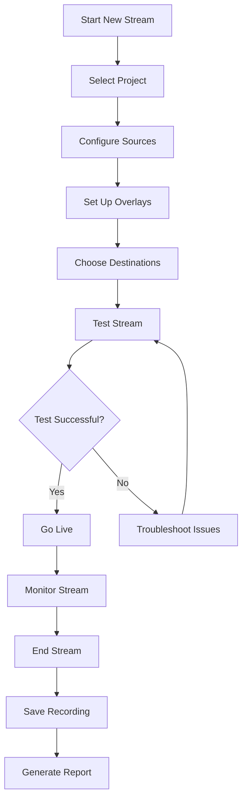

# GGP-GFX UI/UX Design

## Table of Contents
1. [Design Philosophy](#design-philosophy)
2. [User Interface Architecture](#user-interface-architecture)
3. [Desktop Application Design](#desktop-application-design)
4. [Web Application Design](#web-application-design)
5. [Mobile Application Design](#mobile-application-design)
6. [Accessibility Guidelines](#accessibility-guidelines)
7. [Design System](#design-system)
8. [User Experience Flows](#user-experience-flows)

## Design Philosophy

### Core Principles

#### 1. Simplicity Over Complexity
- **Progressive Disclosure**: Show only what users need when they need it
- **Minimal Cognitive Load**: Reduce mental effort required to use the system
- **Clear Hierarchy**: Important functions are prominently displayed
- **Clean Interface**: Remove unnecessary visual clutter

#### 2. Professional Yet Approachable
- **Sophisticated Appearance**: Professional look suitable for broadcast environments
- **Intuitive Navigation**: Easy to learn for non-technical users
- **Consistent Patterns**: Predictable interface behaviors
- **Error Prevention**: Guide users away from mistakes

#### 3. Performance-Oriented Design
- **Responsive Interface**: Immediate feedback for all actions
- **Efficient Workflows**: Minimize clicks and steps
- **Keyboard Shortcuts**: Power user accessibility
- **Real-time Updates**: Live status and feedback

### Design Values

```yaml
Primary Values:
  - Clarity: Clear visual communication
  - Efficiency: Streamlined workflows
  - Reliability: Predictable behavior
  - Professionalism: Broadcast-quality appearance

Secondary Values:
  - Innovation: Modern interaction patterns
  - Flexibility: Customizable interface
  - Accessibility: Universal usability
  - Beauty: Aesthetically pleasing design
```

## User Interface Architecture

### Component Hierarchy

```typescript
interface UIArchitecture {
  application: {
    shell: ApplicationShell;
    workspace: Workspace;
    panels: Panel[];
    dialogs: Dialog[];
    overlays: Overlay[];
  };
  
  workspace: {
    layout: LayoutManager;
    views: View[];
    docking: DockingSystem;
    toolbar: Toolbar;
    statusBar: StatusBar;
  };
  
  panels: {
    preview: PreviewPanel;
    sources: SourcePanel;
    scenes: ScenePanel;
    mixer: MixerPanel;
    controls: ControlPanel;
    properties: PropertiesPanel;
    stats: StatisticsPanel;
  };
}
```

### Layout System

#### Flexible Docking
```css
.workspace {
  display: grid;
  grid-template-areas: 
    "toolbar toolbar toolbar"
    "sidebar main properties"
    "sidebar controls properties"
    "status status status";
  grid-template-columns: 300px 1fr 300px;
  grid-template-rows: 48px 1fr 200px 32px;
  height: 100vh;
  gap: 1px;
  background: var(--border-color);
}

.panel {
  background: var(--panel-bg);
  border: 1px solid var(--border-color);
  border-radius: var(--border-radius);
  overflow: hidden;
  
  &.dockable {
    resize: both;
    min-width: 200px;
    min-height: 150px;
  }
  
  &.floating {
    position: absolute;
    box-shadow: var(--shadow-large);
    z-index: 1000;
  }
}
```

#### Responsive Breakpoints
```scss
$breakpoints: (
  mobile: 480px,
  tablet: 768px,
  desktop: 1024px,
  large: 1440px,
  xlarge: 1920px
);

// Layout adaptations
@media (max-width: map-get($breakpoints, tablet)) {
  .workspace {
    grid-template-areas: 
      "toolbar"
      "main"
      "controls"
      "status";
    grid-template-columns: 1fr;
    grid-template-rows: 48px 1fr 200px 32px;
  }
  
  .sidebar-panels {
    display: none;
  }
}
```

## Desktop Application Design

### Main Window Layout

#### Primary Interface
```typescript
interface MainWindowLayout {
  header: {
    menuBar: MenuBar;
    toolbar: MainToolbar;
    projectInfo: ProjectInfo;
  };
  
  body: {
    sidebar: {
      sources: SourcesPanel;
      scenes: ScenesPanel;
      filters: FiltersPanel;
    };
    
    main: {
      preview: PreviewPane;
      timeline: Timeline;
    };
    
    properties: {
      inspector: PropertiesInspector;
      mixer: AudioMixer;
      stats: PerformanceStats;
    };
  };
  
  footer: {
    statusBar: StatusBar;
    controls: QuickControls;
  };
}
```

### Preview Pane Design

#### Multi-View Layout
```html
<div class="preview-pane">
  <div class="preview-header">
    <div class="view-tabs">
      <button class="tab active">Program</button>
      <button class="tab">Preview</button>
      <button class="tab">Multiview</button>
    </div>
    
    <div class="preview-controls">
      <button class="control-btn" data-action="fullscreen">
        <icon name="fullscreen" />
      </button>
      <button class="control-btn" data-action="grid">
        <icon name="grid" />
      </button>
      <button class="control-btn" data-action="safe-area">
        <icon name="safe-area" />
      </button>
    </div>
  </div>
  
  <div class="preview-content">
    <canvas class="preview-canvas" id="main-preview"></canvas>
    
    <div class="preview-overlay">
      <div class="preview-stats">
        <span class="fps">60 FPS</span>
        <span class="resolution">1920x1080</span>
        <span class="bitrate">6000 kbps</span>
      </div>
      
      <div class="preview-guides" data-visible="false">
        <div class="guide-lines"></div>
        <div class="safe-areas"></div>
      </div>
    </div>
  </div>
</div>
```

#### Multiview Configuration
```typescript
interface MultiviewLayout {
  type: 'quad' | 'pip' | 'custom';
  sources: MultiviewSource[];
  config: {
    showLabels: boolean;
    showBorders: boolean;
    backgroundColor: string;
    labelStyle: LabelStyle;
  };
}

interface MultiviewSource {
  id: string;
  position: Rectangle;
  source: VideoSource;
  label?: string;
  audioLevel?: boolean;
}

class MultiviewRenderer {
  renderLayout(layout: MultiviewLayout, canvas: HTMLCanvasElement): void {
    const ctx = canvas.getContext('2d');
    
    // Clear canvas
    ctx.fillStyle = layout.config.backgroundColor;
    ctx.fillRect(0, 0, canvas.width, canvas.height);
    
    // Render each source
    layout.sources.forEach(source => {
      this.renderSource(ctx, source, layout.config);
    });
  }
  
  private renderSource(ctx: CanvasRenderingContext2D, 
                      source: MultiviewSource, 
                      config: any): void {
    // Draw video frame
    const frame = source.source.getCurrentFrame();
    ctx.drawImage(frame, 
                 source.position.x, source.position.y,
                 source.position.width, source.position.height);
    
    // Draw border
    if (config.showBorders) {
      ctx.strokeStyle = '#ffffff';
      ctx.lineWidth = 2;
      ctx.strokeRect(source.position.x, source.position.y,
                    source.position.width, source.position.height);
    }
    
    // Draw label
    if (config.showLabels && source.label) {
      this.drawLabel(ctx, source.label, source.position, config.labelStyle);
    }
  }
}
```

### Control Panels

#### Source Management
```vue
<template>
  <div class="sources-panel">
    <div class="panel-header">
      <h3>Sources</h3>
      <div class="panel-actions">
        <button @click="addSource" class="btn-add">
          <icon name="plus" />
        </button>
        <button @click="refreshSources" class="btn-refresh">
          <icon name="refresh" />
        </button>
      </div>
    </div>
    
    <div class="sources-list">
      <draggable
        v-model="sources"
        group="sources"
        @change="onSourcesChanged"
        item-key="id"
      >
        <template #item="{ element: source }">
          <div 
            class="source-item"
            :class="{ active: source.active, muted: source.muted }"
            @click="selectSource(source)"
          >
            <div class="source-preview">
              <canvas 
                :ref="`preview-${source.id}`"
                class="source-thumbnail"
              ></canvas>
            </div>
            
            <div class="source-info">
              <div class="source-name">{{ source.name }}</div>
              <div class="source-type">{{ source.type }}</div>
            </div>
            
            <div class="source-controls">
              <button 
                @click.stop="toggleMute(source)"
                class="control-btn"
                :class="{ active: source.muted }"
              >
                <icon :name="source.muted ? 'volume-off' : 'volume-on'" />
              </button>
              
              <button 
                @click.stop="toggleVisibility(source)"
                class="control-btn"
                :class="{ active: !source.visible }"
              >
                <icon :name="source.visible ? 'eye' : 'eye-off'" />
              </button>
              
              <button 
                @click.stop="openSourceSettings(source)"
                class="control-btn"
              >
                <icon name="settings" />
              </button>
            </div>
          </div>
        </template>
      </draggable>
    </div>
  </div>
</template>

<style scoped>
.sources-panel {
  height: 100%;
  display: flex;
  flex-direction: column;
}

.source-item {
  display: flex;
  align-items: center;
  padding: 8px;
  margin: 4px;
  border-radius: 6px;
  background: var(--surface-2);
  cursor: pointer;
  transition: all 0.2s ease;
  
  &:hover {
    background: var(--surface-3);
  }
  
  &.active {
    background: var(--primary-surface);
    border: 1px solid var(--primary-color);
  }
  
  &.muted {
    opacity: 0.6;
  }
}

.source-preview {
  width: 64px;
  height: 36px;
  margin-right: 12px;
  border-radius: 4px;
  overflow: hidden;
  background: var(--surface-1);
}

.source-thumbnail {
  width: 100%;
  height: 100%;
  object-fit: cover;
}
</style>
```

#### Scene Management
```typescript
interface Scene {
  id: string;
  name: string;
  sources: SceneSource[];
  transitions: Transition[];
  hotkey?: string;
}

interface SceneSource {
  id: string;
  sourceId: string;
  transform: Transform;
  filters: Filter[];
  visible: boolean;
  locked: boolean;
}

class SceneManager {
  private scenes: Scene[] = [];
  private activeScene: Scene | null = null;
  private previewScene: Scene | null = null;
  
  createScene(name: string): Scene {
    const scene: Scene = {
      id: generateUUID(),
      name,
      sources: [],
      transitions: []
    };
    
    this.scenes.push(scene);
    this.emit('scene_created', scene);
    
    return scene;
  }
  
  switchToScene(sceneId: string, transition?: Transition): void {
    const scene = this.scenes.find(s => s.id === sceneId);
    if (!scene) return;
    
    if (transition && this.activeScene) {
      this.performTransition(this.activeScene, scene, transition);
    } else {
      this.setActiveScene(scene);
    }
  }
  
  private performTransition(from: Scene, to: Scene, transition: Transition): void {
    const duration = transition.duration || 1000;
    
    // Start transition animation
    const startTime = Date.now();
    const animate = () => {
      const elapsed = Date.now() - startTime;
      const progress = Math.min(elapsed / duration, 1);
      
      // Apply transition effect
      this.applyTransitionEffect(from, to, progress, transition.type);
      
      if (progress < 1) {
        requestAnimationFrame(animate);
      } else {
        this.setActiveScene(to);
        this.emit('transition_complete', { from, to, transition });
      }
    };
    
    animate();
  }
}
```

### Audio Mixer Interface

#### Level Meters and Controls
```vue
<template>
  <div class="audio-mixer">
    <div class="mixer-header">
      <h3>Audio Mixer</h3>
      <button @click="openAdvancedSettings" class="btn-settings">
        <icon name="equalizer" />
      </button>
    </div>
    
    <div class="mixer-channels">
      <div 
        v-for="channel in audioChannels"
        :key="channel.id"
        class="mixer-channel"
      >
        <div class="channel-header">
          <span class="channel-name">{{ channel.name }}</span>
          <button 
            @click="toggleMute(channel)"
            class="mute-btn"
            :class="{ active: channel.muted }"
          >
            M
          </button>
        </div>
        
        <div class="level-meter">
          <div class="meter-track">
            <div 
              class="meter-fill"
              :style="{ height: `${channel.level * 100}%` }"
            ></div>
            <div class="meter-peak" :style="{ bottom: `${channel.peak * 100}%` }"></div>
          </div>
        </div>
        
        <div class="channel-controls">
          <input
            type="range"
            v-model="channel.gain"
            min="-60"
            max="20"
            step="0.1"
            class="gain-slider"
            @input="updateGain(channel)"
          />
          <span class="gain-value">{{ channel.gain }}dB</span>
        </div>
      </div>
    </div>
    
    <div class="master-section">
      <div class="master-controls">
        <label>Master Volume</label>
        <input
          type="range"
          v-model="masterVolume"
          min="0"
          max="100"
          class="master-slider"
          @input="updateMasterVolume"
        />
      </div>
    </div>
  </div>
</template>

<style scoped>
.mixer-channel {
  display: flex;
  flex-direction: column;
  align-items: center;
  padding: 12px;
  background: var(--surface-2);
  border-radius: 8px;
  margin: 8px;
  min-width: 80px;
}

.level-meter {
  height: 200px;
  width: 20px;
  margin: 12px 0;
  position: relative;
}

.meter-track {
  width: 100%;
  height: 100%;
  background: var(--surface-1);
  border-radius: 10px;
  overflow: hidden;
  position: relative;
}

.meter-fill {
  position: absolute;
  bottom: 0;
  width: 100%;
  background: linear-gradient(
    to top,
    #00ff00 0%,
    #ffff00 70%,
    #ff0000 90%
  );
  transition: height 0.1s ease;
}

.meter-peak {
  position: absolute;
  width: 100%;
  height: 2px;
  background: #ff0000;
  transition: bottom 0.3s ease;
}

.gain-slider {
  writing-mode: bt-lr; /* IE */
  writing-mode: vertical-rl;
  width: 20px;
  height: 100px;
  background: transparent;
  outline: none;
}
</style>
```

## Web Application Design

### Progressive Web App Interface

#### Responsive Dashboard
```vue
<template>
  <div class="web-dashboard" :class="{ 'mobile-layout': isMobile }">
    <header class="app-header">
      <div class="header-content">
        <div class="logo">
          
        </div>
        
        <nav class="main-nav" v-if="!isMobile">
          <router-link to="/projects" class="nav-link">Projects</router-link>
          <router-link to="/streams" class="nav-link">Streams</router-link>
          <router-link to="/templates" class="nav-link">Templates</router-link>
          <router-link to="/analytics" class="nav-link">Analytics</router-link>
        </nav>
        
        <div class="header-actions">
          <button @click="showNotifications" class="notification-btn">
            <icon name="bell" />
            <span v-if="unreadCount" class="notification-badge">{{ unreadCount }}</span>
          </button>
          
          <div class="user-menu">
            <button @click="toggleUserMenu" class="user-avatar">
              
            </button>
          </div>
        </div>
      </div>
    </header>
    
    <main class="app-main">
      <aside class="sidebar" v-if="!isMobile || sidebarOpen">
        <div class="project-selector">
          <select v-model="selectedProject" @change="switchProject">
            <option v-for="project in projects" :key="project.id" :value="project.id">
              {{ project.name }}
            </option>
          </select>
        </div>
        
        <nav class="sidebar-nav">
          <a href="#overview" class="nav-item active">
            <icon name="dashboard" />
            <span>Overview</span>
          </a>
          <a href="#sources" class="nav-item">
            <icon name="video" />
            <span>Sources</span>
          </a>
          <a href="#scenes" class="nav-item">
            <icon name="layers" />
            <span>Scenes</span>
          </a>
          <a href="#stream" class="nav-item">
            <icon name="broadcast" />
            <span>Stream</span>
          </a>
        </nav>
      </aside>
      
      <div class="content-area">
        <router-view />
      </div>
    </main>
    
    <!-- Mobile Navigation -->
    <nav class="mobile-nav" v-if="isMobile">
      <button 
        v-for="item in mobileNavItems"
        :key="item.id"
        @click="navigate(item.route)"
        class="mobile-nav-item"
        :class="{ active: $route.path === item.route }"
      >
        <icon :name="item.icon" />
        <span>{{ item.label }}</span>
      </button>
    </nav>
  </div>
</template>

<style scoped>
.web-dashboard {
  display: grid;
  grid-template-areas: 
    "header header"
    "sidebar main";
  grid-template-columns: 280px 1fr;
  grid-template-rows: 64px 1fr;
  height: 100vh;
}

.mobile-layout.web-dashboard {
  grid-template-areas: 
    "header"
    "main"
    "nav";
  grid-template-columns: 1fr;
  grid-template-rows: 64px 1fr 80px;
}

.app-header {
  grid-area: header;
  background: var(--surface-1);
  border-bottom: 1px solid var(--border-color);
  display: flex;
  align-items: center;
  padding: 0 24px;
  z-index: 100;
}

.sidebar {
  grid-area: sidebar;
  background: var(--surface-2);
  border-right: 1px solid var(--border-color);
  padding: 24px;
  overflow-y: auto;
}

.content-area {
  grid-area: main;
  padding: 24px;
  overflow-y: auto;
  background: var(--background);
}

.mobile-nav {
  grid-area: nav;
  background: var(--surface-1);
  border-top: 1px solid var(--border-color);
  display: flex;
  justify-content: space-around;
  align-items: center;
  padding: 12px;
}

.mobile-nav-item {
  display: flex;
  flex-direction: column;
  align-items: center;
  padding: 8px 12px;
  border-radius: 8px;
  background: none;
  border: none;
  color: var(--text-secondary);
  transition: all 0.2s ease;
  
  &.active {
    color: var(--primary-color);
    background: var(--primary-surface);
  }
  
  span {
    font-size: 12px;
    margin-top: 4px;
  }
}
</style>
```

### Cloud Collaboration Interface

#### Real-time Editing
```typescript
interface CollaborationState {
  participants: Participant[];
  activeProject: Project;
  editingMode: 'exclusive' | 'collaborative';
  conflictResolution: 'merge' | 'overwrite' | 'manual';
}

class CollaborationUI {
  private cursors: Map<string, CursorElement> = new Map();
  private selections: Map<string, SelectionElement> = new Map();
  
  showParticipantCursor(userId: string, position: Point): void {
    let cursor = this.cursors.get(userId);
    
    if (!cursor) {
      cursor = this.createCursorElement(userId);
      this.cursors.set(userId, cursor);
    }
    
    cursor.updatePosition(position);
    cursor.show();
    
    // Hide cursor after inactivity
    clearTimeout(cursor.hideTimer);
    cursor.hideTimer = setTimeout(() => {
      cursor.hide();
    }, 3000);
  }
  
  showParticipantSelection(userId: string, selection: Selection): void {
    let selectionEl = this.selections.get(userId);
    
    if (!selectionEl) {
      selectionEl = this.createSelectionElement(userId);
      this.selections.set(userId, selectionEl);
    }
    
    selectionEl.updateSelection(selection);
    selectionEl.show();
  }
  
  private createCursorElement(userId: string): CursorElement {
    const participant = this.getParticipant(userId);
    const element = document.createElement('div');
    element.className = 'collaboration-cursor';
    element.style.backgroundColor = participant.color;
    element.innerHTML = `
      <div class="cursor-pointer"></div>
      <div class="cursor-label">${participant.name}</div>
    `;
    
    document.body.appendChild(element);
    
    return new CursorElement(element);
  }
}
```

## Mobile Application Design

### Touch-Optimized Interface

#### Remote Control Layout
```typescript
interface MobileLayout {
  header: MobileHeader;
  content: {
    connectionStatus: ConnectionPanel;
    quickActions: QuickActionGrid;
    cameraControls: CameraControlPanel;
    streamStatus: StreamStatusPanel;
  };
  navigation: BottomNavigation;
}

interface QuickAction {
  id: string;
  label: string;
  icon: string;
  action: () => Promise<void>;
  enabled: boolean;
  color?: string;
}
```

#### Gesture Controls
```vue
<template>
  <div 
    class="camera-control-pad"
    @touchstart="onTouchStart"
    @touchmove="onTouchMove"
    @touchend="onTouchEnd"
    ref="controlPad"
  >
    <div class="control-center">
      <div class="ptz-indicator" :style="{ 
        transform: `translate(${pan}px, ${tilt}px)` 
      }"></div>
    </div>
    
    <div class="zoom-controls">
      <button 
        @touchstart="startZoom('in')"
        @touchend="stopZoom"
        class="zoom-btn zoom-in"
      >
        <icon name="plus" />
      </button>
      <button 
        @touchstart="startZoom('out')"
        @touchend="stopZoom"
        class="zoom-btn zoom-out"
      >
        <icon name="minus" />
      </button>
    </div>
    
    <div class="preset-buttons">
      <button 
        v-for="preset in presets"
        :key="preset.id"
        @click="goToPreset(preset)"
        class="preset-btn"
        :class="{ active: preset.id === currentPreset }"
      >
        {{ preset.name }}
      </button>
    </div>
  </div>
</template>

<script setup lang="ts">
import { ref, onMounted, onUnmounted } from 'vue';

const controlPad = ref<HTMLElement>();
const pan = ref(0);
const tilt = ref(0);
const isDragging = ref(false);
const startPosition = ref({ x: 0, y: 0 });

const onTouchStart = (event: TouchEvent) => {
  event.preventDefault();
  const touch = event.touches[0];
  startPosition.value = { x: touch.clientX, y: touch.clientY };
  isDragging.value = true;
};

const onTouchMove = (event: TouchEvent) => {
  if (!isDragging.value) return;
  
  event.preventDefault();
  const touch = event.touches[0];
  const deltaX = touch.clientX - startPosition.value.x;
  const deltaY = touch.clientY - startPosition.value.y;
  
  // Apply deadzone
  const deadzone = 10;
  if (Math.abs(deltaX) > deadzone) {
    pan.value = Math.max(-100, Math.min(100, deltaX * 0.5));
  }
  if (Math.abs(deltaY) > deadzone) {
    tilt.value = Math.max(-100, Math.min(100, deltaY * 0.5));
  }
  
  // Send PTZ command
  sendPTZCommand(pan.value, tilt.value);
};

const onTouchEnd = () => {
  isDragging.value = false;
  pan.value = 0;
  tilt.value = 0;
  
  // Return to center
  sendPTZCommand(0, 0);
};

const sendPTZCommand = (panValue: number, tiltValue: number) => {
  // Convert to camera control values
  const panSpeed = Math.round((panValue / 100) * 24);
  const tiltSpeed = Math.round((tiltValue / 100) * 20);
  
  // Send to camera controller
  emit('ptz-command', { pan: panSpeed, tilt: tiltSpeed });
};
</script>

<style scoped>
.camera-control-pad {
  position: relative;
  width: 300px;
  height: 300px;
  background: radial-gradient(circle, var(--surface-3) 0%, var(--surface-1) 100%);
  border-radius: 50%;
  margin: 20px auto;
  touch-action: none;
  user-select: none;
}

.control-center {
  position: absolute;
  top: 50%;
  left: 50%;
  transform: translate(-50%, -50%);
  width: 60px;
  height: 60px;
  background: var(--primary-color);
  border-radius: 50%;
  display: flex;
  align-items: center;
  justify-content: center;
}

.ptz-indicator {
  width: 20px;
  height: 20px;
  background: white;
  border-radius: 50%;
  transition: transform 0.1s ease;
}

.zoom-controls {
  position: absolute;
  right: -60px;
  top: 50%;
  transform: translateY(-50%);
  display: flex;
  flex-direction: column;
  gap: 12px;
}

.zoom-btn {
  width: 48px;
  height: 48px;
  border-radius: 50%;
  background: var(--surface-2);
  border: 2px solid var(--border-color);
  color: var(--text-primary);
  display: flex;
  align-items: center;
  justify-content: center;
  
  &:active {
    background: var(--primary-color);
    color: white;
  }
}

.preset-buttons {
  position: absolute;
  bottom: -80px;
  left: 50%;
  transform: translateX(-50%);
  display: flex;
  gap: 8px;
  flex-wrap: wrap;
  justify-content: center;
  max-width: 300px;
}

.preset-btn {
  padding: 8px 16px;
  background: var(--surface-2);
  border: 1px solid var(--border-color);
  border-radius: 20px;
  color: var(--text-primary);
  font-size: 14px;
  
  &.active {
    background: var(--primary-color);
    color: white;
  }
}
</style>
```

### Adaptive Interface

#### Screen Size Optimization
```css
/* Mobile First Approach */
.mobile-interface {
  font-size: 16px; /* Minimum 16px for iOS zoom prevention */
  line-height: 1.5;
  padding: 16px;
}

/* Touch Target Optimization */
.touch-target {
  min-height: 44px; /* iOS minimum */
  min-width: 44px;
  padding: 12px;
  margin: 8px;
  border-radius: 8px;
  display: flex;
  align-items: center;
  justify-content: center;
}

/* Safe Area Handling */
.mobile-app {
  padding-top: env(safe-area-inset-top);
  padding-bottom: env(safe-area-inset-bottom);
  padding-left: env(safe-area-inset-left);
  padding-right: env(safe-area-inset-right);
}

/* Orientation Handling */
@media (orientation: landscape) {
  .mobile-interface {
    flex-direction: row;
    
    .control-panel {
      width: 300px;
      height: 100vh;
    }
    
    .preview-area {
      flex: 1;
      height: 100vh;
    }
  }
}

@media (orientation: portrait) {
  .mobile-interface {
    flex-direction: column;
    
    .preview-area {
      height: 40vh;
      width: 100vw;
    }
    
    .control-panel {
      height: 60vh;
      width: 100vw;
    }
  }
}
```

## Accessibility Guidelines

### WCAG 2.1 AA Compliance

#### Color and Contrast
```css
:root {
  /* High contrast color palette */
  --bg-primary: #000000;
  --bg-secondary: #1a1a1a;
  --text-primary: #ffffff;
  --text-secondary: #cccccc;
  --accent-primary: #0066cc;
  --accent-secondary: #4da6ff;
  
  /* Ensure 4.5:1 contrast ratio minimum */
  --success-color: #00aa00;
  --warning-color: #ff8800;
  --error-color: #cc0000;
}

/* High contrast mode support */
@media (prefers-contrast: high) {
  :root {
    --bg-primary: #000000;
    --bg-secondary: #000000;
    --text-primary: #ffffff;
    --border-color: #ffffff;
  }
}

/* Reduced motion support */
@media (prefers-reduced-motion: reduce) {
  * {
    animation-duration: 0.01ms !important;
    animation-iteration-count: 1 !important;
    transition-duration: 0.01ms !important;
  }
}
```

#### Keyboard Navigation
```typescript
class KeyboardNavigation {
  private focusableElements: HTMLElement[] = [];
  private currentFocusIndex = 0;
  
  initialize(): void {
    this.updateFocusableElements();
    this.setupKeyboardListeners();
    this.setupFocusTrapping();
  }
  
  private setupKeyboardListeners(): void {
    document.addEventListener('keydown', (event) => {
      switch (event.key) {
        case 'Tab':
          this.handleTabNavigation(event);
          break;
        case 'Escape':
          this.handleEscapeKey(event);
          break;
        case 'Enter':
        case ' ':
          this.handleActivation(event);
          break;
        case 'ArrowUp':
        case 'ArrowDown':
        case 'ArrowLeft':
        case 'ArrowRight':
          this.handleArrowNavigation(event);
          break;
      }
    });
  }
  
  private handleTabNavigation(event: KeyboardEvent): void {
    const direction = event.shiftKey ? -1 : 1;
    const nextIndex = (this.currentFocusIndex + direction + this.focusableElements.length) % this.focusableElements.length;
    
    event.preventDefault();
    this.focusElement(nextIndex);
  }
  
  private setupFocusTrapping(): void {
    // Trap focus within modal dialogs
    document.addEventListener('focusin', (event) => {
      const activeModal = document.querySelector('.modal.active');
      if (activeModal && !activeModal.contains(event.target as Node)) {
        const firstFocusable = activeModal.querySelector('[tabindex="0"], button, input, select, textarea') as HTMLElement;
        firstFocusable?.focus();
      }
    });
  }
}
```

#### Screen Reader Support
```html
<!-- Semantic HTML structure -->
<main role="main" aria-label="Video Production Interface">
  <section aria-labelledby="preview-heading">
    <h2 id="preview-heading">Video Preview</h2>
    <div 
      role="img" 
      aria-label="Live video preview showing current scene"
      aria-describedby="preview-stats"
    >
      <canvas id="preview-canvas"></canvas>
    </div>
    <div id="preview-stats" class="sr-only">
      Current resolution: 1920x1080, Frame rate: 60 FPS, Bitrate: 6000 kbps
    </div>
  </section>
  
  <section aria-labelledby="sources-heading">
    <h2 id="sources-heading">Video Sources</h2>
    <ul role="list" aria-label="Available video sources">
      <li role="listitem">
        <button 
          aria-pressed="false"
          aria-describedby="source-1-desc"
          data-source-id="1"
        >
          Camera 1
        </button>
        <div id="source-1-desc" class="sr-only">
          USB camera, 1080p, currently inactive
        </div>
      </li>
    </ul>
  </section>
</main>

<!-- Screen reader only content -->
<style>
.sr-only {
  position: absolute;
  width: 1px;
  height: 1px;
  padding: 0;
  margin: -1px;
  overflow: hidden;
  clip: rect(0, 0, 0, 0);
  white-space: nowrap;
  border: 0;
}
</style>
```

### Alternative Input Methods

#### Voice Control Integration
```typescript
interface VoiceCommand {
  phrase: string;
  action: string;
  parameters?: Record<string, any>;
  confidence: number;
}

class VoiceController {
  private recognition: SpeechRecognition;
  private commands: VoiceCommand[] = [
    { phrase: 'start streaming', action: 'start_stream', confidence: 0.8 },
    { phrase: 'stop streaming', action: 'stop_stream', confidence: 0.8 },
    { phrase: 'switch to camera *', action: 'switch_camera', confidence: 0.7 },
    { phrase: 'next scene', action: 'next_scene', confidence: 0.9 },
    { phrase: 'previous scene', action: 'previous_scene', confidence: 0.9 },
    { phrase: 'mute audio', action: 'mute_audio', confidence: 0.8 },
    { phrase: 'unmute audio', action: 'unmute_audio', confidence: 0.8 }
  ];
  
  initialize(): void {
    if ('webkitSpeechRecognition' in window) {
      this.recognition = new webkitSpeechRecognition();
      this.setupRecognition();
    }
  }
  
  private setupRecognition(): void {
    this.recognition.continuous = true;
    this.recognition.interimResults = false;
    this.recognition.lang = 'en-US';
    
    this.recognition.onresult = (event) => {
      const result = event.results[event.results.length - 1];
      if (result.isFinal) {
        this.processVoiceCommand(result[0].transcript);
      }
    };
  }
  
  private processVoiceCommand(transcript: string): void {
    const normalizedText = transcript.toLowerCase().trim();
    
    for (const command of this.commands) {
      const match = this.matchCommand(normalizedText, command.phrase);
      if (match && match.confidence >= command.confidence) {
        this.executeCommand(command, match.parameters);
        break;
      }
    }
  }
}
```

## Design System

### Component Library

#### Typography Scale
```css
:root {
  /* Type Scale */
  --font-size-xs: 0.75rem;    /* 12px */
  --font-size-sm: 0.875rem;   /* 14px */
  --font-size-base: 1rem;     /* 16px */
  --font-size-lg: 1.125rem;   /* 18px */
  --font-size-xl: 1.25rem;    /* 20px */
  --font-size-2xl: 1.5rem;    /* 24px */
  --font-size-3xl: 1.875rem;  /* 30px */
  --font-size-4xl: 2.25rem;   /* 36px */
  
  /* Font Weights */
  --font-weight-normal: 400;
  --font-weight-medium: 500;
  --font-weight-semibold: 600;
  --font-weight-bold: 700;
  
  /* Line Heights */
  --line-height-tight: 1.25;
  --line-height-normal: 1.5;
  --line-height-relaxed: 1.75;
}

/* Typography Classes */
.text-xs { font-size: var(--font-size-xs); }
.text-sm { font-size: var(--font-size-sm); }
.text-base { font-size: var(--font-size-base); }
.text-lg { font-size: var(--font-size-lg); }
.text-xl { font-size: var(--font-size-xl); }
.text-2xl { font-size: var(--font-size-2xl); }
.text-3xl { font-size: var(--font-size-3xl); }
.text-4xl { font-size: var(--font-size-4xl); }

.font-normal { font-weight: var(--font-weight-normal); }
.font-medium { font-weight: var(--font-weight-medium); }
.font-semibold { font-weight: var(--font-weight-semibold); }
.font-bold { font-weight: var(--font-weight-bold); }
```

#### Color System
```css
:root {
  /* Primary Colors */
  --primary-50: #eff6ff;
  --primary-100: #dbeafe;
  --primary-200: #bfdbfe;
  --primary-300: #93c5fd;
  --primary-400: #60a5fa;
  --primary-500: #3b82f6;
  --primary-600: #2563eb;
  --primary-700: #1d4ed8;
  --primary-800: #1e40af;
  --primary-900: #1e3a8a;
  
  /* Semantic Colors */
  --success: #10b981;
  --warning: #f59e0b;
  --error: #ef4444;
  --info: var(--primary-500);
  
  /* Neutral Colors */
  --gray-50: #f9fafb;
  --gray-100: #f3f4f6;
  --gray-200: #e5e7eb;
  --gray-300: #d1d5db;
  --gray-400: #9ca3af;
  --gray-500: #6b7280;
  --gray-600: #4b5563;
  --gray-700: #374151;
  --gray-800: #1f2937;
  --gray-900: #111827;
}

/* Dark Theme */
@media (prefers-color-scheme: dark) {
  :root {
    --background: var(--gray-900);
    --surface-1: var(--gray-800);
    --surface-2: var(--gray-700);
    --surface-3: var(--gray-600);
    --text-primary: var(--gray-50);
    --text-secondary: var(--gray-300);
    --border-color: var(--gray-600);
  }
}
```

#### Component Tokens
```css
/* Button System */
.btn {
  display: inline-flex;
  align-items: center;
  justify-content: center;
  font-weight: var(--font-weight-medium);
  border-radius: 6px;
  border: 1px solid transparent;
  transition: all 0.2s ease;
  cursor: pointer;
  text-decoration: none;
  
  &:disabled {
    opacity: 0.6;
    cursor: not-allowed;
  }
}

.btn-sm {
  padding: 8px 12px;
  font-size: var(--font-size-sm);
  line-height: var(--line-height-tight);
}

.btn-md {
  padding: 10px 16px;
  font-size: var(--font-size-base);
  line-height: var(--line-height-normal);
}

.btn-lg {
  padding: 12px 20px;
  font-size: var(--font-size-lg);
  line-height: var(--line-height-normal);
}

.btn-primary {
  background: var(--primary-500);
  color: white;
  
  &:hover:not(:disabled) {
    background: var(--primary-600);
  }
  
  &:active {
    background: var(--primary-700);
  }
}

.btn-secondary {
  background: transparent;
  color: var(--text-primary);
  border-color: var(--border-color);
  
  &:hover:not(:disabled) {
    background: var(--surface-2);
  }
}

.btn-ghost {
  background: transparent;
  color: var(--text-secondary);
  
  &:hover:not(:disabled) {
    background: var(--surface-2);
    color: var(--text-primary);
  }
}
```

## User Experience Flows

### Onboarding Experience

#### First-Time User Setup
```typescript
interface OnboardingStep {
  id: string;
  title: string;
  description: string;
  component: string;
  validation?: () => boolean;
  canSkip: boolean;
}

const onboardingSteps: OnboardingStep[] = [
  {
    id: 'welcome',
    title: 'Welcome to GGP-GFX',
    description: 'Let\'s get you set up for professional gaming production',
    component: 'WelcomeStep',
    canSkip: false
  },
  {
    id: 'hardware-detection',
    title: 'Detect Your Hardware',
    description: 'We\'ll automatically find your cameras and capture devices',
    component: 'HardwareDetectionStep',
    canSkip: true
  },
  {
    id: 'game-selection',
    title: 'Choose Your Games',
    description: 'Select the games you want to stream or record',
    component: 'GameSelectionStep',
    canSkip: false
  },
  {
    id: 'template-selection',
    title: 'Pick a Template',
    description: 'Choose a professional template to get started quickly',
    component: 'TemplateSelectionStep',
    canSkip: true
  },
  {
    id: 'first-project',
    title: 'Create Your First Project',
    description: 'Set up your first production project',
    component: 'ProjectCreationStep',
    validation: () => !!currentProject.value?.name,
    canSkip: false
  }
];

class OnboardingManager {
  private currentStep = 0;
  private completedSteps: Set<string> = new Set();
  
  async nextStep(): Promise<void> {
    const step = onboardingSteps[this.currentStep];
    
    // Validate current step if required
    if (step.validation && !step.validation()) {
      this.showValidationError(step);
      return;
    }
    
    // Mark as completed
    this.completedSteps.add(step.id);
    
    // Move to next step
    if (this.currentStep < onboardingSteps.length - 1) {
      this.currentStep++;
      await this.loadStep(onboardingSteps[this.currentStep]);
    } else {
      await this.completeOnboarding();
    }
  }
  
  async skipStep(): Promise<void> {
    const step = onboardingSteps[this.currentStep];
    
    if (!step.canSkip) {
      return;
    }
    
    // Track skipped step
    this.trackEvent('onboarding_step_skipped', {
      step_id: step.id,
      step_index: this.currentStep
    });
    
    await this.nextStep();
  }
  
  private async completeOnboarding(): Promise<void> {
    // Save user progress
    await this.saveOnboardingProgress();
    
    // Show completion message
    this.showCompletionMessage();
    
    // Navigate to main application
    setTimeout(() => {
      this.router.push('/dashboard');
    }, 2000);
    
    // Track completion
    this.trackEvent('onboarding_completed', {
      completed_steps: Array.from(this.completedSteps),
      total_time: Date.now() - this.startTime
    });
  }
}
```

### Production Workflow

#### Stream Setup Flow


#### User Decision Points
```typescript
interface DecisionPoint {
  id: string;
  context: string;
  options: DecisionOption[];
  defaultOption?: string;
  timeout?: number;
}

interface DecisionOption {
  id: string;
  label: string;
  description: string;
  consequences: string[];
  recommended?: boolean;
}

const streamSetupDecisions: DecisionPoint[] = [
  {
    id: 'stream-quality',
    context: 'Choose stream quality based on your setup and bandwidth',
    options: [
      {
        id: '1080p60',
        label: '1080p 60fps',
        description: 'High quality, requires 6+ Mbps upload',
        consequences: ['Better viewer experience', 'Higher bandwidth usage'],
        recommended: true
      },
      {
        id: '720p60',
        label: '720p 60fps',
        description: 'Balanced quality, requires 3+ Mbps upload',
        consequences: ['Good viewer experience', 'Moderate bandwidth usage']
      },
      {
        id: '720p30',
        label: '720p 30fps',
        description: 'Lower quality, requires 2+ Mbps upload',
        consequences: ['Acceptable quality', 'Low bandwidth usage']
      }
    ],
    timeout: 30000
  }
];
```

---

Next: [Development Guide →](07-development-guide.md)