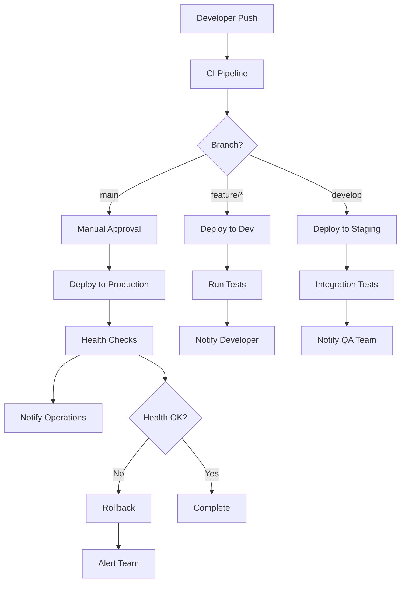

# GGP-GFX Deployment & Operations

## Table of Contents
1. [Deployment Strategy](#deployment-strategy)
2. [Infrastructure Architecture](#infrastructure-architecture)
3. [Container Orchestration](#container-orchestration)
4. [Monitoring & Observability](#monitoring--observability)
5. [Logging Strategy](#logging-strategy)
6. [Backup & Recovery](#backup--recovery)
7. [Scaling & Performance](#scaling--performance)
8. [Incident Response](#incident-response)

## Deployment Strategy

### Multi-Environment Pipeline

#### Environment Hierarchy
```yaml
Environments:
  Development:
    Purpose: Feature development and testing
    Auto-Deploy: All commits to feature branches
    Resources: Minimal (single instance)
    Data: Synthetic test data
    
  Staging:
    Purpose: Integration testing and QA
    Auto-Deploy: All commits to develop branch
    Resources: Production-like (scaled down)
    Data: Sanitized production data
    
  Production:
    Purpose: Live customer-facing environment
    Auto-Deploy: Manual approval required
    Resources: Full scale with redundancy
    Data: Live customer data
    
  Disaster Recovery:
    Purpose: Failover in case of production failure
    Auto-Deploy: Mirrored from production
    Resources: Full scale (standby mode)
    Data: Replicated production data
```

#### Deployment Flow


### Blue-Green Deployment

#### Implementation Strategy
```yaml
# Kubernetes Blue-Green Deployment
apiVersion: argoproj.io/v1alpha1
kind: Rollout
metadata:
  name: ggp-gfx-api
spec:
  replicas: 5
  strategy:
    blueGreen:
      # Traffic routing
      activeService: ggp-gfx-api-active
      previewService: ggp-gfx-api-preview
      
      # Automated testing
      autoPromotionEnabled: false
      scaleDownDelaySeconds: 30
      prePromotionAnalysis:
        templates:
        - templateName: success-rate
        args:
        - name: service-name
          value: ggp-gfx-api-preview
      postPromotionAnalysis:
        templates:
        - templateName: success-rate
        args:
        - name: service-name
          value: ggp-gfx-api-active
          
      # Rollback on failure
      abortScaleDownDelaySeconds: 30
      
  selector:
    matchLabels:
      app: ggp-gfx-api
      
  template:
    metadata:
      labels:
        app: ggp-gfx-api
    spec:
      containers:
      - name: api
        image: ghcr.io/ggp-gfx/api:latest
        ports:
        - containerPort: 8080
        resources:
          requests:
            memory: 512Mi
            cpu: 250m
          limits:
            memory: 1Gi
            cpu: 500m
        livenessProbe:
          httpGet:
            path: /health
            port: 8080
          initialDelaySeconds: 30
          periodSeconds: 10
        readinessProbe:
          httpGet:
            path: /ready
            port: 8080
          initialDelaySeconds: 5
          periodSeconds: 5
```

#### Rollback Strategy
```bash
#!/bin/bash
# rollback.sh - Automated rollback script

set -euo pipefail

NAMESPACE=${1:-default}
SERVICE_NAME=${2:-ggp-gfx-api}
ROLLBACK_REVISION=${3:-previous}

echo "🔄 Starting rollback for ${SERVICE_NAME} in ${NAMESPACE}"

# Get current and previous revisions
CURRENT_REVISION=$(kubectl get rollout ${SERVICE_NAME} -n ${NAMESPACE} -o jsonpath='{.status.currentPodHash}')
PREVIOUS_REVISION=$(kubectl get rollout ${SERVICE_NAME} -n ${NAMESPACE} -o jsonpath='{.status.stableRS}')

echo "📊 Current revision: ${CURRENT_REVISION}"
echo "📊 Previous revision: ${PREVIOUS_REVISION}"

# Initiate rollback
kubectl argo rollouts abort ${SERVICE_NAME} -n ${NAMESPACE}
kubectl argo rollouts undo ${SERVICE_NAME} -n ${NAMESPACE}

# Wait for rollback to complete
echo "⏳ Waiting for rollback to complete..."
kubectl argo rollouts status ${SERVICE_NAME} -n ${NAMESPACE} --timeout=300s

# Verify health
echo "🏥 Checking service health..."
HEALTH_CHECK_URL="https://${SERVICE_NAME}.${NAMESPACE}.svc.cluster.local:8080/health"

for i in {1..10}; do
    if kubectl run health-check --rm -i --restart=Never --image=curlimages/curl -- \
       curl -f "${HEALTH_CHECK_URL}"; then
        echo "✅ Service is healthy after rollback"
        break
    else
        echo "❌ Health check failed, attempt ${i}/10"
        sleep 10
    fi
done

# Send notification
curl -X POST "${SLACK_WEBHOOK_URL}" \
  -H 'Content-type: application/json' \
  --data "{\"text\":\"🔄 Rollback completed for ${SERVICE_NAME} in ${NAMESPACE}\"}"

echo "✅ Rollback completed successfully"
```

## Infrastructure Architecture

### Cloud-Native Architecture

#### AWS Infrastructure
```terraform
# infrastructure/terraform/main.tf
terraform {
  required_version = ">= 1.0"
  required_providers {
    aws = {
      source  = "hashicorp/aws"
      version = "~> 5.0"
    }
    kubernetes = {
      source  = "hashicorp/kubernetes"
      version = "~> 2.20"
    }
  }
  
  backend "s3" {
    bucket = "ggp-gfx-terraform-state"
    key    = "infrastructure/terraform.tfstate"
    region = "us-west-2"
  }
}

# VPC Configuration
module "vpc" {
  source = "terraform-aws-modules/vpc/aws"
  
  name = "ggp-gfx-vpc"
  cidr = "10.0.0.0/16"
  
  azs             = ["us-west-2a", "us-west-2b", "us-west-2c"]
  private_subnets = ["10.0.1.0/24", "10.0.2.0/24", "10.0.3.0/24"]
  public_subnets  = ["10.0.101.0/24", "10.0.102.0/24", "10.0.103.0/24"]
  
  enable_nat_gateway = true
  enable_vpn_gateway = false
  enable_dns_hostnames = true
  enable_dns_support = true
  
  tags = {
    Environment = var.environment
    Terraform   = "true"
  }
}

# EKS Cluster
module "eks" {
  source = "terraform-aws-modules/eks/aws"
  
  cluster_name    = "ggp-gfx-${var.environment}"
  cluster_version = "1.27"
  
  vpc_id     = module.vpc.vpc_id
  subnet_ids = module.vpc.private_subnets
  
  # Node groups
  eks_managed_node_groups = {
    general = {
      desired_size = 3
      max_size     = 10
      min_size     = 1
      
      instance_types = ["m6i.large"]
      capacity_type  = "ON_DEMAND"
      
      k8s_labels = {
        Environment = var.environment
        NodeGroup   = "general"
      }
    }
    
    gpu = {
      desired_size = 2
      max_size     = 5
      min_size     = 0
      
      instance_types = ["g4dn.xlarge"]
      capacity_type  = "ON_DEMAND"
      
      k8s_labels = {
        Environment = var.environment
        NodeGroup   = "gpu"
        "nvidia.com/gpu" = "present"
      }
      
      taints = {
        dedicated = {
          key    = "nvidia.com/gpu"
          value  = "true"
          effect = "NO_SCHEDULE"
        }
      }
    }
  }
  
  # Cluster add-ons
  cluster_addons = {
    coredns = {
      most_recent = true
    }
    kube-proxy = {
      most_recent = true
    }
    vpc-cni = {
      most_recent = true
    }
    aws-ebs-csi-driver = {
      most_recent = true
    }
  }
  
  tags = {
    Environment = var.environment
    Terraform   = "true"
  }
}

# RDS Database
resource "aws_db_instance" "postgres" {
  identifier = "ggp-gfx-${var.environment}"
  
  engine         = "postgres"
  engine_version = "15.3"
  instance_class = var.environment == "production" ? "db.r6g.xlarge" : "db.t3.medium"
  
  allocated_storage     = var.environment == "production" ? 500 : 100
  max_allocated_storage = var.environment == "production" ? 1000 : 200
  
  db_name  = "ggpgfx"
  username = "ggpgfx"
  password = random_password.db_password.result
  
  vpc_security_group_ids = [aws_security_group.rds.id]
  db_subnet_group_name   = aws_db_subnet_group.main.name
  
  backup_retention_period = var.environment == "production" ? 30 : 7
  backup_window          = "03:00-04:00"
  maintenance_window     = "sun:04:00-sun:05:00"
  
  skip_final_snapshot = var.environment != "production"
  deletion_protection = var.environment == "production"
  
  performance_insights_enabled = true
  monitoring_interval         = 60
  monitoring_role_arn        = aws_iam_role.rds_monitoring.arn
  
  tags = {
    Environment = var.environment
    Terraform   = "true"
  }
}

# ElastiCache Redis
resource "aws_elasticache_replication_group" "redis" {
  replication_group_id    = "ggp-gfx-${var.environment}"
  description             = "GGP-GFX Redis cluster"
  
  engine               = "redis"
  engine_version       = "7.0"
  node_type           = var.environment == "production" ? "cache.r6g.large" : "cache.t3.micro"
  port                = 6379
  parameter_group_name = "default.redis7"
  
  num_cache_clusters = var.environment == "production" ? 3 : 1
  
  subnet_group_name  = aws_elasticache_subnet_group.main.name
  security_group_ids = [aws_security_group.redis.id]
  
  at_rest_encryption_enabled = true
  transit_encryption_enabled = true
  auth_token                 = random_password.redis_password.result
  
  automatic_failover_enabled = var.environment == "production"
  multi_az_enabled          = var.environment == "production"
  
  snapshot_retention_limit = var.environment == "production" ? 7 : 1
  snapshot_window         = "03:00-05:00"
  
  tags = {
    Environment = var.environment
    Terraform   = "true"
  }
}

# S3 Buckets
resource "aws_s3_bucket" "media" {
  bucket = "ggp-gfx-media-${var.environment}-${random_id.bucket_suffix.hex}"
  
  tags = {
    Environment = var.environment
    Purpose     = "media-storage"
    Terraform   = "true"
  }
}

resource "aws_s3_bucket_versioning" "media" {
  bucket = aws_s3_bucket.media.id
  versioning_configuration {
    status = "Enabled"
  }
}

resource "aws_s3_bucket_server_side_encryption_configuration" "media" {
  bucket = aws_s3_bucket.media.id
  
  rule {
    apply_server_side_encryption_by_default {
      sse_algorithm = "AES256"
    }
  }
}

# CloudFront Distribution
resource "aws_cloudfront_distribution" "cdn" {
  origin {
    domain_name = aws_s3_bucket.media.bucket_regional_domain_name
    origin_id   = "S3-${aws_s3_bucket.media.id}"
    
    s3_origin_config {
      origin_access_identity = aws_cloudfront_origin_access_identity.media.cloudfront_access_identity_path
    }
  }
  
  enabled = true
  
  default_cache_behavior {
    allowed_methods        = ["DELETE", "GET", "HEAD", "OPTIONS", "PATCH", "POST", "PUT"]
    cached_methods         = ["GET", "HEAD"]
    target_origin_id       = "S3-${aws_s3_bucket.media.id}"
    compress              = true
    viewer_protocol_policy = "redirect-to-https"
    
    forwarded_values {
      query_string = false
      cookies {
        forward = "none"
      }
    }
    
    min_ttl     = 0
    default_ttl = 86400
    max_ttl     = 31536000
  }
  
  restrictions {
    geo_restriction {
      restriction_type = "none"
    }
  }
  
  viewer_certificate {
    cloudfront_default_certificate = true
  }
  
  tags = {
    Environment = var.environment
    Terraform   = "true"
  }
}
```

#### Multi-Region Setup
```yaml
# infrastructure/ansible/multi-region-setup.yml
---
- name: Setup Multi-Region Infrastructure
  hosts: localhost
  vars:
    regions:
      - us-west-2    # Primary
      - us-east-1    # Secondary
      - eu-west-1    # European customers
      - ap-northeast-1  # Asian customers
    
  tasks:
    - name: Deploy infrastructure in each region
      include_tasks: deploy-region.yml
      vars:
        region: "{{ item }}"
        is_primary: "{{ item == 'us-west-2' }}"
      loop: "{{ regions }}"
      
    - name: Setup cross-region replication
      include_tasks: setup-replication.yml
      vars:
        primary_region: us-west-2
        secondary_regions: "{{ regions | reject('match', 'us-west-2') | list }}"
        
    - name: Configure Route 53 health checks
      amazon.aws.route53:
        command: create
        zone: ggp-gfx.com
        record: api.ggp-gfx.com
        type: A
        value: "{{ hostvars['primary']['load_balancer_ip'] }}"
        health_check: true
        health_check_method: GET
        health_check_path: /health
        failover: PRIMARY
        
    - name: Setup monitoring and alerting
      include_tasks: setup-monitoring.yml
      vars:
        regions: "{{ regions }}"
```

## Container Orchestration

### Kubernetes Deployment

#### Service Manifest
```yaml
# k8s/api-gateway/deployment.yml
apiVersion: apps/v1
kind: Deployment
metadata:
  name: api-gateway
  namespace: ggp-gfx
  labels:
    app: api-gateway
    version: v1
spec:
  replicas: 3
  strategy:
    type: RollingUpdate
    rollingUpdate:
      maxSurge: 1
      maxUnavailable: 0
  selector:
    matchLabels:
      app: api-gateway
  template:
    metadata:
      labels:
        app: api-gateway
        version: v1
      annotations:
        prometheus.io/scrape: "true"
        prometheus.io/port: "9090"
        prometheus.io/path: "/metrics"
    spec:
      serviceAccountName: api-gateway
      containers:
      - name: api-gateway
        image: ghcr.io/ggp-gfx/api-gateway:latest
        ports:
        - containerPort: 8080
          name: http
        - containerPort: 9090
          name: metrics
        env:
        - name: DATABASE_URL
          valueFrom:
            secretKeyRef:
              name: database-credentials
              key: url
        - name: REDIS_URL
          valueFrom:
            secretKeyRef:
              name: redis-credentials
              key: url
        - name: JWT_SECRET
          valueFrom:
            secretKeyRef:
              name: jwt-secret
              key: secret
        resources:
          requests:
            memory: 512Mi
            cpu: 250m
            ephemeral-storage: 1Gi
          limits:
            memory: 1Gi
            cpu: 500m
            ephemeral-storage: 2Gi
        livenessProbe:
          httpGet:
            path: /health
            port: 8080
          initialDelaySeconds: 30
          periodSeconds: 10
          timeoutSeconds: 5
          failureThreshold: 3
        readinessProbe:
          httpGet:
            path: /ready
            port: 8080
          initialDelaySeconds: 5
          periodSeconds: 5
          timeoutSeconds: 3
          failureThreshold: 3
        securityContext:
          allowPrivilegeEscalation: false
          runAsNonRoot: true
          runAsUser: 65534
          readOnlyRootFilesystem: true
          capabilities:
            drop:
            - ALL
        volumeMounts:
        - name: tmp
          mountPath: /tmp
        - name: cache
          mountPath: /app/cache
      volumes:
      - name: tmp
        emptyDir: {}
      - name: cache
        emptyDir:
          sizeLimit: 1Gi
      imagePullSecrets:
      - name: ghcr-secret
      nodeSelector:
        kubernetes.io/arch: amd64
      tolerations:
      - key: "dedicated"
        operator: "Equal"
        value: "api"
        effect: "NoSchedule"
      affinity:
        podAntiAffinity:
          preferredDuringSchedulingIgnoredDuringExecution:
          - weight: 100
            podAffinityTerm:
              labelSelector:
                matchLabels:
                  app: api-gateway
              topologyKey: kubernetes.io/hostname

---
apiVersion: v1
kind: Service
metadata:
  name: api-gateway
  namespace: ggp-gfx
  labels:
    app: api-gateway
spec:
  selector:
    app: api-gateway
  ports:
  - name: http
    port: 80
    targetPort: 8080
  - name: metrics
    port: 9090
    targetPort: 9090
  type: ClusterIP

---
apiVersion: networking.k8s.io/v1
kind: Ingress
metadata:
  name: api-gateway
  namespace: ggp-gfx
  annotations:
    kubernetes.io/ingress.class: nginx
    cert-manager.io/cluster-issuer: letsencrypt-prod
    nginx.ingress.kubernetes.io/rate-limit: "100"
    nginx.ingress.kubernetes.io/rate-limit-burst: "150"
    nginx.ingress.kubernetes.io/cors-allow-origin: "https://app.ggp-gfx.com"
spec:
  tls:
  - hosts:
    - api.ggp-gfx.com
    secretName: api-gateway-tls
  rules:
  - host: api.ggp-gfx.com
    http:
      paths:
      - path: /
        pathType: Prefix
        backend:
          service:
            name: api-gateway
            port:
              number: 80
```

#### GPU-Enabled Services
```yaml
# k8s/video-processor/deployment.yml
apiVersion: apps/v1
kind: Deployment
metadata:
  name: video-processor
  namespace: ggp-gfx
spec:
  replicas: 2
  selector:
    matchLabels:
      app: video-processor
  template:
    metadata:
      labels:
        app: video-processor
    spec:
      nodeSelector:
        accelerator: nvidia-tesla-t4
      tolerations:
      - key: nvidia.com/gpu
        operator: Exists
        effect: NoSchedule
      containers:
      - name: video-processor
        image: ghcr.io/ggp-gfx/video-processor:latest
        resources:
          requests:
            memory: 4Gi
            cpu: 2
            nvidia.com/gpu: 1
          limits:
            memory: 8Gi
            cpu: 4
            nvidia.com/gpu: 1
        env:
        - name: CUDA_VISIBLE_DEVICES
          value: "0"
        - name: NVIDIA_VISIBLE_DEVICES
          value: "all"
        - name: NVIDIA_DRIVER_CAPABILITIES
          value: "compute,utility"
        volumeMounts:
        - name: dev-shm
          mountPath: /dev/shm
        - name: gpu-metrics
          mountPath: /var/lib/nvidia
      volumes:
      - name: dev-shm
        emptyDir:
          medium: Memory
          sizeLimit: 2Gi
      - name: gpu-metrics
        hostPath:
          path: /var/lib/nvidia
      runtimeClassName: nvidia
```

### Helm Charts

#### Chart Structure
```yaml
# charts/ggp-gfx/Chart.yaml
apiVersion: v2
name: ggp-gfx
description: GGP-GFX Gaming Production Platform
type: application
version: 1.0.0
appVersion: "1.0.0"
keywords:
  - gaming
  - streaming
  - video-production
maintainers:
  - name: GGP-GFX Team
    email: dev@ggp-gfx.com
dependencies:
  - name: postgresql
    version: 12.x.x
    repository: https://charts.bitnami.com/bitnami
    condition: postgresql.enabled
  - name: redis
    version: 17.x.x
    repository: https://charts.bitnami.com/bitnami
    condition: redis.enabled
  - name: nginx-ingress
    version: 4.x.x
    repository: https://kubernetes.github.io/ingress-nginx
    condition: ingress.enabled
```

#### Values Configuration
```yaml
# charts/ggp-gfx/values.yaml
global:
  imageRegistry: ghcr.io
  imagePullSecrets:
    - ghcr-secret
  storageClass: gp3
  
# API Gateway Configuration
apiGateway:
  enabled: true
  replicaCount: 3
  image:
    repository: ggp-gfx/api-gateway
    tag: latest
    pullPolicy: IfNotPresent
  
  service:
    type: ClusterIP
    port: 80
    
  ingress:
    enabled: true
    className: nginx
    annotations:
      cert-manager.io/cluster-issuer: letsencrypt-prod
      nginx.ingress.kubernetes.io/rate-limit: "100"
    hosts:
      - host: api.ggp-gfx.com
        paths:
          - path: /
            pathType: Prefix
    tls:
      - secretName: api-gateway-tls
        hosts:
          - api.ggp-gfx.com
  
  resources:
    requests:
      memory: 512Mi
      cpu: 250m
    limits:
      memory: 1Gi
      cpu: 500m
  
  autoscaling:
    enabled: true
    minReplicas: 3
    maxReplicas: 10
    targetCPUUtilizationPercentage: 70
    targetMemoryUtilizationPercentage: 80

# Video Processor Configuration
videoProcessor:
  enabled: true
  replicaCount: 2
  image:
    repository: ggp-gfx/video-processor
    tag: latest
  
  resources:
    requests:
      memory: 4Gi
      cpu: 2
      nvidia.com/gpu: 1
    limits:
      memory: 8Gi
      cpu: 4
      nvidia.com/gpu: 1
  
  nodeSelector:
    accelerator: nvidia-tesla-t4
  
  tolerations:
    - key: nvidia.com/gpu
      operator: Exists
      effect: NoSchedule

# Database Configuration
postgresql:
  enabled: true
  auth:
    postgresPassword: ""  # Set in secrets
    username: ggpgfx
    password: ""  # Set in secrets
    database: ggpgfx
  
  primary:
    persistence:
      enabled: true
      size: 100Gi
      storageClass: gp3
  
  metrics:
    enabled: true
    serviceMonitor:
      enabled: true

# Redis Configuration
redis:
  enabled: true
  auth:
    enabled: true
    password: ""  # Set in secrets
  
  master:
    persistence:
      enabled: true
      size: 20Gi
      storageClass: gp3
  
  replica:
    replicaCount: 2
    persistence:
      enabled: true
      size: 20Gi
      storageClass: gp3
  
  metrics:
    enabled: true
    serviceMonitor:
      enabled: true

# Monitoring
monitoring:
  prometheus:
    enabled: true
  
  grafana:
    enabled: true
    adminPassword: ""  # Set in secrets
  
  alertmanager:
    enabled: true
```

## Monitoring & Observability

### Prometheus Configuration

#### Monitoring Stack
```yaml
# k8s/monitoring/prometheus.yml
apiVersion: monitoring.coreos.com/v1
kind: Prometheus
metadata:
  name: prometheus
  namespace: monitoring
spec:
  serviceAccountName: prometheus
  
  # Data retention
  retention: 30d
  retentionSize: 50GiB
  
  # Storage
  storage:
    volumeClaimTemplate:
      spec:
        storageClassName: gp3
        accessModes: ["ReadWriteOnce"]
        resources:
          requests:
            storage: 100Gi
  
  # Resource requirements
  resources:
    requests:
      memory: 2Gi
      cpu: 1
    limits:
      memory: 4Gi
      cpu: 2
  
  # Service discovery
  serviceMonitorSelector:
    matchLabels:
      team: ggp-gfx
  
  podMonitorSelector: {}
  
  ruleSelector:
    matchLabels:
      team: ggp-gfx
  
  # Alerting
  alerting:
    alertmanagers:
    - namespace: monitoring
      name: alertmanager
      port: web
  
  # External labels
  externalLabels:
    cluster: ggp-gfx-production
    replica: prometheus

---
apiVersion: monitoring.coreos.com/v1
kind: ServiceMonitor
metadata:
  name: api-gateway
  namespace: monitoring
  labels:
    team: ggp-gfx
spec:
  selector:
    matchLabels:
      app: api-gateway
  namespaceSelector:
    matchNames:
    - ggp-gfx
  endpoints:
  - port: metrics
    interval: 30s
    path: /metrics
    scrapeTimeout: 10s

---
apiVersion: monitoring.coreos.com/v1
kind: PrometheusRule
metadata:
  name: ggp-gfx-alerts
  namespace: monitoring
  labels:
    team: ggp-gfx
spec:
  groups:
  - name: api-gateway
    rules:
    - alert: APIGatewayHighErrorRate
      expr: |
        (
          sum(rate(http_requests_total{job="api-gateway",status=~"5.."}[5m])) /
          sum(rate(http_requests_total{job="api-gateway"}[5m]))
        ) > 0.05
      for: 5m
      labels:
        severity: critical
        service: api-gateway
      annotations:
        summary: "API Gateway error rate is above 5%"
        description: "The API Gateway error rate has been above 5% for more than 5 minutes"
    
    - alert: APIGatewayHighLatency
      expr: |
        histogram_quantile(0.95, 
          sum(rate(http_request_duration_seconds_bucket{job="api-gateway"}[5m])) by (le)
        ) > 2
      for: 5m
      labels:
        severity: warning
        service: api-gateway
      annotations:
        summary: "API Gateway 95th percentile latency is above 2s"
        description: "The API Gateway 95th percentile latency has been above 2 seconds for more than 5 minutes"
  
  - name: video-processor
    rules:
    - alert: VideoProcessorGPUUtilization
      expr: |
        nvidia_gpu_utilization_gpu > 90
      for: 10m
      labels:
        severity: warning
        service: video-processor
      annotations:
        summary: "Video processor GPU utilization is above 90%"
        description: "GPU utilization has been above 90% for more than 10 minutes"
    
    - alert: VideoProcessorMemoryUsage
      expr: |
        (
          nvidia_gpu_memory_used_bytes / nvidia_gpu_memory_total_bytes
        ) > 0.85
      for: 5m
      labels:
        severity: warning
        service: video-processor
      annotations:
        summary: "Video processor GPU memory usage is above 85%"
        description: "GPU memory usage has been above 85% for more than 5 minutes"
```

### Grafana Dashboards

#### Application Metrics Dashboard
```json
{
  "dashboard": {
    "id": null,
    "title": "GGP-GFX Application Metrics",
    "tags": ["ggp-gfx", "application"],
    "timezone": "browser",
    "panels": [
      {
        "id": 1,
        "title": "Request Rate",
        "type": "graph",
        "targets": [
          {
            "expr": "sum(rate(http_requests_total{job=\"api-gateway\"}[5m])) by (method, status)",
            "legendFormat": "{{method}} {{status}}"
          }
        ],
        "yAxes": [
          {
            "label": "Requests/sec",
            "min": 0
          }
        ],
        "legend": {
          "show": true
        },
        "gridPos": {
          "h": 8,
          "w": 12,
          "x": 0,
          "y": 0
        }
      },
      {
        "id": 2,
        "title": "Response Time",
        "type": "graph",
        "targets": [
          {
            "expr": "histogram_quantile(0.50, sum(rate(http_request_duration_seconds_bucket{job=\"api-gateway\"}[5m])) by (le))",
            "legendFormat": "50th percentile"
          },
          {
            "expr": "histogram_quantile(0.95, sum(rate(http_request_duration_seconds_bucket{job=\"api-gateway\"}[5m])) by (le))",
            "legendFormat": "95th percentile"
          },
          {
            "expr": "histogram_quantile(0.99, sum(rate(http_request_duration_seconds_bucket{job=\"api-gateway\"}[5m])) by (le))",
            "legendFormat": "99th percentile"
          }
        ],
        "yAxes": [
          {
            "label": "Seconds",
            "min": 0
          }
        ],
        "gridPos": {
          "h": 8,
          "w": 12,
          "x": 12,
          "y": 0
        }
      },
      {
        "id": 3,
        "title": "GPU Utilization",
        "type": "graph",
        "targets": [
          {
            "expr": "nvidia_gpu_utilization_gpu",
            "legendFormat": "GPU {{instance}}"
          }
        ],
        "yAxes": [
          {
            "label": "Percent",
            "min": 0,
            "max": 100
          }
        ],
        "gridPos": {
          "h": 8,
          "w": 12,
          "x": 0,
          "y": 8
        }
      },
      {
        "id": 4,
        "title": "Active Streams",
        "type": "stat",
        "targets": [
          {
            "expr": "sum(active_streams_total)",
            "legendFormat": "Active Streams"
          }
        ],
        "fieldConfig": {
          "defaults": {
            "color": {
              "mode": "thresholds"
            },
            "thresholds": {
              "steps": [
                {
                  "color": "green",
                  "value": null
                },
                {
                  "color": "yellow",
                  "value": 50
                },
                {
                  "color": "red",
                  "value": 100
                }
              ]
            }
          }
        },
        "gridPos": {
          "h": 8,
          "w": 12,
          "x": 12,
          "y": 8
        }
      }
    ],
    "time": {
      "from": "now-1h",
      "to": "now"
    },
    "refresh": "30s"
  }
}
```

### Distributed Tracing

#### Jaeger Configuration
```yaml
# k8s/monitoring/jaeger.yml
apiVersion: jaegertracing.io/v1
kind: Jaeger
metadata:
  name: jaeger
  namespace: monitoring
spec:
  strategy: production
  
  collector:
    maxReplicas: 5
    resources:
      requests:
        memory: 1Gi
        cpu: 500m
      limits:
        memory: 2Gi
        cpu: 1
  
  query:
    replicas: 2
    resources:
      requests:
        memory: 512Mi
        cpu: 250m
      limits:
        memory: 1Gi
        cpu: 500m
  
  storage:
    type: elasticsearch
    elasticsearch:
      nodeCount: 3
      storage:
        storageClassName: gp3
        size: 100Gi
      resources:
        requests:
          memory: 2Gi
          cpu: 1
        limits:
          memory: 4Gi
          cpu: 2
  
  ingress:
    enabled: true
    annotations:
      kubernetes.io/ingress.class: nginx
      cert-manager.io/cluster-issuer: letsencrypt-prod
    hosts:
      - jaeger.ggp-gfx.com
    tls:
      - secretName: jaeger-tls
        hosts:
          - jaeger.ggp-gfx.com
```

## Logging Strategy

### Centralized Logging

#### ELK Stack Configuration
```yaml
# k8s/logging/elasticsearch.yml
apiVersion: elasticsearch.k8s.elastic.co/v1
kind: Elasticsearch
metadata:
  name: elasticsearch
  namespace: logging
spec:
  version: 8.8.0
  
  nodeSets:
  - name: master
    count: 3
    config:
      node.roles: ["master"]
      cluster.remote.connect: false
    podTemplate:
      spec:
        containers:
        - name: elasticsearch
          resources:
            requests:
              memory: 2Gi
              cpu: 1
            limits:
              memory: 4Gi
              cpu: 2
        volumes:
        - name: elasticsearch-data
          persistentVolumeClaim:
            claimName: elasticsearch-data
    volumeClaimTemplates:
    - metadata:
        name: elasticsearch-data
      spec:
        accessModes: ["ReadWriteOnce"]
        storageClassName: gp3
        resources:
          requests:
            storage: 100Gi
  
  - name: data
    count: 3
    config:
      node.roles: ["data", "ingest"]
    podTemplate:
      spec:
        containers:
        - name: elasticsearch
          resources:
            requests:
              memory: 4Gi
              cpu: 2
            limits:
              memory: 8Gi
              cpu: 4
    volumeClaimTemplates:
    - metadata:
        name: elasticsearch-data
      spec:
        accessModes: ["ReadWriteOnce"]
        storageClassName: gp3
        resources:
          requests:
            storage: 500Gi

---
apiVersion: kibana.k8s.elastic.co/v1
kind: Kibana
metadata:
  name: kibana
  namespace: logging
spec:
  version: 8.8.0
  count: 2
  
  elasticsearchRef:
    name: elasticsearch
  
  config:
    server.publicBaseUrl: https://kibana.ggp-gfx.com
    
  podTemplate:
    spec:
      containers:
      - name: kibana
        resources:
          requests:
            memory: 1Gi
            cpu: 500m
          limits:
            memory: 2Gi
            cpu: 1

---
apiVersion: networking.k8s.io/v1
kind: Ingress
metadata:
  name: kibana
  namespace: logging
  annotations:
    kubernetes.io/ingress.class: nginx
    cert-manager.io/cluster-issuer: letsencrypt-prod
spec:
  tls:
  - hosts:
    - kibana.ggp-gfx.com
    secretName: kibana-tls
  rules:
  - host: kibana.ggp-gfx.com
    http:
      paths:
      - path: /
        pathType: Prefix
        backend:
          service:
            name: kibana-kb-http
            port:
              number: 5601
```

#### Fluent Bit Configuration
```yaml
# k8s/logging/fluent-bit.yml
apiVersion: v1
kind: ConfigMap
metadata:
  name: fluent-bit-config
  namespace: logging
data:
  fluent-bit.conf: |
    [SERVICE]
        Flush         1
        Log_Level     info
        Daemon        off
        Parsers_File  parsers.conf
        HTTP_Server   On
        HTTP_Listen   0.0.0.0
        HTTP_Port     2020
    
    [INPUT]
        Name              tail
        Path              /var/log/containers/*.log
        Parser            docker
        Tag               kube.*
        Refresh_Interval  5
        Mem_Buf_Limit     50MB
        Skip_Long_Lines   On
    
    [FILTER]
        Name                kubernetes
        Match               kube.*
        Kube_URL            https://kubernetes.default.svc:443
        Kube_CA_File        /var/run/secrets/kubernetes.io/serviceaccount/ca.crt
        Kube_Token_File     /var/run/secrets/kubernetes.io/serviceaccount/token
        Kube_Tag_Prefix     kube.var.log.containers.
        Merge_Log           On
        Merge_Log_Key       log_processed
        K8S-Logging.Parser  On
        K8S-Logging.Exclude Off
    
    [FILTER]
        Name                parser
        Match               kube.*
        Key_Name            log
        Parser              json
        Reserve_Data        On
    
    [OUTPUT]
        Name            es
        Match           kube.*
        Host            elasticsearch-es-http.logging.svc.cluster.local
        Port            9200
        HTTP_User       elastic
        HTTP_Passwd     ${ELASTICSEARCH_PASSWORD}
        Logstash_Format On
        Logstash_Prefix ggp-gfx
        Retry_Limit     False
        Type            _doc
        Replace_Dots    On
        Remove_Keys     kubernetes.pod_id,kubernetes.master_url,kubernetes.container_image_id
        
  parsers.conf: |
    [PARSER]
        Name        docker
        Format      json
        Time_Key    time
        Time_Format %Y-%m-%dT%H:%M:%S.%L
        Time_Keep   On
    
    [PARSER]
        Name        json
        Format      json
        Time_Key    timestamp
        Time_Format %Y-%m-%dT%H:%M:%S.%L
        Time_Keep   On

---
apiVersion: apps/v1
kind: DaemonSet
metadata:
  name: fluent-bit
  namespace: logging
spec:
  selector:
    matchLabels:
      name: fluent-bit
  template:
    metadata:
      labels:
        name: fluent-bit
    spec:
      serviceAccountName: fluent-bit
      tolerations:
      - key: node-role.kubernetes.io/master
        operator: Exists
        effect: NoSchedule
      containers:
      - name: fluent-bit
        image: fluent/fluent-bit:2.1.4
        env:
        - name: ELASTICSEARCH_PASSWORD
          valueFrom:
            secretKeyRef:
              name: elasticsearch-es-elastic-user
              key: elastic
        volumeMounts:
        - name: varlog
          mountPath: /var/log
        - name: varlibdockercontainers
          mountPath: /var/lib/docker/containers
          readOnly: true
        - name: fluent-bit-config
          mountPath: /fluent-bit/etc/
        resources:
          requests:
            cpu: 100m
            memory: 128Mi
          limits:
            cpu: 200m
            memory: 256Mi
      volumes:
      - name: varlog
        hostPath:
          path: /var/log
      - name: varlibdockercontainers
        hostPath:
          path: /var/lib/docker/containers
      - name: fluent-bit-config
        configMap:
          name: fluent-bit-config
```

## Backup & Recovery

### Database Backup Strategy

#### Automated Backup System
```bash
#!/bin/bash
# scripts/backup-database.sh

set -euo pipefail

# Configuration
BACKUP_RETENTION_DAYS=${BACKUP_RETENTION_DAYS:-30}
S3_BUCKET=${S3_BUCKET:-ggp-gfx-backups}
DATABASE_URL=${DATABASE_URL}
BACKUP_PREFIX="postgresql-backup"

# Generate backup filename with timestamp
BACKUP_DATE=$(date +%Y%m%d_%H%M%S)
BACKUP_FILENAME="${BACKUP_PREFIX}_${BACKUP_DATE}.sql.gz"
LOCAL_BACKUP_PATH="/tmp/${BACKUP_FILENAME}"

echo "🗄️ Starting database backup: ${BACKUP_FILENAME}"

# Create backup
pg_dump "${DATABASE_URL}" | gzip > "${LOCAL_BACKUP_PATH}"

# Verify backup file
if [[ ! -f "${LOCAL_BACKUP_PATH}" ]] || [[ ! -s "${LOCAL_BACKUP_PATH}" ]]; then
    echo "❌ Backup file is missing or empty"
    exit 1
fi

echo "✅ Database backup created: $(du -h ${LOCAL_BACKUP_PATH} | cut -f1)"

# Upload to S3
aws s3 cp "${LOCAL_BACKUP_PATH}" "s3://${S3_BUCKET}/database/${BACKUP_FILENAME}" \
    --storage-class STANDARD_IA \
    --server-side-encryption AES256

echo "☁️ Backup uploaded to S3"

# Clean up local file
rm -f "${LOCAL_BACKUP_PATH}"

# Clean up old backups
CUTOFF_DATE=$(date -d "${BACKUP_RETENTION_DAYS} days ago" +%Y%m%d)

aws s3 ls "s3://${S3_BUCKET}/database/" | while read -r line; do
    BACKUP_DATE_FROM_LINE=$(echo "$line" | awk '{print $4}' | grep -o '[0-9]\{8\}' | head -1)
    
    if [[ "${BACKUP_DATE_FROM_LINE}" < "${CUTOFF_DATE}" ]]; then
        BACKUP_FILE=$(echo "$line" | awk '{print $4}')
        echo "🗑️ Deleting old backup: ${BACKUP_FILE}"
        aws s3 rm "s3://${S3_BUCKET}/database/${BACKUP_FILE}"
    fi
done

echo "🎉 Backup process completed successfully"

# Send notification
curl -X POST "${SLACK_WEBHOOK_URL}" \
  -H 'Content-type: application/json' \
  --data "{\"text\":\"✅ Database backup completed: ${BACKUP_FILENAME}\"}"
```

#### Kubernetes CronJob for Backups
```yaml
# k8s/backup/database-backup.yml
apiVersion: batch/v1
kind: CronJob
metadata:
  name: database-backup
  namespace: ggp-gfx
spec:
  schedule: "0 2 * * *"  # Daily at 2 AM
  timeZone: "UTC"
  concurrencyPolicy: Forbid
  successfulJobsHistoryLimit: 3
  failedJobsHistoryLimit: 3
  
  jobTemplate:
    spec:
      backoffLimit: 2
      template:
        metadata:
          annotations:
            sidecar.istio.io/inject: "false"
        spec:
          restartPolicy: OnFailure
          serviceAccountName: backup-operator
          
          containers:
          - name: backup
            image: postgres:15
            command:
            - /bin/bash
            - -c
            - |
              set -euo pipefail
              
              # Install AWS CLI
              apt-get update && apt-get install -y awscli
              
              # Run backup script
              /scripts/backup-database.sh
              
            env:
            - name: DATABASE_URL
              valueFrom:
                secretKeyRef:
                  name: database-credentials
                  key: url
            - name: AWS_ACCESS_KEY_ID
              valueFrom:
                secretKeyRef:
                  name: aws-credentials
                  key: access-key-id
            - name: AWS_SECRET_ACCESS_KEY
              valueFrom:
                secretKeyRef:
                  name: aws-credentials
                  key: secret-access-key
            - name: S3_BUCKET
              value: "ggp-gfx-backups-production"
            - name: SLACK_WEBHOOK_URL
              valueFrom:
                secretKeyRef:
                  name: slack-webhook
                  key: url
                  
            volumeMounts:
            - name: backup-scripts
              mountPath: /scripts
              
            resources:
              requests:
                memory: 512Mi
                cpu: 250m
              limits:
                memory: 1Gi
                cpu: 500m
                
          volumes:
          - name: backup-scripts
            configMap:
              name: backup-scripts
              defaultMode: 0755
```

### Disaster Recovery Plan

#### Recovery Procedures
```yaml
# Disaster Recovery Runbook
Recovery_Procedures:
  Database_Recovery:
    RTO: 30 minutes  # Recovery Time Objective
    RPO: 1 hour      # Recovery Point Objective
    
    Steps:
      1. Assess_Damage:
         - Check database connectivity
         - Verify data corruption extent
         - Identify last known good state
      
      2. Initiate_Recovery:
         - Stop application services
         - Create new database instance
         - Download latest backup from S3
      
      3. Restore_Data:
         - Restore from backup
         - Apply transaction logs if available
         - Verify data integrity
      
      4. Restart_Services:
         - Update connection strings
         - Restart application pods
         - Run health checks
         
  Application_Recovery:
    RTO: 15 minutes
    RPO: 0 (stateless)
    
    Steps:
      1. Switch_Traffic:
         - Update DNS to point to DR region
         - Activate standby load balancers
      
      2. Scale_Services:
         - Scale up pods in DR region
         - Verify all services are healthy
      
      3. Data_Sync:
         - Sync any cached data
         - Update session stores
```

## Scaling & Performance

### Horizontal Pod Autoscaling

#### HPA Configuration
```yaml
# k8s/autoscaling/hpa.yml
apiVersion: autoscaling/v2
kind: HorizontalPodAutoscaler
metadata:
  name: api-gateway-hpa
  namespace: ggp-gfx
spec:
  scaleTargetRef:
    apiVersion: apps/v1
    kind: Deployment
    name: api-gateway
  
  minReplicas: 3
  maxReplicas: 20
  
  metrics:
  - type: Resource
    resource:
      name: cpu
      target:
        type: Utilization
        averageUtilization: 70
  
  - type: Resource
    resource:
      name: memory
      target:
        type: Utilization
        averageUtilization: 80
  
  - type: Pods
    pods:
      metric:
        name: http_requests_per_second
      target:
        type: AverageValue
        averageValue: "100"
  
  behavior:
    scaleUp:
      stabilizationWindowSeconds: 60
      policies:
      - type: Percent
        value: 100
        periodSeconds: 15
      - type: Pods
        value: 2
        periodSeconds: 60
    scaleDown:
      stabilizationWindowSeconds: 300
      policies:
      - type: Percent
        value: 10
        periodSeconds: 60

---
apiVersion: autoscaling/v2
kind: HorizontalPodAutoscaler
metadata:
  name: video-processor-hpa
  namespace: ggp-gfx
spec:
  scaleTargetRef:
    apiVersion: apps/v1
    kind: Deployment
    name: video-processor
  
  minReplicas: 2
  maxReplicas: 10
  
  metrics:
  - type: Resource
    resource:
      name: nvidia.com/gpu
      target:
        type: Utilization
        averageUtilization: 80
  
  - type: Pods
    pods:
      metric:
        name: processing_queue_length
      target:
        type: AverageValue
        averageValue: "5"
  
  behavior:
    scaleUp:
      stabilizationWindowSeconds: 120  # GPU startup takes longer
      policies:
      - type: Pods
        value: 1
        periodSeconds: 120
    scaleDown:
      stabilizationWindowSeconds: 600  # Keep GPUs longer to avoid churn
      policies:
      - type: Pods
        value: 1
        periodSeconds: 300
```

### Cluster Autoscaling

#### Node Pool Configuration
```yaml
# k8s/autoscaling/cluster-autoscaler.yml
apiVersion: apps/v1
kind: Deployment
metadata:
  name: cluster-autoscaler
  namespace: kube-system
spec:
  replicas: 1
  selector:
    matchLabels:
      app: cluster-autoscaler
  template:
    metadata:
      labels:
        app: cluster-autoscaler
    spec:
      serviceAccountName: cluster-autoscaler
      containers:
      - image: k8s.gcr.io/autoscaling/cluster-autoscaler:v1.27.0
        name: cluster-autoscaler
        resources:
          limits:
            cpu: 100m
            memory: 300Mi
          requests:
            cpu: 100m
            memory: 300Mi
        command:
        - ./cluster-autoscaler
        - --v=4
        - --stderrthreshold=info
        - --cloud-provider=aws
        - --skip-nodes-with-local-storage=false
        - --expander=least-waste
        - --node-group-auto-discovery=asg:tag=k8s.io/cluster-autoscaler/enabled,k8s.io/cluster-autoscaler/ggp-gfx-production
        - --balance-similar-node-groups
        - --scale-down-enabled=true
        - --scale-down-delay-after-add=10m
        - --scale-down-unneeded-time=10m
        - --scale-down-utilization-threshold=0.5
        env:
        - name: AWS_REGION
          value: us-west-2
```

## Incident Response

### Alerting System

#### Alert Manager Configuration
```yaml
# k8s/monitoring/alertmanager.yml
apiVersion: monitoring.coreos.com/v1alpha1
kind: AlertmanagerConfig
metadata:
  name: ggp-gfx-alerts
  namespace: monitoring
spec:
  route:
    groupBy: ['alertname', 'cluster', 'service']
    groupWait: 30s
    groupInterval: 5m
    repeatInterval: 4h
    receiver: 'default'
    routes:
    - match:
        severity: critical
      receiver: 'critical-alerts'
      groupWait: 0s
      groupInterval: 1m
      repeatInterval: 30m
    - match:
        service: video-processor
      receiver: 'video-team'
    - match:
        service: api-gateway
      receiver: 'backend-team'
  
  receivers:
  - name: 'default'
    slackConfigs:
    - apiURL:
        key: url
        name: slack-webhook
      channel: '#alerts'
      title: '{{ range .Alerts }}{{ .Annotations.summary }}{{ end }}'
      text: '{{ range .Alerts }}{{ .Annotations.description }}{{ end }}'
  
  - name: 'critical-alerts'
    slackConfigs:
    - apiURL:
        key: url
        name: slack-webhook
      channel: '#critical-alerts'
      title: '🚨 CRITICAL: {{ range .Alerts }}{{ .Annotations.summary }}{{ end }}'
      text: '{{ range .Alerts }}{{ .Annotations.description }}{{ end }}'
    pagerdutyConfigs:
    - routingKey:
        key: routing-key
        name: pagerduty-key
      description: '{{ range .Alerts }}{{ .Annotations.summary }}{{ end }}'
  
  - name: 'video-team'
    slackConfigs:
    - apiURL:
        key: url
        name: slack-webhook
      channel: '#video-team'
      title: '📹 Video Service Alert: {{ range .Alerts }}{{ .Annotations.summary }}{{ end }}'
  
  - name: 'backend-team'
    slackConfigs:
    - apiURL:
        key: url
        name: slack-webhook
      channel: '#backend-team'
      title: '⚙️ Backend Service Alert: {{ range .Alerts }}{{ .Annotations.summary }}{{ end }}'
```

### Incident Response Playbook

#### Automated Response Scripts
```bash
#!/bin/bash
# scripts/incident-response.sh

set -euo pipefail

INCIDENT_TYPE=${1:-unknown}
SEVERITY=${2:-medium}
COMPONENT=${3:-unknown}

echo "🚨 Incident Response Triggered"
echo "Type: ${INCIDENT_TYPE}"
echo "Severity: ${SEVERITY}"
echo "Component: ${COMPONENT}"

case "${INCIDENT_TYPE}" in
  "high-error-rate")
    echo "📊 High error rate detected, scaling up services..."
    kubectl scale deployment api-gateway --replicas=10 -n ggp-gfx
    kubectl scale deployment video-processor --replicas=5 -n ggp-gfx
    ;;
    
  "database-connection-failure")
    echo "🗄️ Database connection failure, checking connections..."
    kubectl get pods -n ggp-gfx -l app=api-gateway -o wide
    kubectl logs -n ggp-gfx -l app=api-gateway --tail=100
    ;;
    
  "gpu-memory-exhaustion")
    echo "🎮 GPU memory exhaustion, restarting video processors..."
    kubectl rollout restart deployment/video-processor -n ggp-gfx
    kubectl rollout status deployment/video-processor -n ggp-gfx
    ;;
    
  "disk-space-low")
    echo "💾 Low disk space, cleaning up old logs..."
    kubectl exec -n logging deployment/elasticsearch -- \
      curl -X DELETE "localhost:9200/ggp-gfx-*" \
      --data '{"query": {"range": {"@timestamp": {"lt": "now-7d"}}}}'
    ;;
    
  *)
    echo "❓ Unknown incident type, manual intervention required"
    ;;
esac

# Send incident notification
curl -X POST "${SLACK_WEBHOOK_URL}" \
  -H 'Content-type: application/json' \
  --data "{
    \"text\": \"🚨 Incident Response Activated\",
    \"attachments\": [{
      \"color\": \"danger\",
      \"fields\": [
        {\"title\": \"Type\", \"value\": \"${INCIDENT_TYPE}\", \"short\": true},
        {\"title\": \"Severity\", \"value\": \"${SEVERITY}\", \"short\": true},
        {\"title\": \"Component\", \"value\": \"${COMPONENT}\", \"short\": true},
        {\"title\": \"Time\", \"value\": \"$(date -u)\", \"short\": true}
      ]
    }]
  }"

echo "✅ Incident response actions completed"
```

#### On-Call Rotation
```yaml
# On-Call Schedule Configuration
oncall_schedule:
  primary:
    - name: "Backend Team"
      schedule: "Mon-Fri 9:00-17:00 PST"
      escalation_delay: 15m
      
    - name: "DevOps Team"
      schedule: "24/7"
      escalation_delay: 5m
      
    - name: "Video Team"
      schedule: "Mon-Fri 8:00-18:00 PST"
      escalation_delay: 10m
  
  escalation_policy:
    1: "Notify assigned team"
    2: "Escalate to team lead (after 15 minutes)"
    3: "Escalate to engineering manager (after 30 minutes)"
    4: "Escalate to VP Engineering (after 1 hour)"
  
  notification_channels:
    - slack: "#incidents"
    - pagerduty: "ggp-gfx-oncall"
    - email: "oncall@ggp-gfx.com"
```

---

Next: [Security & Compliance →](09-security-compliance.md)