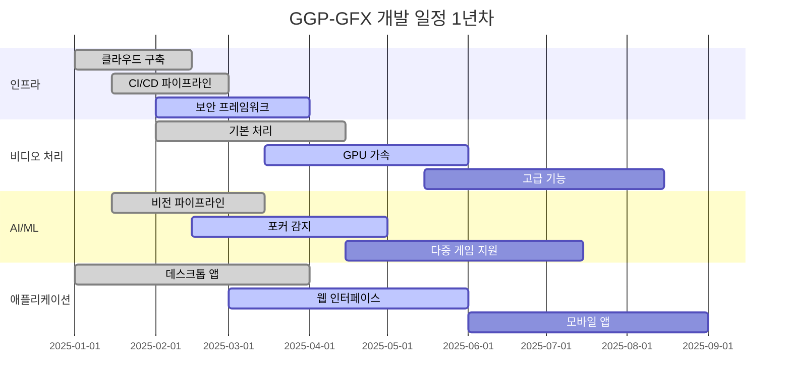

# GGP-GFX 프로젝트 관리

## 목차
1. [개발 로드맵](#개발-로드맵)
2. [팀 구조](#팀-구조)
3. [리스크 관리](#리스크-관리)
4. [일정 및 마일스톤](#일정-및-마일스톤)
5. [리소스 계획](#리소스-계획)
6. [품질 보증](#품질-보증)
7. [이해관계자 관리](#이해관계자-관리)
8. [프로젝트 거버넌스](#프로젝트-거버넌스)

## 개발 로드맵

### 제품 페이즈

#### 1단계: 기반 구축 (1-6개월)
```yaml
Phase_1_Foundation:
  기간: 6개월
  팀_규모: 15-20명 개발자
  예산: $2.5M
  
  목표:
    - 핵심 아키텍처 구축
    - 기본 비디오 처리 구현
    - MVP 사용자 인터페이스 생성
    - 개발 인프라 구축
    
  주요_산출물:
    핵심_인프라:
      - 클라우드 인프라 구축 (AWS/Kubernetes)
      - CI/CD 파이프라인
      - 개발 환경
      - 보안 프레임워크
      
    비디오_처리_엔진:
      - 다중 소스 비디오 입력
      - 기본 GPU 가속
      - 실시간 인코딩/디코딩
      - 형식 변환
      
    AI_기반:
      - 컴퓨터 비전 파이프라인
      - 기본 게임 감지 (포커)
      - 훈련 데이터 수집
      - 모델 배포 인프라
      
    사용자_인터페이스:
      - 데스크톱 애플리케이션 (Electron)
      - 기본 웹 인터페이스
      - 인증 시스템
      - 프로젝트 관리
      
  성공_기준:
    - 1080p/60fps에서 4개 비디오 소스 동시 처리
    - 95% 정확도로 포커 카드 감지
    - 100명 동시 사용자 지원
    - 스테이징 환경에서 99.5% 가동시간
```

#### 2단계: 핵심 기능 (7-12개월)
```yaml
Phase_2_Core_Features:
  기간: 6개월
  팀_규모: 25-30명 개발자
  예산: $3M
  
  목표:
    - 고급 비디오 처리 기능
    - 다중 게임 AI 지원
    - 전문 그래픽 엔진
    - 다중 플랫폼 스트리밍
    
  주요_산출물:
    고급_비디오_처리:
      - 스필 억제가 있는 크로마 키
      - 실시간 색상 보정
      - 다중 레이어 합성
      - 모션 추적
      
    AI_게임_감지:
      - 포커 (모든 변형)
      - 블랙잭 지원
      - 체스 인식
      - 사용자 정의 게임 훈련
      
    그래픽_엔진:
      - 2D/3D 그래픽 렌더링
      - 애니메이션 시스템
      - 템플릿 마켓플레이스
      - 실시간 오버레이
      
    스트리밍_플랫폼:
      - 다중 플랫폼 스트리밍 (Twitch, YouTube, Facebook)
      - 적응형 비트레이트 스트리밍
      - 스트림 상태 모니터링
      - 녹화 기능
      
  성공_기준:
    - 4K/60fps에서 16개 비디오 소스 지원
    - 98% 정확도의 다중 게임 감지
    - 5개 이상 플랫폼 동시 스트리밍
    - 1,000명 동시 사용자 지원
```

#### 3단계: 확장 및 최적화 (13-18개월)
```yaml
Phase_3_Scale_Polish:
  기간: 6개월
  팀_규모: 35-40명 개발자
  예산: $3.5M
  
  목표:
    - 클라우드 네이티브 아키텍처
    - 모바일 애플리케이션
    - 엔터프라이즈 기능
    - 성능 최적화
    
  주요_산출물:
    클라우드_플랫폼:
      - 클라우드 렌더링 서비스
      - 분산 처리
      - 자동 확장 인프라
      - 글로벌 CDN 통합
      
    모바일_애플리케이션:
      - iOS 애플리케이션
      - Android 애플리케이션
      - 원격 제어 기능
      - 두 번째 화면 경험
      
    엔터프라이즈_기능:
      - 다중 사용자 협업
      - 고급 분석
      - 사용자 정의 브랜딩
      - API 생태계
      
    성능_최적화:
      - GPU 최적화
      - 메모리 관리
      - 네트워크 최적화
      - 캐싱 전략
      
  성공_기준:
    - 10,000명 동시 사용자 지원
    - 앱 스토어에 모바일 앱 출시
    - 엔터프라이즈 고객 온보딩
    - 99.9% 가동시간 SLA 달성
```

### 기술 발전

#### 1년차: 핵심 플랫폼


#### 혁신 로드맵
```yaml
혁신_일정:
  2025_Q1_Q2:
    집중: 기반 및 핵심 기능
    기술:
      - Kubernetes 오케스트레이션
      - CUDA/Vulkan 최적화
      - 실시간 ML 추론
      - WebRTC 스트리밍
      
  2025_Q3_Q4:
    집중: 고급 기능 및 확장
    기술:
      - 엣지 컴퓨팅 통합
      - 8K 비디오 처리
      - 고급 AI 모델
      - 클라우드 렌더링
      
  2026_Q1_Q2:
    집중: 차세대 기능
    기술:
      - AR/VR 통합
      - 양자 컴퓨팅 준비
      - 브레인-컴퓨터 인터페이스
      - 홀로그래픽 디스플레이
```

## 팀 구조

### 핵심 팀 조직

```yaml
경영진:
  CEO: 전체 비전 및 전략
  CTO: 기술 리더십 및 아키텍처
  CPO: 제품 전략 및 로드맵
  VP_Engineering: 개발 팀 관리
  VP_AI: AI/ML 전략 및 연구

개발_팀:
  Backend_개발:
    - 팀_리드: 1명
    - 시니어_개발자: 4명
    - 개발자: 6명
    - 전문분야: Go, Rust, Python, C++
    
  Frontend_개발:
    - 팀_리드: 1명
    - 시니어_개발자: 3명
    - 개발자: 4명
    - 전문분야: React, TypeScript, Electron
    
  AI_ML_팀:
    - AI_리드: 1명
    - ML_엔지니어: 4명
    - 데이터_과학자: 3명
    - CV_전문가: 2명
    
  DevOps_인프라:
    - DevOps_리드: 1명
    - 클라우드_엔지니어: 3명
    - 보안_엔지니어: 2명
    - 시스템_관리자: 2명
    
  QA_테스트:
    - QA_리드: 1명
    - 자동화_엔지니어: 3명
    - 테스트_엔지니어: 4명
    - 성능_테스터: 2명

지원_팀:
  제품_관리:
    - 제품_관리자: 2명
    - 비즈니스_분석가: 2명
    - 사용자_연구원: 1명
    
  디자인:
    - UX_디자이너: 2명
    - UI_디자이너: 2명
    - 그래픽_디자이너: 1명
    
  마케팅_영업:
    - 마케팅_관리자: 1명
    - 개발자_관계: 1명
    - 영업_엔지니어: 2명
```

### 팀 확장 계획

#### 1단계 (1-6개월): 15-20명
```yaml
핵심_팀_구성:
  - Backend 개발자: 5명
  - Frontend 개발자: 3명
  - AI/ML 엔지니어: 3명
  - DevOps 엔지니어: 2명
  - QA 엔지니어: 2명
  - 제품 관리자: 1명
  - UX/UI 디자이너: 2명
  - 프로젝트 관리자: 1명
```

#### 2단계 (7-12개월): 25-30명
```yaml
확장_팀:
  추가_인력:
    - Backend 개발자: +3명
    - Frontend 개발자: +2명
    - AI/ML 엔지니어: +2명
    - 모바일 개발자: +2명
    - 보안 엔지니어: +1명
    - 성능 엔지니어: +1명
    - 추가 QA: +2명
```

#### 3단계 (13-18개월): 35-40명
```yaml
성숙_팀:
  전문화_역할:
    - 클라우드 아키텍트: +1명
    - 데이터 엔지니어: +2명
    - DevRel 엔지니어: +1명
    - 기술 라이터: +1명
    - 고객 성공 관리자: +2명
    - 비즈니스 개발: +1명
```

## 리스크 관리

### 기술적 리스크

#### 고위험 (High Risk)
```yaml
성능_확장성:
  위험도: 높음
  영향: 높음
  설명: 실시간 비디오 처리의 성능 요구사항
  완화_전략:
    - 조기 성능 테스팅
    - GPU 최적화 전문가 채용
    - 클라우드 기반 확장 아키텍처
    - 프로토타입을 통한 검증
  
AI_정확도:
  위험도: 높음
  영향: 높음
  설명: 게임 감지 AI의 정확도 요구사항
  완화_전략:
    - 대규모 훈련 데이터 확보
    - 다중 모델 앙상블 접근
    - 지속적인 모델 개선
    - 사용자 피드백 루프 구축
```

#### 중위험 (Medium Risk)
```yaml
기술_스택_변화:
  위험도: 중간
  영향: 중간
  설명: 급속한 기술 변화로 인한 스택 노후화
  완화_전략:
    - 정기적인 기술 검토
    - 모듈형 아키텍처 설계
    - 기술 트렌드 모니터링
    - 점진적 업그레이드 계획

타사_종속성:
  위험도: 중간
  영향: 중간
  설명: 클라우드 제공업체 및 라이브러리 의존성
  완화_전략:
    - 다중 클라우드 전략
    - 오픈소스 대안 확보
    - SLA 협상 및 모니터링
    - 백업 솔루션 준비
```

### 비즈니스 리스크

#### 시장 리스크
```yaml
경쟁_환경:
  위험도: 높음
  영향: 높음
  설명: 기존 업체의 대응 및 신규 진입자
  완화_전략:
    - 차별화된 기능 개발
    - 특허 포트폴리오 구축
    - 빠른 출시 및 시장 점유
    - 고객 로열티 프로그램

규제_변화:
  위험도: 중간
  영향: 높음
  설명: 데이터 보호 및 스트리밍 관련 규제
  완화_전략:
    - 법무팀과의 긴밀한 협업
    - 프라이버시 바이 디자인
    - 지역별 컴플라이언스 확보
    - 규제 변화 모니터링
```

### 리스크 모니터링

```yaml
리스크_추적_지표:
  기술_리스크:
    - 성능 벤치마크 결과
    - AI 모델 정확도 지표
    - 시스템 가동시간
    - 버그 발견율
    
  비즈니스_리스크:
    - 시장 점유율 변화
    - 경쟁사 동향
    - 고객 이탈률
    - 규제 변화 추적

월간_리스크_리뷰:
  - 리스크 상태 업데이트
  - 새로운 리스크 식별
  - 완화 전략 효과성 평가
  - 행동 계획 조정
```

## 일정 및 마일스톤

### 주요 마일스톤

#### 2025년 일정
```yaml
2025_Q1:
  마일스톤_1_기반_완료:
    일정: 2025-03-31
    주요_산출물:
      - 클라우드 인프라 구축 완료
      - 기본 비디오 처리 엔진
      - 포커 감지 AI 프로토타입
      - MVP 데스크톱 애플리케이션
    성공_기준:
      - 1080p/30fps 처리 가능
      - 포커 카드 90% 감지 정확도
      - 10명 동시 사용자 지원

2025_Q2:
  마일스톤_2_알파_버전:
    일정: 2025-06-30
    주요_산출물:
      - GPU 가속 처리 구현
      - 다중 게임 지원 (포커, 블랙잭)
      - 기본 그래픽 오버레이
      - 웹 애플리케이션 베타
    성공_기준:
      - 1080p/60fps 처리
      - 95% 감지 정확도
      - 100명 동시 사용자 지원

2025_Q3:
  마일스톤_3_베타_버전:
    일정: 2025-09-30
    주요_산출물:
      - 다중 플랫폼 스트리밍
      - 고급 그래픽 엔진
      - 모바일 앱 프로토타입
      - 템플릿 마켓플레이스
    성공_기준:
      - 4K/60fps 처리
      - 5개 플랫폼 동시 스트리밍
      - 1,000명 동시 사용자

2025_Q4:
  마일스톤_4_RC_버전:
    일정: 2025-12-31
    주요_산출물:
      - 프로덕션 준비 완료
      - 모바일 앱 스토어 출시
      - 엔터프라이즈 기능
      - 상용 라이선스 출시
    성공_기준:
      - 99.9% 가동시간
      - 10,000명 동시 사용자
      - 베타 사용자 만족도 4.5+
```

### 개발 스프린트 계획

```yaml
Sprint_구조:
  길이: 2주
  팀: 스크럼 방법론
  계획: 매 스프린트 시작 시
  리뷰: 매 스프린트 종료 시
  회고: 팀 개선을 위한 정기 회의

Sprint_목표_예시:
  Sprint_1_인프라:
    - Kubernetes 클러스터 구축
    - CI/CD 파이프라인 설정
    - 개발 환경 표준화
    
  Sprint_2_비디오:
    - FFmpeg 통합
    - GPU 메모리 최적화
    - 기본 필터 구현
    
  Sprint_3_AI:
    - 데이터 파이프라인 구축
    - 첫 번째 모델 훈련
    - 추론 서비스 배포
```

## 리소스 계획

### 예산 배분

#### 전체 예산: $9M (18개월)
```yaml
인력_비용: $6.3M (70%)
  - 개발팀 급여: $4.5M
  - 관리팀 급여: $1.2M
  - 컨설턴트/계약직: $0.6M

인프라_비용: $1.8M (20%)
  - 클라우드 서비스: $1.2M
  - 개발 도구 라이선스: $0.3M
  - 하드웨어 구매: $0.3M

운영_비용: $0.9M (10%)
  - 마케팅 및 영업: $0.4M
  - 법무 및 특허: $0.2M
  - 일반 관리비: $0.3M
```

### 인프라 리소스

#### 클라우드 리소스 계획
```yaml
개발_환경:
  - 개발자당 VM: 2 vCPU, 8GB RAM
  - 개발 클러스터: 10 노드 Kubernetes
  - 개발 데이터베이스: 관리형 서비스
  - 예상 비용: $5,000/월

스테이징_환경:
  - 프로덕션 유사 구성
  - 자동 배포 파이프라인
  - 성능 테스트 환경
  - 예상 비용: $15,000/월

프로덕션_환경:
  - 고가용성 클러스터
  - 자동 확장 구성
  - 모니터링 및 로깅
  - 예상 비용: $50,000/월 (출시 후)
```

## 품질 보증

### 테스트 전략

#### 테스트 피라미드
```yaml
단위_테스트:
  - 커버리지 목표: 80%
  - 자동화율: 100%
  - 실행 빈도: 모든 커밋
  - 도구: Jest, pytest, Go test

통합_테스트:
  - API 테스트: Postman/Newman
  - 데이터베이스 테스트: 실제 DB 사용
  - 외부 서비스 모킹
  - 실행 빈도: 매일

E2E_테스트:
  - UI 자동화: Cypress, Selenium
  - 시나리오 기반 테스트
  - 성능 테스트 포함
  - 실행 빈도: 릴리스 전

성능_테스트:
  - 부하 테스트: k6, JMeter
  - 스트레스 테스트
  - 확장성 테스트
  - 실행 빈도: 주간
```

### 코드 품질

```yaml
코드_리뷰:
  - 모든 PR에 대해 2명 이상 리뷰
  - 자동화된 코드 품질 검사
  - 보안 취약점 스캔
  - 성능 영향 분석

정적_분석:
  - SonarQube를 통한 코드 품질 측정
  - 보안 취약점 자동 검출
  - 기술 부채 추적
  - 코딩 표준 준수 확인

지속적_통합:
  - 자동화된 빌드 및 테스트
  - 품질 게이트를 통한 배포 제어
  - 실패 시 즉시 알림
  - 배포 전 모든 테스트 통과 필수
```

---

다음: [완료된 문서 목록 확인](README-ko.md)