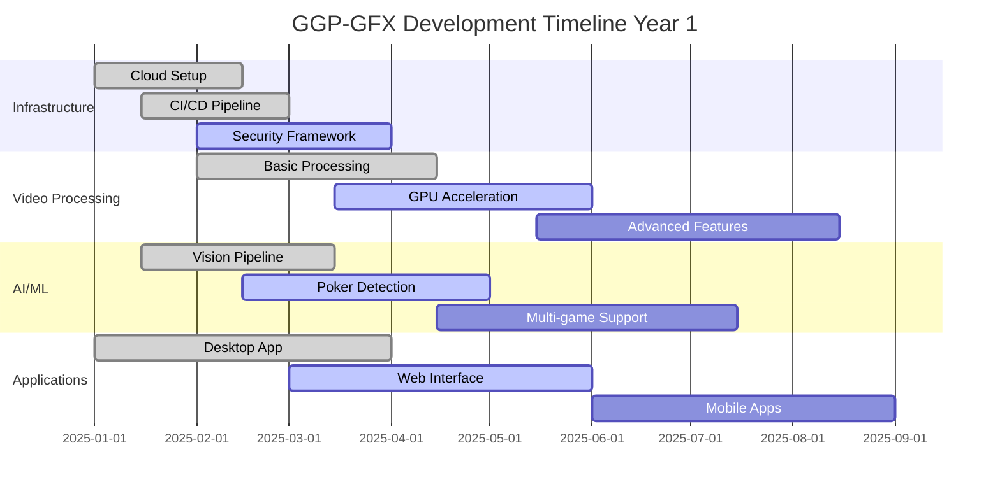
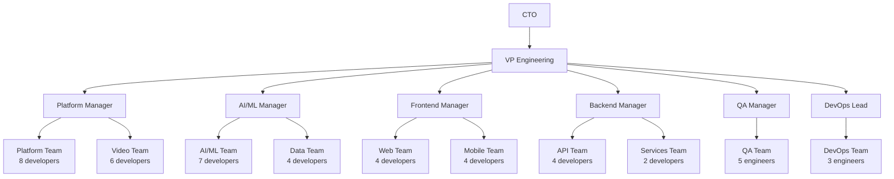
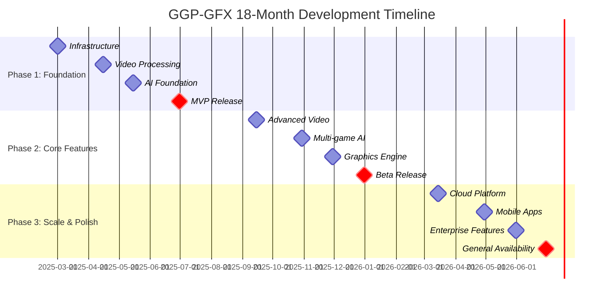

# GGP-GFX Project Management

## Table of Contents
1. [Development Roadmap](#development-roadmap)
2. [Team Structure](#team-structure)
3. [Risk Management](#risk-management)
4. [Timeline & Milestones](#timeline--milestones)
5. [Resource Planning](#resource-planning)
6. [Quality Assurance](#quality-assurance)
7. [Stakeholder Management](#stakeholder-management)
8. [Project Governance](#project-governance)

## Development Roadmap

### Product Phases

#### Phase 1: Foundation (Months 1-6)
```yaml
Phase_1_Foundation:
  Duration: 6 months
  Team_Size: 15-20 developers
  Budget: $2.5M
  
  Objectives:
    - Establish core architecture
    - Implement basic video processing
    - Create MVP user interface
    - Set up development infrastructure
    
  Key_Deliverables:
    Core_Infrastructure:
      - Cloud infrastructure setup (AWS/Kubernetes)
      - CI/CD pipeline
      - Development environments
      - Security framework
      
    Video_Processing_Engine:
      - Multi-source video input
      - Basic GPU acceleration
      - Real-time encoding/decoding
      - Format conversion
      
    AI_Foundation:
      - Computer vision pipeline
      - Basic game detection (poker)
      - Training data collection
      - Model deployment infrastructure
      
    User_Interface:
      - Desktop application (Electron)
      - Basic web interface
      - Authentication system
      - Project management
      
  Success_Criteria:
    - Process 4 video sources simultaneously at 1080p/60fps
    - Detect poker cards with 95% accuracy
    - Support 100 concurrent users
    - 99.5% uptime in staging environment
```

#### Phase 2: Core Features (Months 7-12)
```yaml
Phase_2_Core_Features:
  Duration: 6 months
  Team_Size: 25-30 developers
  Budget: $3M
  
  Objectives:
    - Advanced video processing features
    - Multi-game AI support
    - Professional graphics engine
    - Multi-platform streaming
    
  Key_Deliverables:
    Advanced_Video_Processing:
      - Chroma key with spill suppression
      - Real-time color correction
      - Multi-layer compositing
      - Motion tracking
      
    AI_Game_Detection:
      - Poker (all variants)
      - Blackjack support
      - Chess recognition
      - Custom game training
      
    Graphics_Engine:
      - 2D/3D graphics rendering
      - Animation system
      - Template marketplace
      - Real-time overlays
      
    Streaming_Platform:
      - Multi-platform streaming (Twitch, YouTube, Facebook)
      - Adaptive bitrate streaming
      - Stream health monitoring
      - Recording capabilities
      
  Success_Criteria:
    - Support 16 video sources at 4K/60fps
    - Multi-game detection with 98% accuracy
    - Stream to 5+ platforms simultaneously
    - 1000 concurrent users supported
```

#### Phase 3: Scale & Polish (Months 13-18)
```yaml
Phase_3_Scale_Polish:
  Duration: 6 months
  Team_Size: 35-40 developers
  Budget: $3.5M
  
  Objectives:
    - Cloud-native architecture
    - Mobile applications
    - Enterprise features
    - Performance optimization
    
  Key_Deliverables:
    Cloud_Platform:
      - Cloud rendering service
      - Distributed processing
      - Auto-scaling infrastructure
      - Global CDN integration
      
    Mobile_Applications:
      - iOS application
      - Android application
      - Remote control features
      - Second screen experience
      
    Enterprise_Features:
      - Multi-user collaboration
      - Advanced analytics
      - Custom branding
      - API ecosystem
      
    Performance_Optimization:
      - GPU optimization
      - Memory management
      - Network optimization
      - Caching strategies
      
  Success_Criteria:
    - Support 10,000 concurrent users
    - Mobile apps in app stores
    - Enterprise customers onboarded
    - 99.9% uptime SLA achieved
```

### Technology Evolution

#### Year 1: Core Platform


#### Innovation Roadmap
```yaml
Innovation_Timeline:
  2025_Q1_Q2:
    Focus: Foundation & Core Features
    Technologies:
      - Kubernetes orchestration
      - CUDA/Vulkan optimization
      - Real-time ML inference
      - WebRTC streaming
      
  2025_Q3_Q4:
    Focus: Advanced Features & Scale
    Technologies:
      - Edge computing integration
      - 8K video processing
      - Advanced AI models
      - Cloud rendering
      
  2026_Q1_Q2:
    Focus: Next-Generation Features
    Technologies:
      - VR/AR integration
      - 5G streaming optimization
      - Quantum-resistant encryption
      - Advanced analytics
      
  2026_Q3_Beyond:
    Focus: Market Leadership
    Technologies:
      - AI-powered director
      - Autonomous production
      - Blockchain integration
      - Neural network acceleration
```

## Team Structure

### Organizational Design

#### Core Development Teams
```yaml
Team_Structure:
  Engineering_Leadership:
    - CTO (Chief Technology Officer)
    - VP Engineering
    - Principal Architect
    - Engineering Managers (4)
    
  Platform_Team:
    Size: 8 developers
    Responsibilities:
      - Infrastructure architecture
      - DevOps and deployment
      - Security implementation
      - Performance optimization
    Technologies:
      - Kubernetes, Docker
      - AWS, GCP, Azure
      - Terraform, Ansible
      - Prometheus, Grafana
      
  Video_Processing_Team:
    Size: 6 developers
    Responsibilities:
      - Video pipeline development
      - GPU optimization
      - Codec implementation
      - Performance tuning
    Technologies:
      - C++, CUDA, Vulkan
      - FFmpeg, GStreamer
      - DirectX, Metal
      - Hardware acceleration
      
  AI_ML_Team:
    Size: 7 developers
    Responsibilities:
      - Computer vision models
      - Game detection algorithms
      - Training pipelines
      - Model optimization
    Technologies:
      - Python, PyTorch, TensorFlow
      - OpenCV, MediaPipe
      - ONNX, TensorRT
      - MLOps tools
      
  Frontend_Team:
    Size: 8 developers
    Responsibilities:
      - Desktop application
      - Web interface
      - Mobile applications
      - UI/UX implementation
    Technologies:
      - TypeScript, React
      - Electron, React Native
      - Next.js, Tailwind CSS
      - WebGL, WebGPU
      
  Backend_Team:
    Size: 6 developers
    Responsibilities:
      - API development
      - Database design
      - Business logic
      - Integration services
    Technologies:
      - Go, Node.js, Rust
      - PostgreSQL, Redis
      - GraphQL, REST
      - Message queues
      
  QA_Testing_Team:
    Size: 5 engineers
    Responsibilities:
      - Test automation
      - Performance testing
      - Security testing
      - Quality assurance
    Technologies:
      - Jest, Playwright
      - k6, JMeter
      - OWASP ZAP
      - Testing frameworks
```

#### Reporting Structure


### Role Definitions

#### Senior Technical Roles
```typescript
interface TechnicalRole {
  title: string;
  level: 'senior' | 'staff' | 'principal';
  responsibilities: string[];
  requirements: string[];
  compensation: CompensationRange;
}

const seniorRoles: TechnicalRole[] = [
  {
    title: 'Principal Software Architect',
    level: 'principal',
    responsibilities: [
      'Define overall system architecture',
      'Make technology stack decisions',
      'Lead architecture reviews',
      'Mentor senior engineers',
      'Drive technical standards'
    ],
    requirements: [
      '15+ years software development',
      'Experience with large-scale systems',
      'Cloud-native architecture expertise',
      'Video processing background preferred',
      'Leadership experience'
    ],
    compensation: { base: 250000, equity: 0.5, bonus: 50000 }
  },
  
  {
    title: 'Staff ML Engineer',
    level: 'staff',
    responsibilities: [
      'Design computer vision systems',
      'Implement ML training pipelines',
      'Optimize model performance',
      'Research new AI techniques',
      'Lead ML architecture decisions'
    ],
    requirements: [
      '10+ years ML/AI experience',
      'Computer vision expertise',
      'PyTorch/TensorFlow proficiency',
      'GPU optimization experience',
      'PhD preferred'
    ],
    compensation: { base: 220000, equity: 0.3, bonus: 40000 }
  },
  
  {
    title: 'Staff Frontend Engineer',
    level: 'staff',
    responsibilities: [
      'Lead UI architecture decisions',
      'Implement complex user interfaces',
      'Optimize rendering performance',
      'Mentor frontend developers',
      'Drive UX standards'
    ],
    requirements: [
      '10+ years frontend development',
      'React/TypeScript expertise',
      'WebGL/WebGPU experience',
      'Performance optimization skills',
      'Design system experience'
    ],
    compensation: { base: 200000, equity: 0.25, bonus: 35000 }
  }
];
```

### Hiring Plan

#### Recruitment Strategy
```yaml
Hiring_Timeline:
  Q1_2025:
    Priorities:
      - Principal Architect
      - Staff ML Engineer
      - Senior Video Processing Engineers (2)
      - Senior Platform Engineers (2)
    
  Q2_2025:
    Priorities:
      - Frontend Engineers (3)
      - Backend Engineers (2)
      - QA Engineers (2)
      - DevOps Engineer (1)
    
  Q3_2025:
    Priorities:
      - Mobile Engineers (2)
      - ML Engineers (2)
      - Platform Engineers (2)
      - Data Engineers (2)
    
  Q4_2025:
    Priorities:
      - Scale team based on milestones
      - Specialized roles as needed
      - International expansion hires

Recruitment_Channels:
  Technical_Recruiting:
    - AngelList/Wellfound
    - Stack Overflow Jobs
    - GitHub Jobs
    - LinkedIn Technical Recruiting
    
  Specialized_Recruiting:
    - AI/ML: Kaggle, Papers with Code
    - Video: NAB, IBC conferences
    - Gaming: GDC, gaming communities
    - Security: DEF CON, security forums
    
  University_Partnerships:
    - Stanford CS/AI programs
    - MIT CSAIL
    - CMU Graphics Lab
    - UC Berkeley RISE Lab
    
Compensation_Philosophy:
  - Competitive with FAANG companies
  - Significant equity participation
  - Performance-based bonuses
  - Comprehensive benefits
  - Remote-first flexibility
```

## Risk Management

### Technical Risks

#### Risk Assessment Matrix
```yaml
Technical_Risks:
  High_Impact_High_Probability:
    GPU_Performance_Bottlenecks:
      Impact: "Critical performance degradation"
      Probability: 0.7
      Mitigation:
        - Extensive GPU benchmarking
        - Multiple GPU vendor support
        - Fallback to CPU processing
        - Performance monitoring
      Owner: Video Processing Team
      
    AI_Model_Accuracy:
      Impact: "Poor user experience, customer churn"
      Probability: 0.6
      Mitigation:
        - Diverse training datasets
        - Continuous model improvement
        - Human-in-the-loop validation
        - A/B testing framework
      Owner: AI/ML Team
      
  High_Impact_Medium_Probability:
    Cloud_Cost_Overrun:
      Impact: "Budget exceeded, profitability affected"
      Probability: 0.5
      Mitigation:
        - Cost monitoring and alerts
        - Reserved instance planning
        - Efficient resource utilization
        - Multi-cloud strategy
      Owner: Platform Team
      
    Security_Breach:
      Impact: "Data loss, reputation damage, legal liability"
      Probability: 0.3
      Mitigation:
        - Security-first architecture
        - Regular penetration testing
        - Compliance certifications
        - Incident response plan
      Owner: Security Team
      
  Medium_Impact_High_Probability:
    Third_Party_Dependencies:
      Impact: "Feature delays, maintenance overhead"
      Probability: 0.8
      Mitigation:
        - Dependency monitoring
        - Alternative solutions
        - Custom implementations
        - Vendor diversification
      Owner: All Teams
      
    Talent_Acquisition:
      Impact: "Development delays, increased costs"
      Probability: 0.7
      Mitigation:
        - Competitive compensation
        - Strong company culture
        - Flexible work arrangements
        - Multiple recruiting channels
      Owner: Engineering Management
```

### Business Risks

#### Market and Competitive Analysis
```yaml
Business_Risks:
  Market_Risks:
    Competitive_Response:
      Risk: "Established players copy features quickly"
      Impact: "Reduced differentiation, pricing pressure"
      Mitigation:
        - Continuous innovation
        - Patent protection
        - Network effects
        - Customer lock-in features
      
    Market_Size:
      Risk: "Gaming production market smaller than projected"
      Impact: "Revenue targets not met"
      Mitigation:
        - Market research validation
        - Adjacent market expansion
        - Feature diversification
        - Flexible business model
      
    Technology_Shift:
      Risk: "New technology makes solution obsolete"
      Impact: "Product becomes irrelevant"
      Mitigation:
        - Technology radar monitoring
        - R&D investment
        - Adaptable architecture
        - Strategic partnerships
      
  Operational_Risks:
    Key_Personnel:
      Risk: "Loss of critical team members"
      Impact: "Development delays, knowledge loss"
      Mitigation:
        - Documentation standards
        - Knowledge sharing
        - Succession planning
        - Retention programs
      
    Regulatory_Changes:
      Risk: "New regulations affect operations"
      Impact: "Compliance costs, feature restrictions"
      Mitigation:
        - Regulatory monitoring
        - Compliance framework
        - Legal advisory
        - Flexible architecture
```

### Risk Monitoring

#### Risk Tracking System
```typescript
interface RiskItem {
  id: string;
  title: string;
  category: 'technical' | 'business' | 'operational';
  impact: 1 | 2 | 3 | 4 | 5;  // 1=low, 5=critical
  probability: number;  // 0-1
  status: 'identified' | 'active' | 'mitigated' | 'closed';
  owner: string;
  mitigation: MitigationPlan;
  lastUpdated: Date;
}

class RiskManager {
  private risks: Map<string, RiskItem> = new Map();
  private alertThreshold = 3.0; // Risk score threshold
  
  calculateRiskScore(risk: RiskItem): number {
    return risk.impact * risk.probability;
  }
  
  async assessRisks(): Promise<RiskAssessment> {
    const activeRisks = Array.from(this.risks.values())
      .filter(risk => risk.status === 'active');
    
    const highRisks = activeRisks
      .filter(risk => this.calculateRiskScore(risk) >= this.alertThreshold)
      .sort((a, b) => this.calculateRiskScore(b) - this.calculateRiskScore(a));
    
    return {
      totalRisks: activeRisks.length,
      highRisks: highRisks.length,
      riskScore: this.calculateOverallRiskScore(activeRisks),
      topRisks: highRisks.slice(0, 5),
      recommendations: await this.generateRecommendations(highRisks)
    };
  }
  
  async generateMitigationPlan(risk: RiskItem): Promise<MitigationPlan> {
    return {
      actions: await this.identifyMitigationActions(risk),
      timeline: this.createMitigationTimeline(risk),
      budget: await this.estimateMitigationCost(risk),
      success_criteria: this.defineMitigationCriteria(risk)
    };
  }
}
```

## Timeline & Milestones

### Project Timeline

#### Development Phases


#### Critical Path Analysis
```yaml
Critical_Path_Items:
  1_GPU_Processing_Pipeline:
    Duration: 4 months
    Dependencies: []
    Risk_Level: High
    Mitigation: "Parallel development with multiple approaches"
    
  2_AI_Model_Training:
    Duration: 3 months
    Dependencies: ["Data collection", "Training infrastructure"]
    Risk_Level: High
    Mitigation: "Transfer learning, pre-trained models"
    
  3_Cloud_Infrastructure:
    Duration: 2 months
    Dependencies: ["Architecture design"]
    Risk_Level: Medium
    Mitigation: "Infrastructure as code, automation"
    
  4_User_Interface_Development:
    Duration: 5 months
    Dependencies: ["Design system", "Backend APIs"]
    Risk_Level: Medium
    Mitigation: "Agile development, user testing"
    
  5_Integration_Testing:
    Duration: 2 months
    Dependencies: ["All core components"]
    Risk_Level: Medium
    Mitigation: "Continuous integration, automated testing"

Buffer_Time:
  Phase_1: 2 weeks (built into schedule)
  Phase_2: 3 weeks (built into schedule)
  Phase_3: 4 weeks (built into schedule)
  Final_Testing: 2 weeks (dedicated buffer)
```

### Milestone Definitions

#### Phase 1 Milestones
```yaml
MVP_Release_Criteria:
  Technical_Requirements:
    - Process 4 video sources at 1080p/60fps
    - Basic poker card detection (90% accuracy)
    - Simple overlay graphics
    - Single-platform streaming (Twitch)
    - Desktop application (Windows/macOS)
    
  Quality_Gates:
    - 95% test coverage
    - Load testing: 50 concurrent users
    - Security scan: No critical vulnerabilities
    - Performance: <100ms video latency
    
  User_Acceptance:
    - 10 beta users successfully stream
    - User satisfaction: 4.0/5.0 minimum
    - Documentation complete
    - Support processes established
    
  Business_Criteria:
    - Demo to 5 potential customers
    - Product-market fit validation
    - Pricing model validated
    - Go-to-market strategy defined
```

#### Phase 2 Milestones
```yaml
Beta_Release_Criteria:
  Technical_Requirements:
    - 16 video sources at 4K/60fps
    - Multi-game AI (poker, blackjack, chess)
    - Advanced graphics and animations
    - Multi-platform streaming (5+ platforms)
    - Web application with full features
    
  Quality_Gates:
    - 98% test coverage
    - Load testing: 500 concurrent users
    - Security: SOC 2 Type I compliant
    - Performance: 99.5% uptime
    
  User_Acceptance:
    - 100 beta users actively using
    - User satisfaction: 4.2/5.0 minimum
    - Complete feature documentation
    - 24/7 support capability
    
  Business_Criteria:
    - 10 paying customers
    - $100K ARR (Annual Recurring Revenue)
    - Market validation complete
    - Funding secured for Phase 3
```

### Success Metrics

#### Key Performance Indicators
```typescript
interface ProjectKPIs {
  technical: TechnicalMetrics;
  user: UserMetrics;
  business: BusinessMetrics;
  team: TeamMetrics;
}

const kpiTargets: ProjectKPIs = {
  technical: {
    performance: {
      videoLatency: { target: 50, unit: 'ms', tolerance: 0.1 },
      aiAccuracy: { target: 98, unit: '%', tolerance: 0.02 },
      systemUptime: { target: 99.9, unit: '%', tolerance: 0.001 },
      concurrentUsers: { target: 1000, unit: 'users', tolerance: 0.1 }
    },
    quality: {
      testCoverage: { target: 95, unit: '%', tolerance: 0.05 },
      bugDensity: { target: 0.1, unit: 'bugs/KLOC', tolerance: 2.0 },
      securityVulns: { target: 0, unit: 'critical', tolerance: 0 }
    }
  },
  
  user: {
    adoption: {
      activeUsers: { target: 10000, unit: 'MAU', tolerance: 0.2 },
      retention: { target: 85, unit: '%', tolerance: 0.1 },
      satisfaction: { target: 4.5, unit: '/5', tolerance: 0.2 }
    },
    engagement: {
      sessionDuration: { target: 45, unit: 'minutes', tolerance: 0.2 },
      featuresUsed: { target: 8, unit: 'features/user', tolerance: 0.2 },
      supportTickets: { target: 2, unit: '%', tolerance: 1.0 }
    }
  },
  
  business: {
    revenue: {
      arr: { target: 10000000, unit: '$', tolerance: 0.2 },
      growth: { target: 20, unit: '%/month', tolerance: 0.2 },
      churn: { target: 5, unit: '%', tolerance: 2.0 }
    },
    market: {
      marketShare: { target: 15, unit: '%', tolerance: 0.3 },
      customerCount: { target: 1000, unit: 'customers', tolerance: 0.2 },
      nps: { target: 50, unit: 'score', tolerance: 10 }
    }
  },
  
  team: {
    productivity: {
      velocity: { target: 40, unit: 'story points', tolerance: 0.2 },
      cycleTime: { target: 5, unit: 'days', tolerance: 1.0 },
      defectRate: { target: 2, unit: '%', tolerance: 1.0 }
    },
    satisfaction: {
      engagement: { target: 4.2, unit: '/5', tolerance: 0.2 },
      retention: { target: 90, unit: '%', tolerance: 0.1 },
      growth: { target: 4.0, unit: '/5', tolerance: 0.2 }
    }
  }
};
```

## Resource Planning

### Budget Allocation

#### Development Budget Breakdown
```yaml
Total_18_Month_Budget: $12,000,000

Personnel_Costs: $8,400,000 (70%)
  Engineering_Team: $6,000,000
    - Senior Engineers: $3,600,000
    - Mid-level Engineers: $1,800,000
    - Junior Engineers: $600,000
  
  Management_Leadership: $1,200,000
    - Engineering Managers: $600,000
    - Technical Leads: $400,000
    - Product Management: $200,000
  
  Operations_Support: $1,200,000
    - DevOps Engineers: $400,000
    - QA Engineers: $400,000
    - Security Engineers: $200,000
    - Data Engineers: $200,000

Infrastructure_Costs: $2,400,000 (20%)
  Cloud_Services: $1,800,000
    - Compute (GPU instances): $1,200,000
    - Storage and databases: $300,000
    - Networking and CDN: $300,000
  
  Development_Tools: $600,000
    - IDE licenses: $100,000
    - CI/CD platforms: $200,000
    - Monitoring tools: $150,000
    - Security tools: $150,000

Equipment_Software: $720,000 (6%)
  Hardware: $480,000
    - Development workstations: $300,000
    - GPU development rigs: $120,000
    - Testing equipment: $60,000
  
  Software_Licenses: $240,000
    - Development software: $120,000
    - Design tools: $60,000
    - Project management: $60,000

Contingency_Reserve: $480,000 (4%)
  Risk_Mitigation: $300,000
  Scope_Changes: $180,000
```

#### Resource Scaling Plan
```typescript
interface ResourcePlan {
  phase: string;
  duration: number;
  teamSize: number;
  monthlyCost: number;
  infrastructure: InfrastructureCosts;
  equipment: EquipmentCosts;
}

const resourcePlan: ResourcePlan[] = [
  {
    phase: 'Phase 1: Foundation',
    duration: 6,
    teamSize: 20,
    monthlyCost: 350000,
    infrastructure: {
      compute: 25000,
      storage: 5000,
      networking: 8000,
      monitoring: 3000,
      security: 4000
    },
    equipment: {
      workstations: 60000,
      servers: 20000,
      software: 15000
    }
  },
  
  {
    phase: 'Phase 2: Core Features',
    duration: 6,
    teamSize: 30,
    monthlyCost: 525000,
    infrastructure: {
      compute: 45000,
      storage: 10000,
      networking: 15000,
      monitoring: 5000,
      security: 6000
    },
    equipment: {
      workstations: 40000,
      servers: 30000,
      software: 10000
    }
  },
  
  {
    phase: 'Phase 3: Scale & Polish',
    duration: 6,
    teamSize: 40,
    monthlyCost: 700000,
    infrastructure: {
      compute: 80000,
      storage: 20000,
      networking: 25000,
      monitoring: 8000,
      security: 10000
    },
    equipment: {
      workstations: 30000,
      servers: 50000,
      software: 8000
    }
  }
];

class ResourceManager {
  calculateTotalCost(plans: ResourcePlan[]): number {
    return plans.reduce((total, plan) => {
      const phaseCost = plan.monthlyCost * plan.duration;
      const infraCost = Object.values(plan.infrastructure).reduce((a, b) => a + b, 0) * plan.duration;
      const equipCost = Object.values(plan.equipment).reduce((a, b) => a + b, 0);
      
      return total + phaseCost + infraCost + equipCost;
    }, 0);
  }
  
  optimizeResourceAllocation(constraints: ResourceConstraints): OptimizedPlan {
    // Resource optimization algorithm
    // Consider team velocity, budget constraints, timeline requirements
    // Output optimized resource allocation plan
  }
}
```

### Infrastructure Scaling

#### Cloud Resource Planning
```yaml
Infrastructure_Scaling:
  Phase_1_Development:
    Compute:
      - 10x m5.2xlarge instances (API services)
      - 4x g4dn.2xlarge instances (GPU processing)
      - 2x r5.xlarge instances (databases)
    
    Storage:
      - 2TB EBS GP3 (databases)
      - 10TB S3 (media storage)
      - 500GB EFS (shared storage)
    
    Networking:
      - 1TB CloudFront data transfer
      - 500GB inter-region transfer
      - Load balancers and VPN
    
    Estimated_Monthly_Cost: $8,000
  
  Phase_2_Beta:
    Compute:
      - 20x m5.2xlarge instances
      - 8x g4dn.4xlarge instances
      - 4x r5.2xlarge instances
      - Kubernetes cluster (20 nodes)
    
    Storage:
      - 5TB EBS GP3
      - 50TB S3
      - 2TB EFS
    
    Networking:
      - 10TB CloudFront
      - 2TB inter-region
      - Global load balancing
    
    Estimated_Monthly_Cost: $25,000
  
  Phase_3_Production:
    Compute:
      - Auto-scaling: 50-200 instances
      - GPU cluster: 20-50 instances
      - Multi-region deployment
      - Kubernetes (100+ nodes)
    
    Storage:
      - 20TB EBS GP3
      - 500TB S3
      - 10TB EFS
      - RDS Multi-AZ
    
    Networking:
      - 100TB CloudFront
      - Global CDN
      - DDoS protection
    
    Estimated_Monthly_Cost: $80,000
```

## Quality Assurance

### Testing Strategy

#### Multi-Level Testing Approach
```yaml
Testing_Pyramid:
  Unit_Tests: 70%
    Scope: Individual functions and components
    Tools: Jest, pytest, go test, cargo test
    Coverage_Target: 95%
    Automation: 100%
    
  Integration_Tests: 20%
    Scope: Service interactions and APIs
    Tools: Supertest, TestContainers, Postman
    Coverage_Target: 85%
    Automation: 100%
    
  End_to_End_Tests: 10%
    Scope: Complete user workflows
    Tools: Playwright, Selenium, Cypress
    Coverage_Target: Critical paths only
    Automation: 90%

Specialized_Testing:
  Performance_Testing:
    Load_Testing:
      - Tools: k6, JMeter, Artillery
      - Scenarios: Normal, peak, stress loads
      - Metrics: Latency, throughput, errors
      - Frequency: Every release
    
    GPU_Performance:
      - Tools: NVIDIA Nsight, custom benchmarks
      - Scenarios: Multi-stream processing
      - Metrics: GPU utilization, memory usage
      - Frequency: Every GPU code change
  
  Security_Testing:
    Static_Analysis:
      - Tools: SonarQube, CodeQL, Semgrep
      - Scope: All source code
      - Frequency: Every commit
    
    Dynamic_Testing:
      - Tools: OWASP ZAP, Burp Suite
      - Scope: All web interfaces and APIs
      - Frequency: Weekly automated scans
    
    Penetration_Testing:
      - Scope: Complete system
      - Frequency: Quarterly
      - External security firm
  
  Compatibility_Testing:
    Platform_Testing:
      - Windows 10/11 (multiple versions)
      - macOS (last 3 versions)
      - Linux (Ubuntu, CentOS, Debian)
      - Mobile (iOS 15+, Android 10+)
    
    Hardware_Testing:
      - NVIDIA GPUs (RTX 30xx, 40xx series)
      - AMD GPUs (RX 6xxx, 7xxx series)
      - Various CPU configurations
      - Memory configurations (16GB-128GB)
```

#### Quality Gates
```typescript
interface QualityGate {
  name: string;
  criteria: QualityCriteria[];
  blockingLevel: 'warning' | 'error' | 'critical';
  automationLevel: number; // 0-100%
  responsibility: string;
}

const qualityGates: QualityGate[] = [
  {
    name: 'Code Commit Gate',
    criteria: [
      { metric: 'unit_test_coverage', threshold: 80, operator: '>=' },
      { metric: 'static_analysis_issues', threshold: 0, operator: '==' },
      { metric: 'security_vulnerabilities', threshold: 0, operator: '==' },
      { metric: 'code_duplication', threshold: 5, operator: '<=' }
    ],
    blockingLevel: 'error',
    automationLevel: 100,
    responsibility: 'Developer'
  },
  
  {
    name: 'Integration Gate',
    criteria: [
      { metric: 'integration_test_pass_rate', threshold: 98, operator: '>=' },
      { metric: 'api_response_time', threshold: 200, operator: '<=' },
      { metric: 'database_migration_success', threshold: 100, operator: '==' }
    ],
    blockingLevel: 'error',
    automationLevel: 95,
    responsibility: 'CI/CD Pipeline'
  },
  
  {
    name: 'Performance Gate',
    criteria: [
      { metric: 'video_processing_latency', threshold: 50, operator: '<=' },
      { metric: 'gpu_utilization', threshold: 85, operator: '<=' },
      { metric: 'memory_usage', threshold: 90, operator: '<=' },
      { metric: 'concurrent_user_support', threshold: 1000, operator: '>=' }
    ],
    blockingLevel: 'critical',
    automationLevel: 80,
    responsibility: 'Performance Team'
  },
  
  {
    name: 'Security Gate',
    criteria: [
      { metric: 'critical_vulnerabilities', threshold: 0, operator: '==' },
      { metric: 'high_vulnerabilities', threshold: 5, operator: '<=' },
      { metric: 'dependency_vulnerabilities', threshold: 0, operator: '==' },
      { metric: 'penetration_test_pass', threshold: 100, operator: '==' }
    ],
    blockingLevel: 'critical',
    automationLevel: 70,
    responsibility: 'Security Team'
  }
];

class QualityGateEngine {
  async evaluateGate(gate: QualityGate, metrics: MetricData): Promise<GateResult> {
    const results = await Promise.all(
      gate.criteria.map(criterion => this.evaluateCriterion(criterion, metrics))
    );
    
    const passed = results.every(result => result.passed);
    const failedCriteria = results.filter(result => !result.passed);
    
    return {
      gateName: gate.name,
      passed,
      blockingLevel: gate.blockingLevel,
      failedCriteria,
      canProceed: passed || gate.blockingLevel === 'warning',
      recommendations: await this.generateRecommendations(failedCriteria)
    };
  }
}
```

### Continuous Improvement

#### Quality Metrics Dashboard
```yaml
Quality_Metrics:
  Development_Quality:
    Code_Quality:
      - Lines of code
      - Cyclomatic complexity
      - Code duplication
      - Technical debt ratio
    
    Test_Quality:
      - Test coverage
      - Test execution time
      - Flaky test rate
      - Test maintenance effort
  
  Product_Quality:
    Defects:
      - Defect density
      - Defect discovery rate
      - Defect resolution time
      - Customer reported defects
    
    Performance:
      - Response time percentiles
      - Throughput metrics
      - Resource utilization
      - Error rates
  
  Process_Quality:
    Delivery:
      - Lead time
      - Cycle time
      - Deployment frequency
      - Change failure rate
    
    Team_Health:
      - Velocity trends
      - Sprint goal achievement
      - Team satisfaction
      - Knowledge sharing metrics

Improvement_Process:
  Regular_Reviews:
    - Weekly quality metrics review
    - Monthly retrospectives
    - Quarterly quality assessments
    - Annual quality planning
  
  Continuous_Learning:
    - Tech talks and knowledge sharing
    - Conference attendance
    - Training and certification
    - Experimentation time (20%)
  
  Tool_Investment:
    - Automated testing tools
    - Static analysis platforms
    - Performance monitoring
    - Quality dashboards
```

## Stakeholder Management

### Stakeholder Mapping

#### Internal Stakeholders
```yaml
Internal_Stakeholders:
  Executive_Team:
    CEO:
      Interests: Business success, investor relations, strategic direction
      Influence: Very High
      Engagement: Monthly executive reviews, quarterly board updates
      Communication: Executive dashboards, strategic presentations
    
    CTO:
      Interests: Technical excellence, architecture decisions, team growth
      Influence: Very High
      Engagement: Weekly technical reviews, architecture decisions
      Communication: Technical reports, architecture documents
    
    VP_Product:
      Interests: Product-market fit, user experience, feature delivery
      Influence: High
      Engagement: Daily product discussions, sprint planning
      Communication: Product metrics, user feedback, roadmap updates
    
    VP_Sales:
      Interests: Sales enablement, customer feedback, competitive positioning
      Influence: High
      Engagement: Weekly sales alignment, customer interviews
      Communication: Sales materials, competitive analysis
  
  Development_Team:
    Engineering_Managers:
      Interests: Team productivity, career development, technical challenges
      Influence: High
      Engagement: Daily standups, weekly 1:1s, sprint retrospectives
      Communication: Team metrics, career planning, technical discussions
    
    Individual_Contributors:
      Interests: Technical growth, work-life balance, interesting challenges
      Influence: Medium
      Engagement: Daily standups, code reviews, technical discussions
      Communication: Technical updates, learning opportunities
```

#### External Stakeholders
```yaml
External_Stakeholders:
  Investors:
    Board_Members:
      Interests: ROI, market opportunity, risk management
      Influence: Very High
      Engagement: Quarterly board meetings, monthly updates
      Communication: Financial metrics, market analysis, risk reports
    
    Angel_Investors:
      Interests: Product success, team execution, exit potential
      Influence: Medium
      Engagement: Quarterly updates, product demos
      Communication: Progress reports, product updates
  
  Customers:
    Beta_Users:
      Interests: Product functionality, ease of use, reliability
      Influence: High
      Engagement: Weekly feedback sessions, user interviews
      Communication: Product updates, feature requests, support
    
    Enterprise_Customers:
      Interests: Scalability, security, support, ROI
      Influence: Very High
      Engagement: Monthly business reviews, technical discussions
      Communication: Enterprise features, SLA reports, roadmap
  
  Partners:
    Technology_Partners:
      Interests: Integration success, mutual benefit, market expansion
      Influence: Medium
      Engagement: Quarterly partner reviews, technical integration
      Communication: Partnership updates, integration guides
    
    Hardware_Vendors:
      Interests: Platform adoption, performance optimization
      Influence: Medium
      Engagement: Technical collaboration, performance testing
      Communication: Performance reports, optimization guides
```

### Communication Plan

#### Stakeholder Communication Matrix
```typescript
interface CommunicationPlan {
  stakeholder: string;
  frequency: string;
  format: string;
  content: string[];
  owner: string;
  success_metrics: string[];
}

const communicationPlans: CommunicationPlan[] = [
  {
    stakeholder: 'Executive Team',
    frequency: 'Monthly',
    format: 'Executive Dashboard + Presentation',
    content: [
      'Key metrics and KPIs',
      'Milestone progress',
      'Risk assessment',
      'Resource needs',
      'Strategic decisions needed'
    ],
    owner: 'VP Engineering',
    success_metrics: [
      'Executive satisfaction score',
      'Decision turnaround time',
      'Strategic alignment score'
    ]
  },
  
  {
    stakeholder: 'Development Teams',
    frequency: 'Weekly',
    format: 'All-hands meeting + Slack updates',
    content: [
      'Sprint progress',
      'Technical challenges',
      'Cross-team dependencies',
      'Learning opportunities',
      'Company updates'
    ],
    owner: 'Engineering Managers',
    success_metrics: [
      'Team engagement score',
      'Information clarity rating',
      'Cross-team collaboration index'
    ]
  },
  
  {
    stakeholder: 'Beta Customers',
    frequency: 'Bi-weekly',
    format: 'Product update email + User forum',
    content: [
      'New features released',
      'Known issues and fixes',
      'Upcoming features',
      'Best practices',
      'Community highlights'
    ],
    owner: 'Product Manager',
    success_metrics: [
      'Customer satisfaction score',
      'Feature adoption rate',
      'Support ticket reduction'
    ]
  }
];

class StakeholderManager {
  async generateStakeholderReport(stakeholder: string): Promise<StakeholderReport> {
    const plan = communicationPlans.find(p => p.stakeholder === stakeholder);
    if (!plan) throw new Error(`No plan found for ${stakeholder}`);
    
    const metrics = await this.gatherMetrics(plan.content);
    const insights = await this.generateInsights(metrics, stakeholder);
    const recommendations = await this.generateRecommendations(insights);
    
    return {
      stakeholder,
      reportDate: new Date(),
      metrics,
      insights,
      recommendations,
      nextActions: await this.getNextActions(stakeholder)
    };
  }
}
```

## Project Governance

### Decision Making Framework

#### Decision Rights Matrix (RACI)
```yaml
Decision_Framework:
  Architecture_Decisions:
    Technology_Stack:
      Responsible: Principal Architect
      Accountable: CTO
      Consulted: [Engineering Managers, Tech Leads]
      Informed: [Development Teams, VP Product]
    
    Security_Architecture:
      Responsible: Security Architect
      Accountable: CTO
      Consulted: [Compliance Team, Legal]
      Informed: [All Engineering Teams]
  
  Product_Decisions:
    Feature_Prioritization:
      Responsible: VP Product
      Accountable: CEO
      Consulted: [Engineering, Sales, Marketing]
      Informed: [All Teams]
    
    User_Experience:
      Responsible: UX Lead
      Accountable: VP Product
      Consulted: [Frontend Team, Customers]
      Informed: [Development Teams]
  
  Business_Decisions:
    Budget_Allocation:
      Responsible: CFO
      Accountable: CEO
      Consulted: [Department Heads]
      Informed: [All Teams]
    
    Strategic_Partnerships:
      Responsible: VP Business Development
      Accountable: CEO
      Consulted: [Legal, Product, Engineering]
      Informed: [Leadership Team]

Decision_Process:
  1_Problem_Identification:
    - Stakeholder raises issue
    - Problem statement created
    - Impact assessment
    - Urgency evaluation
  
  2_Information_Gathering:
    - Research and analysis
    - Stakeholder consultation
    - Option evaluation
    - Risk assessment
  
  3_Decision_Making:
    - Recommendation prepared
    - Stakeholder review
    - Decision made by accountable party
    - Decision documented
  
  4_Implementation:
    - Communication plan executed
    - Implementation tracked
    - Results measured
    - Lessons learned captured
```

### Project Controls

#### Progress Monitoring System
```typescript
interface ProjectControl {
  metric: string;
  target: number;
  current: number;
  trend: 'improving' | 'stable' | 'declining';
  status: 'green' | 'yellow' | 'red';
  action_required: boolean;
}

class ProjectController {
  async generateProjectStatus(): Promise<ProjectStatus> {
    const controls = await Promise.all([
      this.assessSchedulePerformance(),
      this.assessBudgetPerformance(),
      this.assessQualityPerformance(),
      this.assessRiskStatus(),
      this.assessTeamHealth()
    ]);
    
    const overallStatus = this.calculateOverallStatus(controls);
    const alerts = this.generateAlerts(controls);
    const recommendations = await this.generateActionPlan(controls);
    
    return {
      reportDate: new Date(),
      overallStatus,
      controls,
      alerts,
      recommendations,
      executiveSummary: await this.generateExecutiveSummary(controls)
    };
  }
  
  private async assessSchedulePerformance(): Promise<ProjectControl> {
    const milestones = await this.getMilestones();
    const completedOnTime = milestones.filter(m => m.completedOnTime).length;
    const schedulePerformance = completedOnTime / milestones.length;
    
    return {
      metric: 'Schedule Performance',
      target: 0.95, // 95% on-time delivery
      current: schedulePerformance,
      trend: this.calculateTrend('schedule', schedulePerformance),
      status: schedulePerformance >= 0.95 ? 'green' : 
              schedulePerformance >= 0.85 ? 'yellow' : 'red',
      action_required: schedulePerformance < 0.90
    };
  }
  
  private async assessBudgetPerformance(): Promise<ProjectControl> {
    const budgetStatus = await this.getBudgetStatus();
    const burnRate = budgetStatus.actualSpend / budgetStatus.plannedSpend;
    
    return {
      metric: 'Budget Performance',
      target: 1.0, // On budget
      current: burnRate,
      trend: this.calculateTrend('budget', burnRate),
      status: burnRate <= 1.05 ? 'green' : 
              burnRate <= 1.15 ? 'yellow' : 'red',
      action_required: burnRate > 1.10
    };
  }
  
  generateActionPlan(controls: ProjectControl[]): ActionPlan {
    const actions = [];
    
    for (const control of controls) {
      if (control.action_required) {
        actions.push(...this.getRecommendedActions(control));
      }
    }
    
    return {
      immediateActions: actions.filter(a => a.priority === 'high'),
      plannedActions: actions.filter(a => a.priority === 'medium'),
      monitoringActions: actions.filter(a => a.priority === 'low'),
      executionTimeline: this.createActionTimeline(actions)
    };
  }
}
```

---

**End of GGP-GFX Development Documentation**

This comprehensive documentation suite provides a complete development blueprint for the GGP-GFX gaming production graphics system, covering all aspects from technical specifications to project management. The documentation is structured to support both development teams and business stakeholders throughout the 18-month development lifecycle.