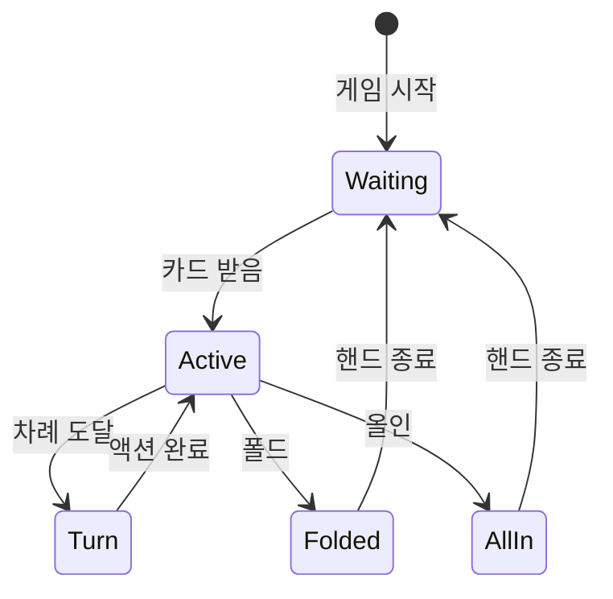

# 하이브리드 스위처 시스템 기획서

## 📁 문서 구조

### [01-개요](./01-개요/)
- 프로젝트 개요
- 비전 및 목표
- 핵심 가치

### [02-시스템설계](./02-시스템설계/)
- 시스템 아키텍처
- 핵심 설계 원칙
- 구성 요소

### [03-기능명세](./03-기능명세/)
- 주요 기능
- 상세 기능 명세
- 사용자 시나리오

### [04-기술사양](./04-기술사양/)
- 기술 스택
- API 명세
- 데이터 구조

### [05-운영가이드](./05-운영가이드/)
- 설치 및 설정
- 운영 매뉴얼
- 문제 해결 가이드

---

## 🎯 프로젝트 목표

하이브리드 스위처 시스템은 라이브 포커 방송의 스위칭 작업에서 인적 오류를 차단하고 제작 패러다임을 혁신하는 것을 목표로 합니다.

## 📅 문서 버전
- 버전: 1.0.0
- 작성일: 2025-08-01
- 최종 수정일: 2025-08-01

---


# 01-개요/01-프로젝트개요.md

# 프로젝트 개요

## 1. 프로젝트명
**하이브리드 스위처 시스템 (Hybrid Switcher System)**

## 2. 프로젝트 배경

### 2.1 현황 및 문제점
- **라이브 포커 방송의 복잡성**: 다수의 플레이어, 실시간 게임 진행, 복잡한 베팅 규칙
- **인적 오류 발생**: 스위처 운영자의 실수로 인한 방송 사고
- **높은 인지 부담**: 게임 상황 파악과 카메라 스위칭을 동시에 수행
- **운영자 피로도**: 장시간 집중력 유지의 어려움

### 2.2 해결 방안
하이브리드 모델을 통한 물리적 분리와 지능형 자동화로 인적 오류를 원천 차단

## 3. 프로젝트 정의

### 3.1 핵심 개념
"위치 확인"과 "액션 실행"을 물리적으로 분리하여 운영자가 화면에만 집중하며 반사적으로 조작할 수 있는 혁신적인 스위칭 시스템

### 3.2 주요 특징
- **직관적 인터페이스**: 테이블 좌석과 1:1 매핑된 버튼 배치
- **시각적 피드백**: 녹색 점멸로 현재 차례 표시
- **지능형 알고리즘**: Last Aggressor 추적, 자동 게임 진행
- **에러 복구**: 실행 취소 및 실시간 상태 수정 기능

## 4. 기대 효과

### 4.1 운영 효율성
- 방송 사고 90% 이상 감소
- 운영자 피로도 50% 감소
- 스위칭 정확도 99% 이상 달성

### 4.2 제작 품질
- 일관된 방송 품질 유지
- 시청자 경험 향상
- 제작 비용 절감

### 4.3 확장성
- 다양한 포커 변형 게임 지원
- 타 카드 게임으로 확장 가능
- API를 통한 외부 시스템 연동

---


# 01-개요/02-비전및목표.md

# 비전 및 목표

## 1. 비전 (Vision)

### 1.1 핵심 비전
**"인적 오류를 차단하고 제작 패러다임을 바꾸다"**

라이브 방송 제작에서 기술과 인간의 완벽한 협업을 통해 새로운 제작 표준을 제시합니다.

### 1.2 장기 비전
- 전 세계 포커 방송의 표준 스위칭 시스템으로 자리매김
- AI 기반 완전 자동화 시스템으로 진화
- 모든 카드 게임 방송으로 확장

## 2. 미션 (Mission)

### 2.1 기술적 미션
- 최첨단 기술을 활용한 방송 제작 혁신
- 운영자 중심의 인터페이스 설계
- 지속적인 시스템 개선과 최적화

### 2.2 비즈니스 미션
- 방송 제작 비용 절감
- 제작 품질의 표준화
- 새로운 수익 모델 창출

## 3. 핵심 목표

### 3.1 단기 목표 (6개월)
- [ ] MVP 개발 완료
- [ ] 파일럿 방송 테스트
- [ ] 사용자 피드백 수집 및 반영
- [ ] 베타 버전 출시

### 3.2 중기 목표 (1년)
- [ ] 정식 버전 1.0 출시
- [ ] 주요 포커 방송사 3곳 이상 도입
- [ ] 다국어 지원 (영어, 중국어, 일본어)
- [ ] 클라우드 기반 서비스 런칭

### 3.3 장기 목표 (3년)
- [ ] 글로벌 시장 점유율 30% 달성
- [ ] AI 기반 자동 스위칭 기능 구현
- [ ] 타 스포츠 중계로 사업 확장
- [ ] IPO 준비

## 4. 성공 지표 (KPI)

### 4.1 기술 지표
- 시스템 가동률: 99.9% 이상
- 평균 응답 시간: 50ms 이하
- 오류율: 0.1% 이하

### 4.2 비즈니스 지표
- 고객 만족도: 95% 이상
- 시장 점유율: 연 10% 성장
- 매출 성장률: 연 50% 이상

### 4.3 운영 지표
- 운영자 교육 시간: 2시간 이내
- 방송 사고 감소율: 90% 이상
- 운영 비용 절감률: 40% 이상

---


# 01-개요/03-핵심가치.md

# 핵심 가치

## 1. 혁신 (Innovation)

### 1.1 기술 혁신
- **하이브리드 모델**: 물리적 분리를 통한 새로운 패러다임
- **지능형 자동화**: AI와 알고리즘을 활용한 스마트 시스템
- **실시간 처리**: 초고속 응답으로 끊김 없는 방송

### 1.2 사용자 경험 혁신
- **직관적 디자인**: 학습 곡선 최소화
- **시각적 피드백**: 즉각적인 상태 인지
- **에러 프리**: 실수를 원천 차단하는 설계

## 2. 신뢰성 (Reliability)

### 2.1 시스템 안정성
- **99.9% 가동률**: 미션 크리티컬 환경 대응
- **이중화 구조**: 장애 발생 시 자동 전환
- **실시간 모니터링**: 24/7 시스템 감시

### 2.2 데이터 무결성
- **상태 동기화**: 모든 구성요소 간 실시간 동기화
- **백업 시스템**: 자동 백업 및 복구
- **감사 추적**: 모든 작업 이력 기록

## 3. 효율성 (Efficiency)

### 3.1 운영 효율성
- **자동화**: 반복 작업의 자동 처리
- **최적화**: 리소스 사용 최적화
- **확장성**: 수평적 확장 가능한 아키텍처

### 3.2 비용 효율성
- **TCO 절감**: 총 소유 비용 40% 감소
- **인력 효율화**: 운영 인력 30% 절감
- **에너지 효율**: 그린 컴퓨팅 적용

## 4. 사용자 중심 (User-Centric)

### 4.1 운영자 중심 설계
- **인체공학적 설계**: 피로도 최소화
- **맞춤형 인터페이스**: 사용자별 커스터마이징
- **지속적 개선**: 사용자 피드백 기반 업데이트

### 4.2 접근성
- **다국어 지원**: 글로벌 사용자 대응
- **교육 프로그램**: 체계적인 운영자 교육
- **24/7 지원**: 실시간 기술 지원

## 5. 협업 (Collaboration)

### 5.1 개방형 생태계
- **API 제공**: 써드파티 연동 지원
- **플러그인 시스템**: 기능 확장 가능
- **커뮤니티**: 사용자 커뮤니티 운영

### 5.2 파트너십
- **방송사 협력**: 긴밀한 현장 피드백
- **기술 제휴**: 최신 기술 도입
- **글로벌 네트워크**: 국제 표준 준수

---


# 02-시스템설계/01-시스템아키텍처.md

# 시스템 아키텍처

## 1. 아키텍처 개요

### 1.1 하이브리드 아키텍처
```
┌─────────────────────────────────────────────────────────┐
│                    Presentation Layer                    │
│  ┌─────────────┐  ┌─────────────┐  ┌─────────────┐    │
│  │  상태 표시  │  │  제어 버튼  │  │  모니터링   │    │
│  │   (1열)     │  │   (4열)     │  │    UI       │    │
│  └─────────────┘  └─────────────┘  └─────────────┘    │
└─────────────────────────────────────────────────────────┘
                              │
┌─────────────────────────────────────────────────────────┐
│                    Business Logic Layer                  │
│  ┌─────────────┐  ┌─────────────┐  ┌─────────────┐    │
│  │ Game State  │  │   Action    │  │  Algorithm  │    │
│  │  Manager    │  │  Processor  │  │   Engine    │    │
│  └─────────────┘  └─────────────┘  └─────────────┘    │
└─────────────────────────────────────────────────────────┘
                              │
┌─────────────────────────────────────────────────────────┐
│                      Data Layer                          │
│  ┌─────────────┐  ┌─────────────┐  ┌─────────────┐    │
│  │   State     │  │   Event     │  │   Config    │    │
│  │   Store     │  │    Log      │  │   Store     │    │
│  └─────────────┘  └─────────────┘  └─────────────┘    │
└─────────────────────────────────────────────────────────┘
                              │
┌─────────────────────────────────────────────────────────┐
│                   Integration Layer                      │
│  ┌─────────────┐  ┌─────────────┐  ┌─────────────┐    │
│  │   Camera    │  │   Audio     │  │  External   │    │
│  │   Control   │  │   Mixer     │  │    APIs     │    │
│  └─────────────┘  └─────────────┘  └─────────────┘    │
└─────────────────────────────────────────────────────────┘
```

### 1.2 핵심 설계 원칙
- **물리적 분리**: 위치 확인과 액션 실행의 완전한 분리
- **실시간 동기화**: 모든 구성요소 간 50ms 이내 동기화
- **장애 격리**: 컴포넌트 장애가 전체 시스템에 영향 없음
- **수평적 확장**: 테이블 수 증가에 따른 선형적 확장

## 2. 주요 컴포넌트

### 2.1 Presentation Layer
#### 상태 표시 패널 (1열)
- 테이블 좌석과 1:1 매핑
- LED 기반 시각적 피드백
- 실시간 게임 상태 표시

#### 제어 버튼 패널 (4열)
- 인체공학적 버튼 배치
- 촉각 피드백 지원
- 다중 입력 방지

#### 모니터링 UI
- 실시간 시스템 상태
- 성능 메트릭 표시
- 에러 알림

### 2.2 Business Logic Layer
#### Game State Manager
- 게임 상태 추적 및 관리
- 규칙 검증
- 상태 전환 제어

#### Action Processor
- 사용자 입력 처리
- 액션 검증
- 명령 큐 관리

#### Algorithm Engine
- Last Aggressor 알고리즘
- 자동 진행 로직
- 예측 분석

### 2.3 Data Layer
#### State Store
- In-memory 상태 저장
- Redis 기반 캐싱
- 상태 스냅샷

#### Event Log
- 모든 액션 기록
- 감사 추적
- 재생 기능

#### Config Store
- 시스템 설정
- 게임 규칙
- 사용자 프로파일

### 2.4 Integration Layer
#### Camera Control
- PTZ 카메라 제어
- 프리셋 관리
- 자동 추적

#### Audio Mixer
- 음성 채널 관리
- 자동 믹싱
- 노이즈 제거

#### External APIs
- 방송 시스템 연동
- 통계 시스템 연동
- 써드파티 통합

## 3. 데이터 흐름

### 3.1 입력 처리 흐름
```
사용자 입력 → 입력 검증 → 상태 확인 → 액션 실행 → 상태 업데이트 → UI 반영
     ↓                                            ↓
   로깅                                      외부 시스템 연동
```

### 3.2 상태 동기화 흐름
```
State Change → Event Bus → Subscribers → UI Update
      ↓            ↓            ↓
   Snapshot    Logging    External Sync
```

## 4. 성능 및 확장성

### 4.1 성능 목표
- 응답 시간: < 50ms
- 처리량: 1000 TPS
- 동시 접속: 100 테이블

### 4.2 확장 전략
- 마이크로서비스 아키텍처
- 컨테이너 기반 배포
- 로드 밸런싱

### 4.3 고가용성
- Active-Active 구성
- 자동 장애 조치
- 데이터 복제

---


# 02-시스템설계/02-핵심설계원칙.md

# 핵심 설계 원칙

## 1. 하이브리드 모델 원칙

### 1.1 물리적 분리 (Physical Separation)
#### 개념
- **위치 확인**: 1열 버튼으로 게임 상태 시각화
- **액션 실행**: 4열 버튼으로 실제 제어 수행

#### 장점
- 인지 부담 분산
- 실수 가능성 최소화
- 직관적 조작

#### 구현 방식
```
┌─────────────┐     ┌─────────────┐
│  Visual     │ ←→  │  Control    │
│  Feedback   │     │  Actions    │
└─────────────┘     └─────────────┘
      ↑                    ↑
      └────────┬───────────┘
           Game State
```

### 1.2 반사적 조작 (Reflexive Control)
- 시각 정보 → 즉각 반응
- 의식적 판단 최소화
- 근육 기억 활용

## 2. 사용자 경험 원칙

### 2.1 직관성 (Intuitiveness)
#### 설계 지침
- 테이블 레이아웃과 동일한 버튼 배치
- 색상 코드 표준화 (녹색: 활성, 빨간색: 비활성)
- 일관된 피드백 메커니즘

#### 적용 예시
- 딜러 버튼 위치 = 실제 테이블 위치
- 플레이어 좌석 = 버튼 위치
- 시계 방향 진행 = 버튼 순서

### 2.2 피드백 즉시성 (Immediate Feedback)
#### 시각적 피드백
- LED 점멸: 50ms 이내
- 화면 업데이트: 16ms (60fps)
- 상태 전환: 즉시

#### 청각적 피드백
- 버튼 클릭음
- 상태 변경 알림음
- 에러 경고음

### 2.3 에러 방지 (Error Prevention)
#### 예방적 설계
- 불가능한 액션 버튼 비활성화
- 더블 클릭 방지 (디바운싱)
- 실행 취소 기능

#### 복구 메커니즘
- 1단계 실행 취소
- 상태 롤백
- 수동 오버라이드

## 3. 시스템 설계 원칙

### 3.1 모듈화 (Modularity)
#### 컴포넌트 독립성
```
┌─────────┐  ┌─────────┐  ┌─────────┐
│ Module  │  │ Module  │  │ Module  │
│    A    │  │    B    │  │    C    │
└────┬────┘  └────┬────┘  └────┬────┘
     │            │            │
     └────────────┴────────────┘
              Event Bus
```

#### 인터페이스 표준화
- RESTful API
- WebSocket 통신
- 메시지 큐

### 3.2 실시간성 (Real-time Performance)
#### 성능 기준
- 입력 지연: < 10ms
- 처리 시간: < 30ms
- 전체 응답: < 50ms

#### 최적화 전략
- 이벤트 드리븐 아키텍처
- 비동기 처리
- 캐싱 전략

### 3.3 신뢰성 (Reliability)
#### 장애 허용
- 컴포넌트 이중화
- 자동 페일오버
- 우아한 성능 저하

#### 데이터 무결성
- ACID 트랜잭션
- 이벤트 소싱
- 상태 스냅샷

## 4. 확장성 원칙

### 4.1 수평적 확장 (Horizontal Scaling)
#### 설계 고려사항
- Stateless 서비스
- 분산 캐싱
- 로드 밸런싱

#### 구현 방법
```yaml
services:
  switcher:
    replicas: 3
    load_balancer:
      strategy: round_robin
    health_check:
      interval: 5s
```

### 4.2 플러그인 아키텍처
#### 확장 포인트
- 게임 규칙 엔진
- UI 컴포넌트
- 외부 시스템 연동

#### API 설계
```typescript
interface GamePlugin {
  name: string;
  version: string;
  initialize(): void;
  processAction(action: Action): Result;
  cleanup(): void;
}
```

## 5. 보안 원칙

### 5.1 최소 권한 원칙
- 역할 기반 접근 제어
- 세분화된 권한 관리
- 감사 로깅

### 5.2 데이터 보호
- 전송 중 암호화 (TLS)
- 저장 시 암호화
- 개인정보 마스킹

### 5.3 시스템 보안
- 입력 검증
- SQL 인젝션 방지
- XSS 방지

---


# 02-시스템설계/03-구성요소.md

# 시스템 구성 요소

## 1. 하드웨어 구성

### 1.1 제어 패널
#### 상태 표시 패널 (1열)
```
┌─────────────────────────────────────┐
│  [D]  [1]  [2]  [3]  [4]  [5]  [6] │  D: 딜러
│  ●    ○    ●    ○    ○    ●    ○   │  ●: 활성
│                                     │  ○: 비활성
└─────────────────────────────────────┘
```

**사양**
- LED 버튼: RGB LED, 1000cd/m²
- 크기: 50mm x 50mm
- 간격: 10mm
- 응답 시간: < 5ms

#### 액션 제어 패널 (4열)
```
┌─────────────────────────────────────┐
│  [CALL]  [RAISE]  [FOLD]  [UNDO]   │
│  [CHECK] [BET]    [ALLIN] [RESET]  │
└─────────────────────────────────────┘
```

**사양**
- 기계식 스위치: Cherry MX Blue
- 내구성: 5천만 회 클릭
- 촉각 피드백: 60g 작동력
- 백라이트: RGB LED

### 1.2 메인 컨트롤러
#### 하드웨어 사양
- CPU: Intel i7-12700K
- RAM: 32GB DDR4
- Storage: 1TB NVMe SSD
- Network: 10Gb Ethernet
- OS: Ubuntu 22.04 LTS

#### I/O 인터페이스
- USB 3.0 x 8 (제어 패널)
- HDMI 2.1 x 4 (모니터)
- Ethernet x 2 (이중화)
- GPIO x 24 (확장)

### 1.3 네트워크 장비
#### 주요 구성
- 코어 스위치: Cisco Catalyst 9300
- 방화벽: Fortinet FortiGate
- 로드 밸런서: F5 BIG-IP

## 2. 소프트웨어 구성

### 2.1 운영체제 및 런타임
#### 시스템 소프트웨어
```yaml
OS: Ubuntu 22.04 LTS
Runtime:
  - Node.js 18.x
  - Python 3.10
  - Go 1.20
Database:
  - PostgreSQL 15
  - Redis 7.0
  - InfluxDB 2.0
```

### 2.2 핵심 서비스
#### Game State Service
```typescript
class GameStateService {
  private state: GameState;
  private subscribers: Subscriber[];
  
  updateState(action: Action): void {
    // 상태 업데이트 로직
    this.validateAction(action);
    this.applyAction(action);
    this.notifySubscribers();
  }
}
```

**주요 기능**
- 게임 상태 관리
- 규칙 검증
- 이벤트 발행

#### Action Processing Service
```typescript
class ActionProcessor {
  private queue: ActionQueue;
  private validator: ActionValidator;
  
  async processAction(action: Action): Promise<Result> {
    await this.validator.validate(action);
    return await this.queue.enqueue(action);
  }
}
```

**주요 기능**
- 액션 큐 관리
- 입력 검증
- 비동기 처리

#### Algorithm Engine
```typescript
class LastAggressorAlgorithm {
  private aggressor: Player | null;
  private betHistory: BetAction[];
  
  updateAggressor(action: BetAction): void {
    if (this.isAggressiveAction(action)) {
      this.aggressor = action.player;
      this.betHistory.push(action);
    }
  }
}
```

**주요 기능**
- Last Aggressor 추적
- 베팅 패턴 분석
- 자동 진행 결정

### 2.3 데이터베이스 스키마
#### 주요 테이블
```sql
-- 게임 세션
CREATE TABLE game_sessions (
  id UUID PRIMARY KEY,
  table_id INTEGER NOT NULL,
  started_at TIMESTAMP NOT NULL,
  ended_at TIMESTAMP,
  status VARCHAR(20) NOT NULL
);

-- 플레이어 상태
CREATE TABLE player_states (
  session_id UUID REFERENCES game_sessions(id),
  seat_number INTEGER NOT NULL,
  status VARCHAR(20) NOT NULL,
  stack_size DECIMAL(10,2),
  PRIMARY KEY (session_id, seat_number)
);

-- 액션 로그
CREATE TABLE action_logs (
  id BIGSERIAL PRIMARY KEY,
  session_id UUID REFERENCES game_sessions(id),
  timestamp TIMESTAMP NOT NULL,
  action_type VARCHAR(20) NOT NULL,
  player_seat INTEGER,
  details JSONB
);
```

## 3. 통합 컴포넌트

### 3.1 카메라 제어 시스템
#### 지원 프로토콜
- VISCA over IP
- NDI
- RTSP
- Blackmagic SDI

#### 카메라 프리셋
```json
{
  "presets": {
    "overview": { "pan": 0, "tilt": 0, "zoom": 1 },
    "seat_1": { "pan": -30, "tilt": -10, "zoom": 3 },
    "seat_2": { "pan": -15, "tilt": -10, "zoom": 3 },
    // ... 더 많은 프리셋
  }
}
```

### 3.2 오디오 시스템
#### 오디오 매트릭스
- 입력: 16채널 (각 좌석 + 딜러 + 앰비언트)
- 출력: 8채널 (방송 + 모니터링)
- 처리: DSP 기반 노이즈 제거

### 3.3 외부 시스템 연동
#### API Gateway
```yaml
endpoints:
  - path: /api/v1/game/state
    method: GET
    auth: bearer
  - path: /api/v1/game/action
    method: POST
    auth: bearer
  - path: /api/v1/stats
    method: GET
    auth: api_key
```

#### 지원 통합
- OBS Studio (방송 소프트웨어)
- Wirecast (라이브 프로덕션)
- 통계 분석 시스템
- 베팅 플랫폼

## 4. 모니터링 및 관리

### 4.1 시스템 모니터링
#### 메트릭 수집
```yaml
metrics:
  - name: system_latency
    type: histogram
    unit: milliseconds
  - name: action_count
    type: counter
    labels: [action_type, result]
  - name: active_sessions
    type: gauge
```

### 4.2 로깅 시스템
#### 로그 레벨
- ERROR: 시스템 오류
- WARN: 경고 상황
- INFO: 일반 정보
- DEBUG: 디버깅 정보

### 4.3 백업 및 복구
#### 백업 정책
- 실시간: 상태 스냅샷 (1분 간격)
- 일일: 전체 데이터베이스
- 주간: 시스템 이미지

---


# 03-기능명세/01-주요기능.md

# 주요 기능

## 1. 핵심 기능

### 1.1 하이브리드 컨트롤
#### 물리적 분리 인터페이스
- **상태 표시 (1열)**: 실시간 게임 상태 시각화
- **액션 제어 (4열)**: 게임 진행 제어
- **동기화**: 50ms 이내 상태-제어 동기화

#### 주요 특징
- 직관적 버튼 배치
- 시각적 피드백 (LED)
- 촉각 피드백
- 에러 방지 설계

### 1.2 지능형 자동화
#### Last Aggressor 알고리즘
```
기능: 가장 최근에 공격적 베팅을 한 플레이어 추적
목적: 쇼다운 시 자동 카메라 전환
동작:
  1. Raise/Bet 액션 감지
  2. Aggressor 업데이트
  3. River 이후 자동 포커스
```

#### 자동 게임 진행
- 딜러 버튼 자동 이동
- 블라인드 위치 계산
- 스트리트 전환 감지
- 팟 사이즈 추적

### 1.3 실시간 상태 관리
#### 플레이어 상태
- **Active**: 현재 핸드 참여 중
- **Folded**: 폴드한 상태
- **All-in**: 올인 상태
- **Waiting**: 대기 중

#### 게임 상태
- **Pre-flop**: 프리플롭
- **Flop**: 플롭
- **Turn**: 턴
- **River**: 리버
- **Showdown**: 쇼다운

## 2. 스위칭 기능

### 2.1 카메라 스위칭
#### 자동 스위칭
```yaml
triggers:
  - event: player_turn
    action: switch_to_player_cam
    delay: 0ms
  
  - event: showdown
    action: switch_to_aggressor
    delay: 500ms
  
  - event: all_in
    action: switch_to_wide_shot
    delay: 200ms
```

#### 수동 오버라이드
- 즉시 전환
- 프리셋 호출
- 커스텀 앵글

### 2.2 오디오 믹싱
#### 자동 오디오 관리
- 현재 플레이어 마이크 활성화
- 배경 노이즈 제거
- 레벨 자동 조정

#### 오디오 프리셋
- 일반 플레이
- 하이라이트
- 인터뷰 모드

## 3. 운영 지원 기능

### 3.1 실행 취소 (Undo)
#### 기능 설명
- 최근 액션 취소
- 상태 롤백
- 이력 추적

#### 사용 시나리오
```
1. 잘못된 버튼 클릭
2. 룰 위반 정정
3. 시스템 오류 복구
```

### 3.2 상태 수정
#### 수동 조정 기능
- 플레이어 상태 변경
- 스택 사이즈 수정
- 포지션 재설정

### 3.3 게임 리셋
#### 리셋 옵션
- **Soft Reset**: 현재 핸드만 초기화
- **Hard Reset**: 전체 세션 초기화
- **Partial Reset**: 특정 요소만 초기화

## 4. 모니터링 기능

### 4.1 실시간 대시보드
#### 표시 정보
```
┌─────────────────────────────────┐
│ 테이블 상태: ACTIVE             │
│ 현재 스트리트: FLOP             │
│ 팟 사이즈: $2,450               │
│ 액티브 플레이어: 4/6            │
│ Last Aggressor: Seat 3          │
└─────────────────────────────────┘
```

### 4.2 성능 모니터링
#### 주요 메트릭
- 시스템 지연: < 50ms
- CPU 사용률: < 30%
- 메모리 사용: < 4GB
- 네트워크 지연: < 10ms

### 4.3 에러 추적
#### 에러 레벨
- **Critical**: 시스템 중단
- **Error**: 기능 오류
- **Warning**: 성능 저하
- **Info**: 일반 정보

## 5. 통합 기능

### 5.1 방송 시스템 연동
#### 지원 플랫폼
- OBS Studio
- Wirecast
- vMix
- Blackmagic ATEM

#### 연동 프로토콜
- NDI
- RTMP
- SRT
- WebRTC

### 5.2 통계 시스템 연동
#### 실시간 통계
- 핸드 히스토리
- 플레이어 통계
- 게임 분석
- 트렌드 리포트

### 5.3 API 제공
#### RESTful API
```http
GET /api/v1/game/state
POST /api/v1/game/action
GET /api/v1/stats/session/{id}
WebSocket /ws/game/live
```

## 6. 보안 기능

### 6.1 접근 제어
- 역할 기반 권한 관리
- 다단계 인증
- IP 화이트리스트

### 6.2 감사 로깅
- 모든 액션 기록
- 타임스탬프
- 사용자 추적

### 6.3 데이터 보호
- 전송 암호화 (TLS 1.3)
- 저장 암호화 (AES-256)
- 개인정보 마스킹

---


# 03-기능명세/02-상세기능명세.md

# 상세 기능 명세

## 1. 상태 표시 패널 (1열)

### 1.1 버튼 레이아웃
```
┌───┬───┬───┬───┬───┬───┬───┐
│ D │ 1 │ 2 │ 3 │ 4 │ 5 │ 6 │  좌석 번호
├───┼───┼───┼───┼───┼───┼───┤
│ ● │ ○ │ ● │ ● │ ○ │ ● │ ○ │  상태 표시
└───┴───┴───┴───┴───┴───┴───┘
```

### 1.2 LED 상태 정의
| 상태 | 색상 | 패턴 | 설명 |
|------|------|------|------|
| 현재 차례 | 녹색 | 점멸 (1Hz) | 액션 대기 중 |
| 활성 | 녹색 | 상시 | 핸드 참여 중 |
| 폴드 | 빨간색 | 상시 | 핸드 포기 |
| 올인 | 파란색 | 상시 | 올인 상태 |
| 비활성 | 꺼짐 | - | 빈 좌석 |
| 딜러 | 노란색 | 상시 | 딜러 위치 |

### 1.3 상태 전환 규칙


## 2. 액션 제어 패널 (4열)

### 2.1 기본 액션 버튼
#### CALL/CHECK 버튼
```typescript
interface CallCheckAction {
  type: 'CALL' | 'CHECK';
  conditions: {
    call: 'facing_bet === true';
    check: 'facing_bet === false';
  };
  validation: {
    hasChips: boolean;
    isPlayerTurn: boolean;
  };
}
```

#### RAISE/BET 버튼
```typescript
interface RaiseBetAction {
  type: 'RAISE' | 'BET';
  conditions: {
    raise: 'facing_bet === true';
    bet: 'facing_bet === false';
  };
  parameters: {
    minSize: number;  // BB * 2 or previous_bet * 2
    maxSize: number;  // player stack
  };
}
```

#### FOLD 버튼
```typescript
interface FoldAction {
  type: 'FOLD';
  conditions: {
    canFold: 'is_active && is_turn';
  };
  effects: {
    playerStatus: 'FOLDED';
    showCards: false;
  };
}
```

### 2.2 특수 액션 버튼
#### ALL-IN 버튼
- 전체 스택 베팅
- 자동 금액 계산
- 사이드 팟 생성

#### UNDO 버튼
- 마지막 액션 취소
- 상태 롤백
- 최대 1단계만 가능

#### RESET 버튼
- 긴급 상황 대응
- 관리자 권한 필요
- 확인 다이얼로그

## 3. Last Aggressor 알고리즘

### 3.1 알고리즘 정의
```python
class LastAggressorTracker:
    def __init__(self):
        self.aggressor = None
        self.street_aggressor = {}
        
    def update(self, action, player, street):
        if action in ['BET', 'RAISE']:
            self.aggressor = player
            self.street_aggressor[street] = player
            
    def get_showdown_order(self):
        # River aggressor > Turn > Flop > Preflop
        for street in ['RIVER', 'TURN', 'FLOP', 'PREFLOP']:
            if street in self.street_aggressor:
                return self.street_aggressor[street]
        return None
```

### 3.2 적용 시나리오
1. **쇼다운**: Aggressor부터 카드 공개
2. **카메라 전환**: Aggressor 자동 포커스
3. **통계 추적**: 공격성 지표 계산

## 4. 자동 게임 진행

### 4.1 딜러 버튼 관리
```typescript
class DealerButtonManager {
  private currentPosition: number;
  private activePlayers: number[];
  
  moveButton(): number {
    const nextPosition = this.findNextActive(
      this.currentPosition
    );
    this.currentPosition = nextPosition;
    return nextPosition;
  }
  
  private findNextActive(from: number): number {
    // 시계방향으로 다음 활성 플레이어 찾기
    let position = (from + 1) % this.maxSeats;
    while (!this.activePlayers.includes(position)) {
      position = (position + 1) % this.maxSeats;
    }
    return position;
  }
}
```

### 4.2 블라인드 계산
```typescript
interface BlindPositions {
  smallBlind: number;
  bigBlind: number;
  
  calculate(dealerPosition: number): void {
    if (this.playerCount === 2) {
      // Heads-up 규칙
      this.smallBlind = dealerPosition;
      this.bigBlind = this.getNextActive(dealerPosition);
    } else {
      // 일반 규칙
      this.smallBlind = this.getNextActive(dealerPosition);
      this.bigBlind = this.getNextActive(this.smallBlind);
    }
  }
}
```

### 4.3 스트리트 전환
```typescript
enum Street {
  PREFLOP = 'PREFLOP',
  FLOP = 'FLOP',
  TURN = 'TURN',
  RIVER = 'RIVER',
  SHOWDOWN = 'SHOWDOWN'
}

class StreetManager {
  transition(currentStreet: Street): Street {
    const transitions = {
      [Street.PREFLOP]: Street.FLOP,
      [Street.FLOP]: Street.TURN,
      [Street.TURN]: Street.RIVER,
      [Street.RIVER]: Street.SHOWDOWN
    };
    
    return transitions[currentStreet];
  }
  
  isComplete(actions: Action[]): boolean {
    // 모든 플레이어가 동일한 금액을 콜했는지 확인
    return this.allPlayersActed() && 
           this.betsAreEqual();
  }
}
```

## 5. 카메라 제어 시스템

### 5.1 카메라 프리셋
```json
{
  "presets": {
    "wide_shot": {
      "camera": 1,
      "pan": 0,
      "tilt": 0,
      "zoom": 1,
      "focus": "auto"
    },
    "player_closeup": {
      "camera": 2,
      "pan": "dynamic",
      "tilt": -10,
      "zoom": 5,
      "focus": "face_tracking"
    },
    "table_overview": {
      "camera": 3,
      "pan": 0,
      "tilt": -45,
      "zoom": 2,
      "focus": "table_center"
    }
  }
}
```

### 5.2 자동 전환 규칙
```yaml
rules:
  - name: "Player Turn"
    trigger: "player.turn_start"
    action: 
      preset: "player_closeup"
      duration: 3000
      transition: "cut"
  
  - name: "Big Pot"
    trigger: "pot.size > 1000"
    action:
      preset: "wide_shot"
      duration: 2000
      transition: "dissolve"
  
  - name: "Showdown"
    trigger: "street.showdown"
    action:
      sequence:
        - preset: "wide_shot"
          duration: 1000
        - preset: "player_closeup"
          target: "last_aggressor"
          duration: 3000
```

## 6. 오디오 관리

### 6.1 마이크 제어
```typescript
class AudioManager {
  private activeMics: Set<number> = new Set();
  
  enablePlayerMic(seat: number): void {
    this.activeMics.add(seat);
    this.mixer.unmute(this.getMicChannel(seat));
    this.applyNoiseGate(seat);
  }
  
  autoManage(currentPlayer: number): void {
    // 현재 플레이어만 활성화
    this.activeMics.forEach(mic => {
      if (mic !== currentPlayer) {
        this.disablePlayerMic(mic);
      }
    });
    this.enablePlayerMic(currentPlayer);
  }
}
```

### 6.2 오디오 프로세싱
- **노이즈 게이트**: -40dB threshold
- **컴프레서**: 3:1 ratio, -20dB threshold  
- **EQ**: 음성 최적화 프리셋
- **리미터**: -3dB ceiling

## 7. 에러 처리 및 복구

### 7.1 에러 감지
```typescript
interface ErrorDetector {
  rules: [
    {
      name: "Invalid Action",
      condition: "action.amount > player.stack",
      severity: "WARNING",
      action: "block_and_notify"
    },
    {
      name: "State Corruption",
      condition: "state.checksum !== calculated",
      severity: "CRITICAL",
      action: "emergency_recovery"
    }
  ]
}
```

### 7.2 복구 전략
1. **자동 복구**: 마지막 유효 상태로 롤백
2. **수동 개입**: 관리자 알림 및 대기
3. **비상 모드**: 기본 기능만 유지

---


# 03-기능명세/03-사용자시나리오.md

# 사용자 시나리오

## 1. 기본 게임 진행 시나리오

### 1.1 새 핸드 시작
```
시나리오: 6명 테이블에서 새로운 핸드 시작
사전 조건: 이전 핸드 완료, 모든 플레이어 준비

1. 운영자가 "NEW HAND" 버튼 클릭
2. 시스템이 딜러 버튼을 다음 위치로 이동
3. 1열 LED에 새로운 딜러 위치 표시 (노란색)
4. 블라인드 위치 자동 계산 및 표시
5. 카메라가 딜러 위치로 자동 전환
6. 카드 딜링 대기 상태로 전환

결과: 새 핸드 준비 완료, 프리플롭 액션 대기
```

### 1.2 프리플롭 액션
```
시나리오: UTG 플레이어가 레이즈하는 상황
현재 상태: 블라인드 $1/$2, UTG 차례

1. UTG 위치 LED 녹색 점멸 시작
2. 카메라가 UTG 플레이어로 자동 전환
3. 운영자가 "RAISE" 버튼 클릭
4. 시스템이 Last Aggressor를 UTG로 설정
5. 다음 플레이어 LED 점멸 시작
6. 액션 히스토리에 "UTG raises to $6" 기록

결과: UTG 레이즈 완료, 다음 플레이어 차례
```

## 2. 특수 상황 시나리오

### 2.1 올인 상황
```
시나리오: 숏스택 플레이어가 올인하는 상황
현재 상태: 플롭, 팟 $50, 플레이어 스택 $30

1. 플레이어 차례에 LED 녹색 점멸
2. 운영자가 "ALL-IN" 버튼 클릭
3. 플레이어 LED가 파란색으로 변경
4. 카메라가 와이드 샷으로 전환
5. 사이드 팟 계산 자동 시작
6. 오디오 레벨 자동 상승 (긴장감 연출)

결과: 올인 처리 완료, 사이드 팟 생성
```

### 2.2 쇼다운
```
시나리오: 리버 베팅 완료 후 쇼다운
Last Aggressor: Seat 3 (턴에서 베팅)

1. 리버 액션 완료 감지
2. 시스템이 쇼다운 모드로 전환
3. 카메라가 Seat 3으로 자동 포커스
4. Seat 3의 카드 공개 대기
5. 순차적으로 다른 플레이어 카드 공개
6. 승자 결정 및 팟 분배

결과: 쇼다운 완료, 다음 핸드 준비
```

## 3. 오류 상황 시나리오

### 3.1 잘못된 액션 수정
```
시나리오: 운영자가 CALL 대신 FOLD 클릭
현재 상태: 플레이어가 콜하려 했으나 실수로 폴드 처리

1. 운영자가 잘못된 "FOLD" 버튼 클릭
2. 플레이어 상태가 FOLDED로 변경
3. 운영자가 실수 인지
4. "UNDO" 버튼 클릭
5. 시스템이 이전 상태로 롤백
6. 플레이어 상태 ACTIVE로 복구
7. 올바른 "CALL" 액션 실행

결과: 오류 수정 완료, 정상 진행
```

### 3.2 시스템 오류 복구
```
시나리오: 네트워크 지연으로 상태 동기화 실패
증상: LED 표시와 실제 게임 상태 불일치

1. 시스템이 동기화 오류 감지
2. 경고 메시지 표시
3. 운영자가 "SYNC" 버튼 클릭
4. 마스터 상태 서버에서 정보 가져오기
5. 모든 LED 상태 재설정
6. 카메라 위치 재확인
7. 정상 동작 확인 메시지

결과: 동기화 완료, 정상 운영 재개
```

## 4. 방송 운영 시나리오

### 4.1 하이라이트 생성
```
시나리오: 큰 팟에서 블러프 상황 발생
트리거: 팟 사이즈 > $500, 올인 발생

1. 시스템이 빅 팟 상황 감지
2. 자동으로 "HIGHLIGHT" 마크 생성
3. 멀티 앵글 녹화 시작
4. 플레이어 반응 클로즈업
5. 핸드 완료 후 하이라이트 클립 자동 생성
6. 편집점 마커와 함께 저장

결과: 하이라이트 클립 생성, 즉시 재생 가능
```

### 4.2 광고 시간 전환
```
시나리오: 핸드 종료 후 광고 진입
조건: 다음 빅 블라인드까지 2분 이상

1. 핸드 종료 감지
2. 광고 가능 시간 계산
3. "AD BREAK" 신호 송출
4. 카메라를 와이드 샷으로 전환
5. 오디오 페이드 아웃
6. 광고 종료 신호 대기
7. 라이브로 자동 복귀

결과: 매끄러운 광고 전환 및 복귀
```

## 5. 다중 테이블 운영

### 5.1 테이블 전환
```
시나리오: 2개 테이블 동시 운영 중 전환
테이블 A: 액션 진행 중
테이블 B: 핸드 시작 대기

1. 테이블 A에서 핸드 완료
2. 시스템이 테이블 B 준비 상태 확인
3. "SWITCH TABLE" 버튼 활성화
4. 운영자가 테이블 전환 실행
5. 모든 컨트롤이 테이블 B로 전환
6. LED 상태 테이블 B에 맞게 업데이트
7. 카메라 프리셋 테이블 B로 로드

결과: 테이블 전환 완료, 테이블 B 운영 시작
```

### 5.2 동시 모니터링
```
시나리오: 파이널 테이블 대기 중 서브 테이블 모니터링
메인: 3명 남음
서브: 4명 플레이 중

1. 메인 화면에 서브 테이블 PIP 표시
2. 서브 테이블에서 올인 발생
3. 시스템이 중요 이벤트 알림
4. 운영자가 "QUICK LOOK" 실행
5. 10초간 서브 테이블 전환
6. 자동으로 메인 테이블 복귀

결과: 중요 순간 놓치지 않고 포착
```

## 6. 교육 및 연습 모드

### 6.1 신규 운영자 교육
```
시나리오: 신규 운영자 첫 교육 세션
모드: Training Mode 활성화

1. 교육 모드 진입 (실제 방송 영향 없음)
2. 가상 게임 상황 시뮬레이션
3. 단계별 가이드 표시
4. 잘못된 조작 시 즉시 피드백
5. 정확도 및 반응 시간 측정
6. 교육 완료 후 성과 리포트 생성

결과: 운영자 숙련도 평가 완료
```

### 6.2 비상 상황 대응 훈련
```
시나리오: 시스템 장애 상황 시뮬레이션
훈련 목표: 수동 운영 전환

1. 시뮬레이션 시작
2. 자동 기능 임의 비활성화
3. 운영자가 수동 모드로 전환
4. 백업 컨트롤러 활성화
5. 기본 기능만으로 방송 진행
6. 복구 절차 연습

결과: 비상 대응 능력 검증
```

---


# 04-기술사양/01-기술스택.md

# 기술 스택

## 1. 백엔드 기술

### 1.1 핵심 서버
#### Node.js (v18.x LTS)
- **선택 이유**: 실시간 이벤트 처리, 비동기 I/O
- **주요 프레임워크**: Express.js, Socket.io
- **패키지 관리**: npm, yarn

```json
{
  "dependencies": {
    "express": "^4.18.2",
    "socket.io": "^4.6.1",
    "redis": "^4.6.5",
    "postgresql": "^1.7.1",
    "winston": "^3.9.0"
  }
}
```

#### Go (v1.20)
- **용도**: 고성능 마이크로서비스
- **주요 모듈**: 
  - Camera Control Service
  - Algorithm Engine
  - Real-time Analytics

### 1.2 데이터베이스
#### PostgreSQL 15
- **용도**: 주요 데이터 저장소
- **특징**: 
  - ACID 트랜잭션
  - JSON 지원
  - 고성능 인덱싱

#### Redis 7.0
- **용도**: 캐싱, 세션 관리, Pub/Sub
- **구성**: 
  - Master-Slave 복제
  - Sentinel 고가용성

#### InfluxDB 2.0
- **용도**: 시계열 데이터, 메트릭
- **수집 데이터**:
  - 시스템 성능
  - 게임 통계
  - 사용자 활동

### 1.3 메시징 시스템
#### RabbitMQ
```yaml
exchanges:
  - name: game_events
    type: topic
    durable: true
  
queues:
  - name: action_queue
    durable: true
    arguments:
      x-message-ttl: 60000
  
bindings:
  - exchange: game_events
    queue: action_queue
    routing_key: "game.action.*"
```

## 2. 프론트엔드 기술

### 2.1 UI 프레임워크
#### React 18
- **선택 이유**: 컴포넌트 기반, 가상 DOM
- **상태 관리**: Redux Toolkit
- **스타일링**: Styled Components

```typescript
// 컴포넌트 예시
const StatusButton: React.FC<ButtonProps> = ({ 
  seat, 
  status, 
  onClick 
}) => {
  return (
    <StyledButton
      status={status}
      onClick={() => onClick(seat)}
    >
      <LEDIndicator active={status === 'active'} />
      <SeatNumber>{seat}</SeatNumber>
    </StyledButton>
  );
};
```

### 2.2 실시간 통신
#### WebSocket (Socket.io)
```javascript
// 클라이언트 연결
const socket = io('wss://switcher.example.com', {
  transports: ['websocket'],
  reconnection: true,
  reconnectionDelay: 1000
});

// 이벤트 핸들링
socket.on('gameState', (state) => {
  updateUI(state);
});

socket.emit('action', {
  type: 'CALL',
  player: 3,
  amount: 100
});
```

### 2.3 시각화
#### D3.js
- **용도**: 실시간 차트, 통계 시각화
- **구현**: 
  - 팟 사이즈 그래프
  - 플레이어 통계
  - 시스템 메트릭

## 3. 하드웨어 인터페이스

### 3.1 USB HID 통신
```cpp
// C++ 하드웨어 인터페이스
class ButtonController {
private:
    hid_device* device;
    
public:
    void initialize() {
        device = hid_open(VENDOR_ID, PRODUCT_ID, NULL);
    }
    
    void setLED(int button, LEDState state) {
        unsigned char buf[65];
        buf[0] = 0x01; // Report ID
        buf[1] = button;
        buf[2] = state.color;
        buf[3] = state.pattern;
        hid_write(device, buf, 65);
    }
};
```

### 3.2 카메라 제어
#### NDI SDK
```python
# Python NDI 인터페이스
import NDIlib as ndi

class CameraController:
    def __init__(self):
        self.finder = ndi.find_create_v2()
        self.sources = []
        
    def switch_camera(self, source_name):
        source = self.find_source(source_name)
        if source:
            self.receiver.connect(source)
            
    def apply_preset(self, preset_id):
        ptz_cmd = {
            'pan': presets[preset_id]['pan'],
            'tilt': presets[preset_id]['tilt'],
            'zoom': presets[preset_id]['zoom']
        }
        self.send_ptz_command(ptz_cmd)
```

## 4. DevOps 및 인프라

### 4.1 컨테이너화
#### Docker
```dockerfile
# 멀티 스테이지 빌드
FROM node:18-alpine AS builder
WORKDIR /app
COPY package*.json ./
RUN npm ci --only=production

FROM node:18-alpine
WORKDIR /app
COPY --from=builder /app/node_modules ./node_modules
COPY . .
EXPOSE 3000
CMD ["node", "server.js"]
```

#### Kubernetes
```yaml
apiVersion: apps/v1
kind: Deployment
metadata:
  name: switcher-backend
spec:
  replicas: 3
  selector:
    matchLabels:
      app: switcher
  template:
    metadata:
      labels:
        app: switcher
    spec:
      containers:
      - name: backend
        image: switcher:latest
        ports:
        - containerPort: 3000
        resources:
          requests:
            memory: "256Mi"
            cpu: "500m"
          limits:
            memory: "512Mi"
            cpu: "1000m"
```

### 4.2 CI/CD
#### GitLab CI/CD
```yaml
stages:
  - test
  - build
  - deploy

test:
  stage: test
  script:
    - npm test
    - npm run lint
    - npm run type-check

build:
  stage: build
  script:
    - docker build -t $CI_REGISTRY_IMAGE:$CI_COMMIT_SHA .
    - docker push $CI_REGISTRY_IMAGE:$CI_COMMIT_SHA

deploy:
  stage: deploy
  script:
    - kubectl set image deployment/switcher-backend backend=$CI_REGISTRY_IMAGE:$CI_COMMIT_SHA
```

### 4.3 모니터링
#### Prometheus + Grafana
```yaml
# Prometheus 설정
scrape_configs:
  - job_name: 'switcher'
    static_configs:
      - targets: ['switcher:9090']
    metrics_path: '/metrics'
    scrape_interval: 5s
```

#### ELK Stack
- **Elasticsearch**: 로그 저장 및 검색
- **Logstash**: 로그 수집 및 처리
- **Kibana**: 로그 시각화 및 분석

## 5. 보안 기술

### 5.1 인증/인가
#### JWT + OAuth2
```javascript
// JWT 미들웨어
const authenticateToken = (req, res, next) => {
  const authHeader = req.headers['authorization'];
  const token = authHeader && authHeader.split(' ')[1];
  
  if (!token) {
    return res.sendStatus(401);
  }
  
  jwt.verify(token, process.env.ACCESS_TOKEN_SECRET, (err, user) => {
    if (err) return res.sendStatus(403);
    req.user = user;
    next();
  });
};
```

### 5.2 암호화
- **TLS 1.3**: 모든 통신 암호화
- **AES-256**: 데이터 저장 시 암호화
- **bcrypt**: 비밀번호 해싱

## 6. 개발 도구

### 6.1 IDE 및 에디터
- Visual Studio Code
- JetBrains IDEs
- Vim/Neovim

### 6.2 디버깅 도구
- Chrome DevTools
- Postman
- Wireshark

### 6.3 성능 분석
- New Relic
- AppDynamics
- JMeter

---


# 04-기술사양/02-API명세.md

# API 명세

## 1. API 개요

### 1.1 기본 정보
- **Base URL**: `https://api.switcher.example.com/v1`
- **인증**: Bearer Token (JWT)
- **형식**: JSON
- **버전**: v1.0.0

### 1.2 인증
```http
Authorization: Bearer <token>
Content-Type: application/json
```

### 1.3 응답 형식
```json
{
  "success": true,
  "data": {},
  "error": null,
  "timestamp": "2025-08-01T10:00:00Z"
}
```

## 2. 게임 상태 API

### 2.1 현재 게임 상태 조회
```http
GET /game/state
```

**응답 예시**:
```json
{
  "success": true,
  "data": {
    "sessionId": "550e8400-e29b-41d4-a716-446655440000",
    "tableId": 1,
    "street": "FLOP",
    "pot": 2450,
    "players": [
      {
        "seat": 1,
        "status": "ACTIVE",
        "stack": 1500,
        "position": "BTN",
        "cards": null
      },
      {
        "seat": 2,
        "status": "FOLDED",
        "stack": 980,
        "position": "SB",
        "cards": null
      }
    ],
    "currentPlayer": 3,
    "lastAggressor": 1,
    "dealerPosition": 1
  }
}
```

### 2.2 게임 상태 업데이트
```http
POST /game/state
```

**요청 본문**:
```json
{
  "action": "UPDATE_STREET",
  "data": {
    "street": "TURN",
    "card": "Kh"
  }
}
```

## 3. 액션 처리 API

### 3.1 플레이어 액션 실행
```http
POST /game/action
```

**요청 본문**:
```json
{
  "type": "RAISE",
  "player": 3,
  "amount": 250,
  "timestamp": "2025-08-01T10:00:00Z"
}
```

**응답**:
```json
{
  "success": true,
  "data": {
    "actionId": "act_123456",
    "processed": true,
    "newState": {
      "pot": 2700,
      "currentPlayer": 4,
      "lastAggressor": 3
    }
  }
}
```

### 3.2 액션 취소 (Undo)
```http
POST /game/action/undo
```

**요청 본문**:
```json
{
  "actionId": "act_123456"
}
```

### 3.3 액션 히스토리 조회
```http
GET /game/actions?sessionId={sessionId}&limit=10
```

**응답**:
```json
{
  "success": true,
  "data": {
    "actions": [
      {
        "id": "act_123456",
        "type": "RAISE",
        "player": 3,
        "amount": 250,
        "timestamp": "2025-08-01T10:00:00Z",
        "street": "FLOP"
      }
    ],
    "total": 45,
    "page": 1
  }
}
```

## 4. 카메라 제어 API

### 4.1 카메라 전환
```http
POST /camera/switch
```

**요청 본문**:
```json
{
  "cameraId": 2,
  "preset": "player_closeup",
  "target": {
    "type": "seat",
    "value": 3
  },
  "transition": {
    "type": "cut",
    "duration": 0
  }
}
```

### 4.2 카메라 프리셋 조회
```http
GET /camera/presets
```

**응답**:
```json
{
  "success": true,
  "data": {
    "presets": [
      {
        "id": "wide_shot",
        "name": "Wide Shot",
        "camera": 1,
        "settings": {
          "pan": 0,
          "tilt": 0,
          "zoom": 1
        }
      },
      {
        "id": "player_closeup",
        "name": "Player Close-up",
        "camera": 2,
        "settings": {
          "pan": "dynamic",
          "tilt": -10,
          "zoom": 5
        }
      }
    ]
  }
}
```

### 4.3 PTZ 제어
```http
POST /camera/{cameraId}/ptz
```

**요청 본문**:
```json
{
  "pan": 45,
  "tilt": -15,
  "zoom": 3,
  "speed": 0.5
}
```

## 5. 오디오 제어 API

### 5.1 마이크 제어
```http
POST /audio/mic/{micId}/control
```

**요청 본문**:
```json
{
  "action": "unmute",
  "level": 75,
  "effects": {
    "noiseGate": true,
    "compression": true
  }
}
```

### 5.2 오디오 믹스 설정
```http
PUT /audio/mix
```

**요청 본문**:
```json
{
  "master": {
    "level": 85,
    "limiter": true
  },
  "channels": [
    {
      "id": 1,
      "source": "mic_1",
      "level": 70,
      "pan": 0
    }
  ]
}
```

## 6. 통계 API

### 6.1 세션 통계 조회
```http
GET /stats/session/{sessionId}
```

**응답**:
```json
{
  "success": true,
  "data": {
    "duration": 3600,
    "handsPlayed": 45,
    "avgPotSize": 1250,
    "largestPot": 5500,
    "playerStats": [
      {
        "seat": 1,
        "vpip": 28.5,
        "pfr": 22.1,
        "aggression": 3.2,
        "winRate": 55.5
      }
    ]
  }
}
```

### 6.2 실시간 메트릭
```http
GET /stats/metrics/live
```

**응답**:
```json
{
  "success": true,
  "data": {
    "system": {
      "cpu": 25.5,
      "memory": 45.2,
      "latency": 12
    },
    "game": {
      "activeTables": 2,
      "totalPlayers": 12,
      "actionsPerMinute": 8.5
    }
  }
}
```

## 7. WebSocket API

### 7.1 연결
```javascript
const ws = new WebSocket('wss://api.switcher.example.com/ws');

ws.on('open', () => {
  ws.send(JSON.stringify({
    type: 'SUBSCRIBE',
    channels: ['game_state', 'actions']
  }));
});
```

### 7.2 이벤트 구독
#### 게임 상태 변경
```json
{
  "type": "GAME_STATE_UPDATE",
  "data": {
    "sessionId": "550e8400-e29b-41d4-a716-446655440000",
    "changes": {
      "currentPlayer": 4,
      "pot": 2700
    }
  }
}
```

#### 액션 발생
```json
{
  "type": "ACTION_OCCURRED",
  "data": {
    "action": {
      "type": "CALL",
      "player": 4,
      "amount": 250
    }
  }
}
```

## 8. 관리자 API

### 8.1 시스템 설정
```http
PUT /admin/settings
```

**요청 본문**:
```json
{
  "game": {
    "autoProgressDelay": 1000,
    "undoEnabled": true,
    "maxUndoSteps": 1
  },
  "camera": {
    "defaultTransition": "cut",
    "autoSwitchEnabled": true
  }
}
```

### 8.2 사용자 관리
```http
POST /admin/users
```

**요청 본문**:
```json
{
  "username": "operator1",
  "email": "operator1@example.com",
  "role": "OPERATOR",
  "permissions": ["game_control", "camera_control"]
}
```

## 9. 에러 처리

### 9.1 에러 응답 형식
```json
{
  "success": false,
  "data": null,
  "error": {
    "code": "INVALID_ACTION",
    "message": "Cannot raise less than minimum",
    "details": {
      "minimum": 250,
      "attempted": 100
    }
  }
}
```

### 9.2 에러 코드
| 코드 | 설명 | HTTP 상태 |
|------|------|-----------|
| AUTH_REQUIRED | 인증 필요 | 401 |
| FORBIDDEN | 권한 없음 | 403 |
| NOT_FOUND | 리소스 없음 | 404 |
| INVALID_ACTION | 잘못된 액션 | 400 |
| GAME_STATE_ERROR | 게임 상태 오류 | 409 |
| INTERNAL_ERROR | 서버 오류 | 500 |

## 10. Rate Limiting

### 10.1 제한 정책
- 일반 API: 100 requests/minute
- WebSocket: 50 messages/minute
- 관리자 API: 30 requests/minute

### 10.2 헤더 정보
```http
X-RateLimit-Limit: 100
X-RateLimit-Remaining: 95
X-RateLimit-Reset: 1627890000
```

---


# 04-기술사양/03-데이터구조.md

# 데이터 구조

## 1. 핵심 데이터 모델

### 1.1 게임 세션 (GameSession)
```typescript
interface GameSession {
  id: UUID;
  tableId: number;
  startedAt: Date;
  endedAt?: Date;
  status: SessionStatus;
  config: GameConfig;
  statistics: SessionStatistics;
}

enum SessionStatus {
  PREPARING = 'PREPARING',
  ACTIVE = 'ACTIVE',
  PAUSED = 'PAUSED',
  COMPLETED = 'COMPLETED'
}

interface GameConfig {
  maxPlayers: number;
  smallBlind: number;
  bigBlind: number;
  ante?: number;
  gameType: 'NLHE' | 'PLO' | 'MIXED';
  autoProgress: boolean;
}
```

### 1.2 플레이어 (Player)
```typescript
interface Player {
  sessionId: UUID;
  seat: number;
  name: string;
  stack: number;
  status: PlayerStatus;
  position?: Position;
  cards?: Card[];
  statistics: PlayerStatistics;
}

enum PlayerStatus {
  WAITING = 'WAITING',
  ACTIVE = 'ACTIVE',
  FOLDED = 'FOLDED',
  ALL_IN = 'ALL_IN',
  SITTING_OUT = 'SITTING_OUT'
}

enum Position {
  BTN = 'BTN',
  SB = 'SB',
  BB = 'BB',
  UTG = 'UTG',
  MP = 'MP',
  CO = 'CO'
}
```

### 1.3 게임 상태 (GameState)
```typescript
interface GameState {
  sessionId: UUID;
  handNumber: number;
  street: Street;
  pot: PotInfo;
  board: Card[];
  currentPlayer: number;
  dealerPosition: number;
  lastAggressor?: number;
  bettingRound: BettingRound;
}

enum Street {
  PREFLOP = 'PREFLOP',
  FLOP = 'FLOP',
  TURN = 'TURN',
  RIVER = 'RIVER',
  SHOWDOWN = 'SHOWDOWN'
}

interface PotInfo {
  main: number;
  side: SidePot[];
  total: number;
}

interface SidePot {
  amount: number;
  eligiblePlayers: number[];
}
```

## 2. 액션 데이터

### 2.1 액션 (Action)
```typescript
interface Action {
  id: string;
  sessionId: UUID;
  handNumber: number;
  timestamp: Date;
  player: number;
  type: ActionType;
  amount?: number;
  street: Street;
  metadata?: ActionMetadata;
}

enum ActionType {
  FOLD = 'FOLD',
  CHECK = 'CHECK',
  CALL = 'CALL',
  BET = 'BET',
  RAISE = 'RAISE',
  ALL_IN = 'ALL_IN',
  POST_SB = 'POST_SB',
  POST_BB = 'POST_BB'
}

interface ActionMetadata {
  isVoluntary: boolean;
  timeToAct?: number;
  previousAction?: string;
  potOdds?: number;
}
```

### 2.2 베팅 라운드 (BettingRound)
```typescript
interface BettingRound {
  street: Street;
  actions: Action[];
  currentBet: number;
  minRaise: number;
  playersToAct: number[];
  isComplete: boolean;
}
```

## 3. 하드웨어 인터페이스 데이터

### 3.1 LED 상태 (LEDState)
```typescript
interface LEDState {
  buttonId: number;
  color: LEDColor;
  pattern: LEDPattern;
  brightness: number; // 0-100
}

enum LEDColor {
  OFF = 0x00,
  GREEN = 0x01,
  RED = 0x02,
  BLUE = 0x04,
  YELLOW = 0x03,
  WHITE = 0x07
}

enum LEDPattern {
  SOLID = 'SOLID',
  BLINK_SLOW = 'BLINK_SLOW',    // 1Hz
  BLINK_FAST = 'BLINK_FAST',    // 2Hz
  PULSE = 'PULSE',              // Breathing effect
  FLASH = 'FLASH'               // Quick flash
}
```

### 3.2 버튼 입력 (ButtonInput)
```typescript
interface ButtonInput {
  timestamp: number;
  buttonId: number;
  type: ButtonType;
  event: ButtonEvent;
  modifiers?: ButtonModifier[];
}

enum ButtonType {
  STATUS = 'STATUS',      // 1st row
  ACTION = 'ACTION',      // 4th row
  SPECIAL = 'SPECIAL'     // System buttons
}

enum ButtonEvent {
  PRESS = 'PRESS',
  RELEASE = 'RELEASE',
  HOLD = 'HOLD',
  DOUBLE_CLICK = 'DOUBLE_CLICK'
}
```

## 4. 카메라 시스템 데이터

### 4.1 카메라 설정 (CameraSettings)
```typescript
interface CameraSettings {
  cameraId: number;
  name: string;
  type: CameraType;
  connection: ConnectionInfo;
  capabilities: CameraCapabilities;
  currentPosition: PTZPosition;
}

interface PTZPosition {
  pan: number;      // -180 to 180
  tilt: number;     // -90 to 90
  zoom: number;     // 1 to 30
  focus?: number;   // 0 to 100
}

interface CameraCapabilities {
  hasPTZ: boolean;
  hasAutoFocus: boolean;
  maxZoom: number;
  presetCount: number;
  protocols: string[];
}
```

### 4.2 카메라 프리셋 (CameraPreset)
```typescript
interface CameraPreset {
  id: string;
  name: string;
  cameraId: number;
  position: PTZPosition;
  transitionTime: number;
  audioConfig?: AudioPreset;
  metadata: PresetMetadata;
}

interface PresetMetadata {
  usage: PresetUsage[];
  priority: number;
  tags: string[];
}

enum PresetUsage {
  PLAYER_CLOSEUP = 'PLAYER_CLOSEUP',
  TABLE_WIDE = 'TABLE_WIDE',
  DEALER_VIEW = 'DEALER_VIEW',
  SHOWDOWN = 'SHOWDOWN',
  HIGHLIGHT = 'HIGHLIGHT'
}
```

## 5. 통계 데이터

### 5.1 세션 통계 (SessionStatistics)
```typescript
interface SessionStatistics {
  sessionId: UUID;
  duration: number;
  handsPlayed: number;
  totalPot: number;
  avgPotSize: number;
  largestPot: number;
  playerStatistics: Map<number, PlayerStatistics>;
  systemMetrics: SystemMetrics;
}

interface PlayerStatistics {
  seat: number;
  handsPlayed: number;
  vpip: number;          // Voluntarily Put In Pot %
  pfr: number;           // Pre-Flop Raise %
  aggression: number;    // Aggression Factor
  winRate: number;
  showdownWinRate: number;
  totalWinnings: number;
}
```

### 5.2 시스템 메트릭 (SystemMetrics)
```typescript
interface SystemMetrics {
  timestamp: Date;
  performance: PerformanceMetrics;
  reliability: ReliabilityMetrics;
  usage: UsageMetrics;
}

interface PerformanceMetrics {
  avgLatency: number;
  p95Latency: number;
  p99Latency: number;
  throughput: number;
  cpuUsage: number;
  memoryUsage: number;
}

interface ReliabilityMetrics {
  uptime: number;
  errorRate: number;
  recoveryTime: number;
  failureCount: number;
}
```

## 6. 이벤트 시스템 데이터

### 6.1 시스템 이벤트 (SystemEvent)
```typescript
interface SystemEvent {
  id: string;
  type: EventType;
  source: EventSource;
  timestamp: Date;
  data: any;
  metadata: EventMetadata;
}

enum EventType {
  // Game Events
  HAND_START = 'HAND_START',
  STREET_CHANGE = 'STREET_CHANGE',
  ACTION_PERFORMED = 'ACTION_PERFORMED',
  HAND_COMPLETE = 'HAND_COMPLETE',
  
  // System Events
  CAMERA_SWITCH = 'CAMERA_SWITCH',
  AUDIO_CHANGE = 'AUDIO_CHANGE',
  ERROR_OCCURRED = 'ERROR_OCCURRED',
  STATE_SYNC = 'STATE_SYNC'
}

interface EventMetadata {
  priority: 'LOW' | 'MEDIUM' | 'HIGH' | 'CRITICAL';
  ttl?: number;
  retry?: boolean;
  correlationId?: string;
}
```

### 6.2 오류 이벤트 (ErrorEvent)
```typescript
interface ErrorEvent extends SystemEvent {
  error: ErrorInfo;
  recovery?: RecoveryInfo;
}

interface ErrorInfo {
  code: string;
  message: string;
  severity: ErrorSeverity;
  context: any;
  stackTrace?: string;
}

enum ErrorSeverity {
  WARNING = 'WARNING',
  ERROR = 'ERROR',
  CRITICAL = 'CRITICAL',
  FATAL = 'FATAL'
}

interface RecoveryInfo {
  strategy: RecoveryStrategy;
  attempts: number;
  success: boolean;
  recoveredAt?: Date;
}
```

## 7. 설정 데이터

### 7.1 시스템 설정 (SystemConfiguration)
```typescript
interface SystemConfiguration {
  version: string;
  environment: 'development' | 'staging' | 'production';
  features: FeatureFlags;
  limits: SystemLimits;
  integrations: IntegrationConfig[];
}

interface FeatureFlags {
  autoProgress: boolean;
  undoEnabled: boolean;
  multiTableSupport: boolean;
  aiAssistance: boolean;
  advancedAnalytics: boolean;
}

interface SystemLimits {
  maxTables: number;
  maxPlayersPerTable: number;
  maxUndoSteps: number;
  sessionTimeout: number;
  actionTimeout: number;
}
```

### 7.2 사용자 설정 (UserPreferences)
```typescript
interface UserPreferences {
  userId: string;
  ui: UIPreferences;
  shortcuts: KeyboardShortcuts;
  notifications: NotificationSettings;
  audio: AudioSettings;
}

interface UIPreferences {
  theme: 'light' | 'dark' | 'auto';
  language: string;
  buttonLayout: 'default' | 'compact' | 'custom';
  colorScheme: ColorScheme;
}

interface KeyboardShortcuts {
  actions: Map<string, ActionType>;
  cameras: Map<string, number>;
  special: Map<string, string>;
}
```

---


# 05-운영가이드/01-설치및설정.md

# 설치 및 설정

## 1. 시스템 요구사항

### 1.1 하드웨어 요구사항
#### 최소 사양
- CPU: Intel i5-10400 또는 동급
- RAM: 16GB DDR4
- Storage: 256GB SSD
- Network: 1Gb Ethernet
- USB: USB 3.0 포트 4개 이상

#### 권장 사양
- CPU: Intel i7-12700K 또는 동급
- RAM: 32GB DDR4
- Storage: 1TB NVMe SSD
- Network: 10Gb Ethernet
- USB: USB 3.0 포트 8개 이상

### 1.2 소프트웨어 요구사항
```yaml
운영체제:
  - Ubuntu 22.04 LTS (권장)
  - Ubuntu 20.04 LTS
  - Windows Server 2019/2022

런타임:
  - Node.js 18.x LTS
  - Python 3.10+
  - Docker 20.10+
  - Docker Compose 2.0+

데이터베이스:
  - PostgreSQL 15+
  - Redis 7.0+
```

## 2. 설치 과정

### 2.1 시스템 준비
```bash
# Ubuntu 시스템 업데이트
sudo apt update && sudo apt upgrade -y

# 필수 패키지 설치
sudo apt install -y curl wget git build-essential

# Docker 설치
curl -fsSL https://get.docker.com -o get-docker.sh
sudo sh get-docker.sh

# Docker Compose 설치
sudo curl -L "https://github.com/docker/compose/releases/latest/download/docker-compose-$(uname -s)-$(uname -m)" -o /usr/local/bin/docker-compose
sudo chmod +x /usr/local/bin/docker-compose
```

### 2.2 애플리케이션 설치
```bash
# 저장소 클론
git clone https://github.com/example/hybrid-switcher.git
cd hybrid-switcher

# 환경 변수 설정
cp .env.example .env
nano .env  # 필요한 설정 수정

# Docker 이미지 빌드
docker-compose build

# 서비스 시작
docker-compose up -d
```

### 2.3 데이터베이스 초기화
```bash
# 데이터베이스 마이그레이션
docker-compose exec backend npm run migrate

# 초기 데이터 시딩
docker-compose exec backend npm run seed

# 관리자 계정 생성
docker-compose exec backend npm run create-admin
```

## 3. 하드웨어 설정

### 3.1 제어 패널 연결
```bash
# USB 장치 확인
lsusb | grep "Switcher Controller"

# 권한 설정
sudo usermod -a -G dialout $USER
sudo chmod 666 /dev/ttyUSB*

# udev 규칙 추가
echo 'SUBSYSTEM=="usb", ATTRS{idVendor}=="1234", ATTRS{idProduct}=="5678", MODE="0666"' | sudo tee /etc/udev/rules.d/99-switcher.rules
sudo udevadm control --reload-rules
```

### 3.2 카메라 시스템 연결
```yaml
# config/cameras.yml
cameras:
  - id: 1
    name: "Wide Shot"
    type: "NDI"
    address: "192.168.1.101"
    protocol: "NDI|HX2"
    
  - id: 2
    name: "Player Cam"
    type: "VISCA"
    address: "192.168.1.102"
    port: 5678
    
  - id: 3
    name: "Table Overview"
    type: "RTSP"
    url: "rtsp://192.168.1.103:554/stream1"
```

### 3.3 오디오 시스템 설정
```yaml
# config/audio.yml
audio:
  mixer:
    type: "DANTE"
    primary_interface: "eth1"
    sample_rate: 48000
    bit_depth: 24
    
  channels:
    - id: 1
      name: "Seat 1"
      input: "Dante 1"
      processing:
        - type: "gate"
          threshold: -40
        - type: "compressor"
          ratio: 3:1
```

## 4. 네트워크 설정

### 4.1 방화벽 규칙
```bash
# 필요한 포트 열기
sudo ufw allow 80/tcp    # HTTP
sudo ufw allow 443/tcp   # HTTPS
sudo ufw allow 3000/tcp  # API Server
sudo ufw allow 5432/tcp  # PostgreSQL
sudo ufw allow 6379/tcp  # Redis
sudo ufw allow 8080/tcp  # WebSocket

# 방화벽 활성화
sudo ufw enable
```

### 4.2 NGINX 설정
```nginx
# /etc/nginx/sites-available/switcher
server {
    listen 80;
    server_name switcher.example.com;
    return 301 https://$server_name$request_uri;
}

server {
    listen 443 ssl http2;
    server_name switcher.example.com;
    
    ssl_certificate /etc/ssl/certs/switcher.crt;
    ssl_certificate_key /etc/ssl/private/switcher.key;
    
    location / {
        proxy_pass http://localhost:3000;
        proxy_http_version 1.1;
        proxy_set_header Upgrade $http_upgrade;
        proxy_set_header Connection 'upgrade';
        proxy_set_header Host $host;
        proxy_cache_bypass $http_upgrade;
    }
    
    location /ws {
        proxy_pass http://localhost:8080;
        proxy_http_version 1.1;
        proxy_set_header Upgrade $http_upgrade;
        proxy_set_header Connection "Upgrade";
    }
}
```

## 5. 시스템 설정

### 5.1 환경 변수 (.env)
```bash
# Application
NODE_ENV=production
PORT=3000
API_VERSION=v1

# Database
DB_HOST=localhost
DB_PORT=5432
DB_NAME=switcher
DB_USER=switcher_user
DB_PASSWORD=secure_password

# Redis
REDIS_HOST=localhost
REDIS_PORT=6379
REDIS_PASSWORD=redis_password

# JWT
JWT_SECRET=your_jwt_secret_key
JWT_EXPIRY=24h

# Camera System
CAMERA_API_ENDPOINT=http://camera-server:8000
CAMERA_AUTH_TOKEN=camera_token

# Audio System
AUDIO_MIXER_IP=192.168.1.200
AUDIO_PROTOCOL=DANTE

# Monitoring
ENABLE_METRICS=true
METRICS_PORT=9090
LOG_LEVEL=info
```

### 5.2 애플리케이션 설정
```json
// config/app.json
{
  "game": {
    "maxTables": 4,
    "maxPlayersPerTable": 9,
    "actionTimeout": 30000,
    "autoProgressDelay": 2000,
    "undoEnabled": true,
    "maxUndoSteps": 1
  },
  
  "ui": {
    "theme": "dark",
    "language": "en",
    "refreshRate": 60,
    "animationSpeed": "normal"
  },
  
  "camera": {
    "defaultTransition": "cut",
    "transitionDuration": 500,
    "autoSwitchEnabled": true,
    "presetLoadTime": 1000
  },
  
  "audio": {
    "masterVolume": 85,
    "micGainDefault": 70,
    "noiseGateThreshold": -40,
    "compressionRatio": 3
  }
}
```

## 6. 시스템 검증

### 6.1 서비스 상태 확인
```bash
# Docker 컨테이너 상태
docker-compose ps

# 서비스 헬스체크
curl http://localhost:3000/health

# 데이터베이스 연결 테스트
docker-compose exec backend npm run db:test

# WebSocket 연결 테스트
wscat -c ws://localhost:8080
```

### 6.2 하드웨어 테스트
```bash
# LED 테스트
docker-compose exec backend npm run test:leds

# 버튼 입력 테스트
docker-compose exec backend npm run test:buttons

# 카메라 연결 테스트
docker-compose exec backend npm run test:cameras

# 오디오 시스템 테스트
docker-compose exec backend npm run test:audio
```

## 7. 백업 설정

### 7.1 자동 백업 스크립트
```bash
#!/bin/bash
# /opt/switcher/backup.sh

BACKUP_DIR="/backup/switcher"
DATE=$(date +%Y%m%d_%H%M%S)

# 데이터베이스 백업
docker-compose exec -T postgres pg_dump -U $DB_USER $DB_NAME > "$BACKUP_DIR/db_$DATE.sql"

# 설정 파일 백업
tar -czf "$BACKUP_DIR/config_$DATE.tar.gz" /opt/switcher/config

# Redis 백업
docker-compose exec -T redis redis-cli BGSAVE

# 오래된 백업 삭제 (30일 이상)
find $BACKUP_DIR -type f -mtime +30 -delete
```

### 7.2 백업 스케줄 설정
```bash
# crontab -e
0 2 * * * /opt/switcher/backup.sh
0 */6 * * * docker-compose exec -T redis redis-cli BGSAVE
```

## 8. 모니터링 설정

### 8.1 Prometheus 설정
```yaml
# prometheus.yml
scrape_configs:
  - job_name: 'switcher'
    static_configs:
      - targets: ['localhost:9090']
    metrics_path: '/metrics'
    scrape_interval: 5s
```

### 8.2 로그 설정
```yaml
# config/logging.yml
logging:
  level: info
  format: json
  outputs:
    - type: file
      path: /var/log/switcher/app.log
      rotate:
        size: 100M
        count: 10
    - type: syslog
      host: localhost
      port: 514
```

---


# 05-운영가이드/02-운영매뉴얼.md

# 운영 매뉴얼

## 1. 시스템 시작 및 종료

### 1.1 시스템 시작
```bash
# 1. 하드웨어 전원 확인
- 제어 패널 전원 ON
- 카메라 시스템 전원 ON
- 오디오 믹서 전원 ON

# 2. 소프트웨어 시작
cd /opt/switcher
docker-compose up -d

# 3. 서비스 확인
docker-compose ps
curl http://localhost:3000/health

# 4. 하드웨어 초기화
docker-compose exec backend npm run hardware:init
```

### 1.2 정상 종료
```bash
# 1. 현재 세션 확인
docker-compose exec backend npm run session:status

# 2. 세션 종료
docker-compose exec backend npm run session:end

# 3. 서비스 종료
docker-compose down

# 4. 하드웨어 안전 모드
docker-compose exec backend npm run hardware:safe-mode
```

## 2. 일상 운영

### 2.1 게임 세션 시작
#### 2.1.1 사전 점검
```
체크리스트:
□ 모든 LED 정상 작동
□ 버튼 입력 테스트 완료
□ 카메라 연결 확인
□ 오디오 레벨 체크
□ 네트워크 상태 정상
□ 백업 시스템 준비
```

#### 2.1.2 새 세션 생성
```
1. 관리자 패널 접속
2. "New Session" 클릭
3. 테이블 설정:
   - 플레이어 수
   - 블라인드 레벨
   - 게임 타입
4. "Start Session" 클릭
```

### 2.2 게임 진행
#### 2.2.1 기본 조작
| 상황 | 조작 | 결과 |
|------|------|------|
| 새 핸드 시작 | NEW HAND 버튼 | 딜러 버튼 이동, 블라인드 설정 |
| 플레이어 액션 | 해당 액션 버튼 | 상태 업데이트, 다음 플레이어로 |
| 스트리트 전환 | 자동 감지 | 카메라 전환, 상태 리셋 |
| 쇼다운 | 자동 진행 | Last Aggressor 포커스 |

#### 2.2.2 특수 상황 처리
```
올인 상황:
1. ALL-IN 버튼 클릭
2. 사이드 팟 자동 계산
3. 카메라 와이드 샷 전환
4. 남은 카드 딜링 대기

실수 정정:
1. UNDO 버튼 클릭
2. 이전 상태 확인
3. 올바른 액션 재입력
```

### 2.3 모니터링
#### 2.3.1 실시간 대시보드
```
주요 지표:
- 시스템 지연: < 50ms (정상: 녹색)
- CPU 사용률: < 60% (주의: 노란색)
- 메모리 사용: < 80% (경고: 빨간색)
- 활성 연결: 모든 장치 연결됨
```

#### 2.3.2 로그 확인
```bash
# 실시간 로그 모니터링
docker-compose logs -f backend

# 특정 레벨 로그 필터
docker-compose logs backend | grep ERROR

# 액션 로그 확인
tail -f /var/log/switcher/actions.log
```

## 3. 문제 상황 대응

### 3.1 일반적인 문제
#### LED 동작 불량
```
증상: LED가 깜빡이지 않거나 잘못된 색상 표시

해결:
1. 하드웨어 연결 확인
2. USB 케이블 재연결
3. LED 테스트 모드 실행:
   docker-compose exec backend npm run test:leds
4. 필요시 컨트롤러 재시작
```

#### 버튼 무반응
```
증상: 버튼 클릭해도 반응 없음

해결:
1. 버튼 잠금 상태 확인
2. 디바운싱 설정 확인
3. 입력 로그 확인:
   tail -f /var/log/switcher/input.log
4. 하드웨어 리셋
```

### 3.2 시스템 오류
#### 상태 동기화 실패
```
증상: UI와 실제 게임 상태 불일치

긴급 대응:
1. SYNC 버튼 클릭
2. 수동 상태 확인
3. 필요시 상태 수동 설정

근본 해결:
1. 네트워크 지연 확인
2. Redis 연결 상태 확인
3. 이벤트 버스 재시작
```

#### 카메라 연결 끊김
```
증상: 카메라 전환 실패 또는 검은 화면

해결:
1. 카메라 전원 및 네트워크 확인
2. 카메라 IP 주소 ping 테스트
3. 카메라 서비스 재시작:
   docker-compose restart camera-service
4. 수동 카메라 전환 모드 활성화
```

## 4. 백업 및 복구

### 4.1 수동 백업
```bash
# 전체 시스템 백업
/opt/switcher/scripts/manual-backup.sh

# 데이터베이스만 백업
docker-compose exec postgres pg_dump -U switcher switcher > backup_$(date +%Y%m%d).sql

# 설정 파일 백업
tar -czf config_backup_$(date +%Y%m%d).tar.gz /opt/switcher/config
```

### 4.2 복구 절차
```bash
# 1. 서비스 중단
docker-compose down

# 2. 데이터베이스 복구
docker-compose up -d postgres
docker-compose exec postgres psql -U switcher switcher < backup_20250801.sql

# 3. 설정 파일 복구
tar -xzf config_backup_20250801.tar.gz -C /

# 4. 서비스 재시작
docker-compose up -d
```

## 5. 성능 최적화

### 5.1 일일 유지보수
```bash
# 1. 로그 정리
find /var/log/switcher -name "*.log" -mtime +7 -delete

# 2. 데이터베이스 최적화
docker-compose exec postgres vacuumdb -U switcher -d switcher -z

# 3. Redis 메모리 정리
docker-compose exec redis redis-cli MEMORY PURGE

# 4. Docker 이미지 정리
docker system prune -f
```

### 5.2 성능 튜닝
```yaml
# 시스템 파라미터 조정
sysctl.conf:
  net.core.somaxconn: 1024
  net.ipv4.tcp_max_syn_backlog: 1024
  net.ipv4.tcp_fin_timeout: 15
  
# Redis 최적화
redis.conf:
  maxmemory: 2gb
  maxmemory-policy: allkeys-lru
  save: ""  # 디스크 저장 비활성화
```

## 6. 보안 관리

### 6.1 접근 제어
```bash
# 사용자 권한 확인
docker-compose exec backend npm run user:list

# 권한 변경
docker-compose exec backend npm run user:role --user=operator1 --role=admin

# 비밀번호 재설정
docker-compose exec backend npm run user:reset-password --user=operator1
```

### 6.2 보안 점검
```
일일 점검:
□ 비정상 로그인 시도 확인
□ API 접근 로그 검토
□ 시스템 리소스 사용률 확인

주간 점검:
□ 사용자 권한 감사
□ 보안 패치 확인
□ SSL 인증서 유효기간 확인
```

## 7. 교육 모드 운영

### 7.1 교육 세션 설정
```javascript
// 교육 모드 활성화
{
  "mode": "training",
  "features": {
    "hints": true,
    "slowMode": true,
    "undoLimit": 5,
    "autoCorrect": false
  }
}
```

### 7.2 교육 시나리오
```
1. 기본 조작 연습
   - 버튼 위치 숙지
   - LED 상태 이해
   - 액션 순서 연습

2. 실전 시뮬레이션
   - 실제 게임 상황 재현
   - 시간 제한 있는 연습
   - 오류 상황 대처

3. 평가 및 피드백
   - 정확도 측정
   - 반응 시간 분석
   - 개선점 제시
```

## 8. 리포트 생성

### 8.1 운영 리포트
```bash
# 일일 리포트
docker-compose exec backend npm run report:daily --date=2025-08-01

# 세션 리포트
docker-compose exec backend npm run report:session --id=session_123

# 성능 리포트
docker-compose exec backend npm run report:performance --range=week
```

### 8.2 통계 분석
```
주요 지표:
- 평균 핸드 시간
- 시간당 핸드 수
- 오류 발생률
- 시스템 가동률
- 운영자 효율성
```

---


# 05-운영가이드/03-문제해결가이드.md

# 문제 해결 가이드

## 1. 문제 진단 체계

### 1.1 문제 분류
```
Level 1 - 경미한 문제 (운영자 해결 가능)
├── LED 표시 오류
├── 버튼 일시적 무반응
└── 화면 깜빡임

Level 2 - 중간 문제 (재시작 필요)
├── 서비스 응답 지연
├── 카메라 연결 끊김
└── 동기화 오류

Level 3 - 심각한 문제 (기술지원 필요)
├── 시스템 다운
├── 데이터 손실
└── 하드웨어 고장
```

### 1.2 진단 도구
```bash
# 시스템 상태 전체 진단
docker-compose exec backend npm run diagnose

# 특정 컴포넌트 진단
docker-compose exec backend npm run diagnose:hardware
docker-compose exec backend npm run diagnose:network
docker-compose exec backend npm run diagnose:database
```

## 2. 하드웨어 문제

### 2.1 LED 관련 문제

#### 문제: LED가 전혀 켜지지 않음
```
진단:
1. 전원 연결 확인
2. USB 연결 상태 확인
3. 디바이스 인식 확인: lsusb

해결:
1. USB 케이블 교체
2. 다른 USB 포트 사용
3. 컨트롤러 전원 사이클
4. 드라이버 재설치:
   sudo /opt/switcher/scripts/reinstall-drivers.sh
```

#### 문제: LED 색상이 잘못 표시됨
```
진단:
docker-compose exec backend npm run test:led --pattern=color-test

해결:
1. LED 매핑 설정 확인:
   cat /opt/switcher/config/led-mapping.json
2. 색상 캘리브레이션:
   docker-compose exec backend npm run calibrate:leds
3. 펌웨어 업데이트 확인
```

### 2.2 버튼 입력 문제

#### 문제: 특정 버튼만 작동하지 않음
```
진단:
1. 버튼 테스트 모드 실행
2. 입력 이벤트 모니터링:
   tail -f /var/log/switcher/input.log | grep "button_3"

해결:
1. 버튼 접점 청소
2. 디바운싱 시간 조정:
   {
     "debounceTime": 100  // ms
   }
3. 버튼 매핑 재설정
4. 하드웨어 교체 (최후 수단)
```

#### 문제: 더블 클릭/중복 입력 발생
```
진단:
입력 로그에서 중복 이벤트 확인

해결:
1. 디바운싱 설정 증가:
   docker-compose exec backend npm run config:set --key=input.debounce --value=150
2. 버튼 스위치 점검
3. 전기적 간섭 확인
```

## 3. 소프트웨어 문제

### 3.1 성능 저하

#### 문제: 시스템 응답 지연
```
진단:
1. 성능 메트릭 확인:
   curl http://localhost:9090/metrics | grep latency
2. 리소스 사용률 확인:
   docker stats

해결:
1. 캐시 정리:
   docker-compose exec redis redis-cli FLUSHALL
2. 서비스 재시작:
   docker-compose restart backend
3. 로그 레벨 조정 (디버그 모드 해제):
   export LOG_LEVEL=warn
4. 데이터베이스 인덱스 재구성:
   docker-compose exec postgres reindexdb -d switcher
```

#### 문제: 메모리 누수 의심
```
진단:
1. 메모리 사용 추이 확인
2. 힙 덤프 생성:
   docker-compose exec backend npm run heap-dump

해결:
1. 서비스 재시작 (임시)
2. 메모리 제한 설정:
   docker-compose.yml에서 mem_limit 조정
3. 가비지 컬렉션 강제 실행:
   docker-compose exec backend npm run gc
```

### 3.2 동기화 문제

#### 문제: 상태 불일치
```
증상:
- UI와 실제 상태가 다름
- LED 표시와 게임 상태 불일치

진단:
docker-compose exec backend npm run check:state-consistency

해결:
1. 강제 동기화:
   docker-compose exec backend npm run sync:force
2. 이벤트 버스 재시작:
   docker-compose restart rabbitmq
3. 상태 스냅샷 복원:
   docker-compose exec backend npm run state:restore --snapshot=latest
```

## 4. 네트워크 문제

### 4.1 연결 문제

#### 문제: 카메라 연결 실패
```
진단:
1. 네트워크 연결 테스트:
   ping [camera_ip]
2. 포트 스캔:
   nmap -p 554,5000-5100 [camera_ip]

해결:
1. 네트워크 설정 확인
2. 방화벽 규칙 확인:
   sudo iptables -L
3. 카메라 재부팅
4. 대체 프로토콜 사용:
   NDI → RTSP 전환
```

#### 문제: WebSocket 연결 끊김
```
진단:
1. 연결 로그 확인
2. 네트워크 지연 측정

해결:
1. Keep-alive 간격 조정:
   {
     "pingInterval": 25000,
     "pingTimeout": 5000
   }
2. 프록시 설정 확인
3. SSL 인증서 확인
```

### 4.2 대역폭 문제

#### 문제: 비디오 스트림 끊김
```
진단:
1. 네트워크 사용률 모니터링
2. 패킷 손실 확인:
   mtr [destination_ip]

해결:
1. 비디오 품질 조정
2. QoS 설정:
   - 스위처 트래픽 우선순위 설정
   - DSCP 마킹
3. 네트워크 분리:
   - 제어 트래픽과 미디어 트래픽 분리
```

## 5. 데이터베이스 문제

### 5.1 연결 문제

#### 문제: 데이터베이스 연결 실패
```
진단:
docker-compose exec backend npm run db:ping

해결:
1. PostgreSQL 서비스 확인:
   docker-compose ps postgres
2. 연결 문자열 확인
3. 연결 풀 재설정:
   docker-compose exec backend npm run db:reset-pool
4. 데이터베이스 재시작:
   docker-compose restart postgres
```

### 5.2 성능 문제

#### 문제: 쿼리 응답 지연
```
진단:
1. 느린 쿼리 확인:
   docker-compose exec postgres psql -c "SELECT * FROM pg_stat_statements ORDER BY mean_time DESC LIMIT 10;"

해결:
1. 인덱스 생성:
   CREATE INDEX idx_actions_timestamp ON actions(timestamp);
2. 통계 업데이트:
   ANALYZE;
3. 쿼리 최적화
4. 파티셔닝 고려
```

## 6. 비상 대응

### 6.1 시스템 전체 장애
```
즉시 조치:
1. 백업 시스템 활성화
2. 수동 운영 모드 전환
3. 최소 기능으로 방송 유지

복구 절차:
1. 장애 원인 파악
2. 데이터 무결성 확인
3. 단계별 서비스 재시작
4. 기능 검증 후 정상 운영 재개
```

### 6.2 데이터 복구
```bash
# 1. 최신 백업 확인
ls -la /backup/switcher/

# 2. 데이터베이스 복구
docker-compose exec postgres psql -U switcher -c "DROP DATABASE switcher;"
docker-compose exec postgres psql -U switcher -c "CREATE DATABASE switcher;"
docker-compose exec postgres psql -U switcher switcher < /backup/switcher/db_latest.sql

# 3. Redis 데이터 복구
docker-compose exec redis redis-cli FLUSHALL
docker-compose exec backend npm run cache:rebuild

# 4. 상태 검증
docker-compose exec backend npm run verify:data
```

## 7. 예방 조치

### 7.1 정기 점검 항목
```
일일 점검:
□ 시스템 로그 검토
□ 리소스 사용률 확인
□ 백업 상태 확인
□ 하드웨어 연결 상태

주간 점검:
□ 성능 트렌드 분석
□ 보안 업데이트 확인
□ 디스크 공간 정리
□ 네트워크 성능 테스트

월간 점검:
□ 전체 시스템 백업 테스트
□ 재해 복구 시뮬레이션
□ 하드웨어 예방 정비
□ 소프트웨어 업데이트
```

### 7.2 모니터링 알림 설정
```yaml
alerts:
  - name: high_latency
    condition: latency > 100ms
    duration: 5m
    action: email, slack
    
  - name: memory_usage
    condition: memory > 90%
    duration: 2m
    action: restart_service
    
  - name: connection_lost
    condition: device_disconnected
    duration: 30s
    action: page_operator
```

## 8. 지원 연락처

### 8.1 기술 지원
```
Level 1 Support (운영 시간 내):
- 전화: +82-2-1234-5678
- 이메일: support@switcher.example.com
- 응답 시간: 30분 이내

Level 2 Support (24/7):
- 긴급 전화: +82-2-1234-5679
- 긴급 이메일: emergency@switcher.example.com
- 응답 시간: 15분 이내

원격 지원:
- TeamViewer ID: 123 456 789
- AnyDesk ID: 987 654 321
```

### 8.2 하드웨어 벤더
```
제어 패널:
- 제조사: SwitcherTech Inc.
- 모델: ST-CP100
- 지원: hardware@switchertech.com

카메라 시스템:
- 제조사: ProVideo Systems
- 지원: support@provideo.com

오디오 시스템:
- 제조사: AudioPro Networks
- 지원: help@audiopro.net
```

---

