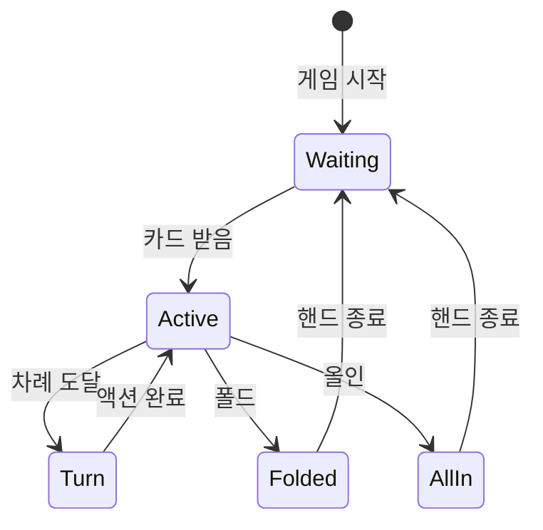

# 상세 기능 명세

## 1. 상태 표시 패널 (1열)

### 1.1 버튼 레이아웃
```
┌───┬───┬───┬───┬───┬───┬───┐
│ D │ 1 │ 2 │ 3 │ 4 │ 5 │ 6 │  좌석 번호
├───┼───┼───┼───┼───┼───┼───┤
│ ● │ ○ │ ● │ ● │ ○ │ ● │ ○ │  상태 표시
└───┴───┴───┴───┴───┴───┴───┘
```

### 1.2 LED 상태 정의
| 상태 | 색상 | 패턴 | 설명 |
|------|------|------|------|
| 현재 차례 | 녹색 | 점멸 (1Hz) | 액션 대기 중 |
| 활성 | 녹색 | 상시 | 핸드 참여 중 |
| 폴드 | 빨간색 | 상시 | 핸드 포기 |
| 올인 | 파란색 | 상시 | 올인 상태 |
| 비활성 | 꺼짐 | - | 빈 좌석 |
| 딜러 | 노란색 | 상시 | 딜러 위치 |

### 1.3 상태 전환 규칙


## 2. 액션 제어 패널 (4열)

### 2.1 기본 액션 버튼
#### CALL/CHECK 버튼
```typescript
interface CallCheckAction {
  type: 'CALL' | 'CHECK';
  conditions: {
    call: 'facing_bet === true';
    check: 'facing_bet === false';
  };
  validation: {
    hasChips: boolean;
    isPlayerTurn: boolean;
  };
}
```

#### RAISE/BET 버튼
```typescript
interface RaiseBetAction {
  type: 'RAISE' | 'BET';
  conditions: {
    raise: 'facing_bet === true';
    bet: 'facing_bet === false';
  };
  parameters: {
    minSize: number;  // BB * 2 or previous_bet * 2
    maxSize: number;  // player stack
  };
}
```

#### FOLD 버튼
```typescript
interface FoldAction {
  type: 'FOLD';
  conditions: {
    canFold: 'is_active && is_turn';
  };
  effects: {
    playerStatus: 'FOLDED';
    showCards: false;
  };
}
```

### 2.2 특수 액션 버튼
#### ALL-IN 버튼
- 전체 스택 베팅
- 자동 금액 계산
- 사이드 팟 생성

#### UNDO 버튼
- 마지막 액션 취소
- 상태 롤백
- 최대 1단계만 가능

#### RESET 버튼
- 긴급 상황 대응
- 관리자 권한 필요
- 확인 다이얼로그

## 3. Last Aggressor 알고리즘

### 3.1 알고리즘 정의
```python
class LastAggressorTracker:
    def __init__(self):
        self.aggressor = None
        self.street_aggressor = {}
        
    def update(self, action, player, street):
        if action in ['BET', 'RAISE']:
            self.aggressor = player
            self.street_aggressor[street] = player
            
    def get_showdown_order(self):
        # River aggressor > Turn > Flop > Preflop
        for street in ['RIVER', 'TURN', 'FLOP', 'PREFLOP']:
            if street in self.street_aggressor:
                return self.street_aggressor[street]
        return None
```

### 3.2 적용 시나리오
1. **쇼다운**: Aggressor부터 카드 공개
2. **카메라 전환**: Aggressor 자동 포커스
3. **통계 추적**: 공격성 지표 계산

## 4. 자동 게임 진행

### 4.1 딜러 버튼 관리
```typescript
class DealerButtonManager {
  private currentPosition: number;
  private activePlayers: number[];
  
  moveButton(): number {
    const nextPosition = this.findNextActive(
      this.currentPosition
    );
    this.currentPosition = nextPosition;
    return nextPosition;
  }
  
  private findNextActive(from: number): number {
    // 시계방향으로 다음 활성 플레이어 찾기
    let position = (from + 1) % this.maxSeats;
    while (!this.activePlayers.includes(position)) {
      position = (position + 1) % this.maxSeats;
    }
    return position;
  }
}
```

### 4.2 블라인드 계산
```typescript
interface BlindPositions {
  smallBlind: number;
  bigBlind: number;
  
  calculate(dealerPosition: number): void {
    if (this.playerCount === 2) {
      // Heads-up 규칙
      this.smallBlind = dealerPosition;
      this.bigBlind = this.getNextActive(dealerPosition);
    } else {
      // 일반 규칙
      this.smallBlind = this.getNextActive(dealerPosition);
      this.bigBlind = this.getNextActive(this.smallBlind);
    }
  }
}
```

### 4.3 스트리트 전환
```typescript
enum Street {
  PREFLOP = 'PREFLOP',
  FLOP = 'FLOP',
  TURN = 'TURN',
  RIVER = 'RIVER',
  SHOWDOWN = 'SHOWDOWN'
}

class StreetManager {
  transition(currentStreet: Street): Street {
    const transitions = {
      [Street.PREFLOP]: Street.FLOP,
      [Street.FLOP]: Street.TURN,
      [Street.TURN]: Street.RIVER,
      [Street.RIVER]: Street.SHOWDOWN
    };
    
    return transitions[currentStreet];
  }
  
  isComplete(actions: Action[]): boolean {
    // 모든 플레이어가 동일한 금액을 콜했는지 확인
    return this.allPlayersActed() && 
           this.betsAreEqual();
  }
}
```

## 5. 카메라 제어 시스템

### 5.1 카메라 프리셋
```json
{
  "presets": {
    "wide_shot": {
      "camera": 1,
      "pan": 0,
      "tilt": 0,
      "zoom": 1,
      "focus": "auto"
    },
    "player_closeup": {
      "camera": 2,
      "pan": "dynamic",
      "tilt": -10,
      "zoom": 5,
      "focus": "face_tracking"
    },
    "table_overview": {
      "camera": 3,
      "pan": 0,
      "tilt": -45,
      "zoom": 2,
      "focus": "table_center"
    }
  }
}
```

### 5.2 자동 전환 규칙
```yaml
rules:
  - name: "Player Turn"
    trigger: "player.turn_start"
    action: 
      preset: "player_closeup"
      duration: 3000
      transition: "cut"
  
  - name: "Big Pot"
    trigger: "pot.size > 1000"
    action:
      preset: "wide_shot"
      duration: 2000
      transition: "dissolve"
  
  - name: "Showdown"
    trigger: "street.showdown"
    action:
      sequence:
        - preset: "wide_shot"
          duration: 1000
        - preset: "player_closeup"
          target: "last_aggressor"
          duration: 3000
```

## 6. 오디오 관리

### 6.1 마이크 제어
```typescript
class AudioManager {
  private activeMics: Set<number> = new Set();
  
  enablePlayerMic(seat: number): void {
    this.activeMics.add(seat);
    this.mixer.unmute(this.getMicChannel(seat));
    this.applyNoiseGate(seat);
  }
  
  autoManage(currentPlayer: number): void {
    // 현재 플레이어만 활성화
    this.activeMics.forEach(mic => {
      if (mic !== currentPlayer) {
        this.disablePlayerMic(mic);
      }
    });
    this.enablePlayerMic(currentPlayer);
  }
}
```

### 6.2 오디오 프로세싱
- **노이즈 게이트**: -40dB threshold
- **컴프레서**: 3:1 ratio, -20dB threshold  
- **EQ**: 음성 최적화 프리셋
- **리미터**: -3dB ceiling

## 7. 에러 처리 및 복구

### 7.1 에러 감지
```typescript
interface ErrorDetector {
  rules: [
    {
      name: "Invalid Action",
      condition: "action.amount > player.stack",
      severity: "WARNING",
      action: "block_and_notify"
    },
    {
      name: "State Corruption",
      condition: "state.checksum !== calculated",
      severity: "CRITICAL",
      action: "emergency_recovery"
    }
  ]
}
```

### 7.2 복구 전략
1. **자동 복구**: 마지막 유효 상태로 롤백
2. **수동 개입**: 관리자 알림 및 대기
3. **비상 모드**: 기본 기능만 유지