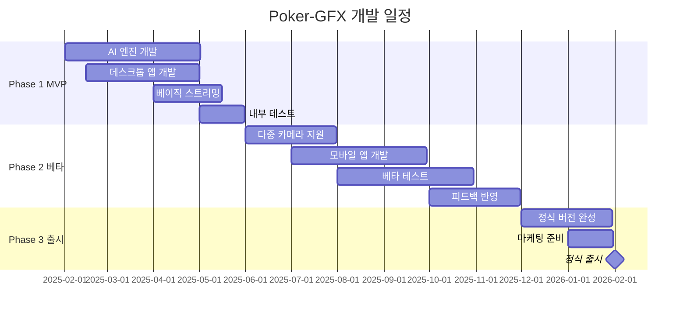

# Poker-GFX 완전 개발 기획서

## 📋 목차

1. [프로젝트 개요](#1-프로젝트-개요)
2. [시장 분석](#2-시장-분석)
3. [핵심 기능 명세](#3-핵심-기능-명세)
4. [기술 아키텍처](#4-기술-아키텍처)
5. [사용자 인터페이스 설계](#5-사용자-인터페이스-설계)
6. [개발 로드맵](#6-개발-로드맵)
7. [팀 구성 및 역할](#7-팀-구성-및-역할)
8. [예산 계획](#8-예산-계획)
9. [리스크 관리](#9-리스크-관리)
10. [품질 보증](#10-품질-보증)

---

## 1. 프로젝트 개요

### 1.1 프로젝트 명칭
**Poker-GFX**: 차세대 포커 방송 및 스트리밍 솔루션

### 1.2 프로젝트 비전
"AI 기술과 직관적인 사용자 경험을 결합하여 포커 방송의 새로운 표준을 제시하는 혁신적인 플랫폼 구축"

### 1.3 프로젝트 미션
- **혁신**: 기존 PokerGFX의 한계를 뛰어넘는 차세대 기술 도입
- **접근성**: 전문가부터 아마추어까지 모든 사용자가 쉽게 사용할 수 있는 솔루션
- **확장성**: 홈 게임부터 국제 토너먼트까지 확장 가능한 플랫폼
- **경제성**: 합리적인 가격으로 고품질 방송 제작 가능

### 1.4 핵심 가치 제안

#### 기존 PokerGFX 대비 차별화 요소
```yaml
기존_PokerGFX_한계점:
  - RFID 리더 하드웨어 의존성
  - 복잡한 설정 및 학습 곡선
  - 높은 초기 투자 비용
  - 제한적인 게임 변형 지원
  - 수동적인 카메라 제어

Poker-GFX_혁신_요소:
  - AI 기반 카드 및 게임 상태 자동 인식
  - 플러그 앤 플레이 방식의 간편한 설정
  - 구독 기반 접근 가능한 가격 모델
  - 모든 포커 변형 및 확장 가능한 게임 지원
  - 지능형 자동 카메라 제어 및 연출
```

### 1.5 목표 시장

#### 1차 목표 시장 (60%)
- **홈 게임 주최자 및 아마추어 스트리머**
  - 규모: 약 50,000명 (국내 기준)
  - 특징: 접근성과 가격에 민감, 간편한 사용성 중시
  - 예산: 월 $50-200

#### 2차 목표 시장 (30%)
- **세미프로 스트리머 및 중소규모 포커룸**
  - 규모: 약 5,000개 업체
  - 특징: 안정성과 전문 기능 필요
  - 예산: 월 $200-1,000

#### 3차 목표 시장 (10%)  
- **대형 토너먼트 및 방송사**
  - 규모: 약 500개 조직
  - 특징: 엔터프라이즈급 기능 및 커스터마이징 요구
  - 예산: 월 $1,000+

---

## 2. 시장 분석

### 2.1 경쟁사 분석

#### 기존 시장 리더: PokerGFX
```yaml
PokerGFX_분석:
  강점:
    - 시장 점유율 80% 이상
    - RFID 기반 정확한 카드 추적
    - 전문 토너먼트에서 검증된 안정성
    - 풍부한 그래픽 템플릿
    
  약점:
    - 복잡한 하드웨어 설정 (RFID 리더, 안테나)
    - 높은 초기 비용 ($15,000-50,000)
    - steep learning curve
    - 유연성 부족 (특정 하드웨어에 종속)
    - 클라우드 기능 부재
    
  기회_영역:
    - AI 기반 자동화 부재
    - 모바일 지원 제한적
    - 실시간 협업 기능 없음
    - 현대적 UI/UX 부재
```

#### 기타 경쟁 솔루션
```yaml
OBS_Studio:
  - 무료 오픈소스
  - 범용적이지만 포커 전용 기능 없음
  - 수동 조작 필요

Streamlabs:
  - 스트리밍 도구
  - 게임별 특화 기능 부족

전문_AV_솔루션:
  - BlackMagic, NewTek 등
  - 높은 전문성 요구
  - 포커 특화 기능 없음
```

### 2.2 시장 기회

#### 성장 동력
- **온라인 포커 시장 급성장**: 연평균 12% 성장
- **스트리밍 문화 확산**: 개인 방송 시장 폭발적 성장  
- **COVID-19 이후 홈 게임 증가**: 대면 게임의 온라인 전환
- **AI 기술 성숙**: 컴퓨터 비전 및 실시간 처리 기술 발전

#### 시장 규모 추정
```yaml
글로벌_TAM: $2.5B (포커 관련 소프트웨어 시장)
SAM: $150M (방송/스트리밍 도구 시장)
SOM: $15M (3년 내 달성 가능 시장)

성장_전망:
  2025년: $2M ARR
  2026년: $8M ARR  
  2027년: $15M ARR
```

---

## 3. 핵심 기능 명세

### 3.1 AI 기반 게임 인식 시스템

#### 3.1.1 카드 인식 엔진
```yaml
카드_감지_기능:
  정확도: 99.5% 이상
  지원_환경:
    - 다양한 조명 조건
    - 여러 카메라 각도
    - 실시간 처리 (30fps)
  
  기술_스택:
    - YOLO v8 기반 객체 감지
    - 커스텀 CNN 분류 모델
    - OpenCV 이미지 처리
    - TensorRT 추론 가속
    
  지원_카드:
    - 표준 52장 덱
    - 다양한 브랜드 (Bicycle, Copag, KEM 등)
    - 사용자 정의 덱 학습 가능
```

#### 3.1.2 게임 상태 추적
```yaml
추적_요소:
  - 플레이어 위치 및 상태
  - 베팅 액션 (콜, 레이즈, 폴드)
  - 팟 크기 계산
  - 블라인드 위치
  - 커뮤니티 카드 진행 상황
  
자동_기능:
  - 핸드 시작/종료 감지
  - 베팅 라운드 전환 인식
  - 올인 상황 감지
  - 사이드팟 계산
```

### 3.2 지능형 방송 제작

#### 3.2.1 자동 카메라 제어
```yaml
카메라_제어_로직:
  상황별_자동_전환:
    - 액션이 있는 플레이어에게 포커스
    - 중요한 결정 순간 클로즈업
    - 올인 상황 시 텐션 연출
    - 쇼다운 시 카드 공개 연출
    
  지원_장비:
    - USB 웹캠 (다중 입력)
    - 전문 카메라 (HDMI/SDI)
    - PTZ 카메라 (자동 팬/틸트/줌)
    - NDI 네트워크 카메라
```

#### 3.2.2 실시간 그래픽 오버레이
```yaml
그래픽_요소:
  플레이어_정보:
    - 이름, 칩 스택, 포지션
    - 통계 (VPIP, PFR, 3-bet)
    - 프로필 사진 및 국기
    
  게임_정보:
    - 현재 팟 크기
    - 베팅 액션 히스토리
    - 블라인드 레벨 (토너먼트)
    - 게임 타이머 및 브레이크
    
  고급_그래픽:
    - 핸드 확률 (에퀴티)
    - 아웃 계산기
    - 팟 오즈 표시
    - 액션 하이라이트
```

### 3.3 스트리밍 및 녹화

#### 3.3.1 다중 플랫폼 스트리밍
```yaml
지원_플랫폼:
  - Twitch
  - YouTube Live
  - Facebook Live
  - 커스텀 RTMP 서버
  
스트리밍_설정:
  - 해상도: 1080p60, 1440p60, 4K30
  - 비트레이트: 적응형 자동 조절
  - 다중 스트림 동시 송출
  - 지연 시간 최소화 (<2초)
```

#### 3.3.2 지연 방송 (Secure Delay)
```yaml
보안_지연_기능:
  목적: 홀카드 보안을 위한 방송 지연
  지연_시간: 5분-60분 설정 가능
  특징:
    - 라이브 모니터링 (딜러/플레이어용)  
    - 지연 방송 (시청자용)
    - 핸드 종료 후 즉시 공개 옵션
    - 응급 상황 시 즉시 라이브 전환
```

### 3.4 사용자 인터페이스

#### 3.4.1 데스크톱 애플리케이션
```yaml
주요_화면:
  메인_컨트롤:
    - 카메라 프리뷰 및 제어
    - 스트림 상태 모니터링
    - 그래픽 오버레이 제어
    - 플레이어 관리
    
  설정_패널:
    - 비디오 소스 구성
    - AI 모델 설정
    - 스트리밍 설정
    - 그래픽 커스터마이징
    
  통계_대시보드:
    - 실시간 게임 통계
    - 플레이어 성과 분석
    - 스트림 품질 지표
```

#### 3.4.2 모바일 컴패니언 앱
```yaml
기능:
  - 원격 카메라 제어
  - 스트림 모니터링
  - 간단한 설정 변경
  - 플레이어 정보 수정
  
플랫폼:
  - iOS 14+
  - Android 10+
```

---

## 4. 기술 아키텍처

### 4.1 시스템 아키텍처

#### 4.1.1 전체 구조
```
┌─────────────────────────────────────────────────────────┐
│                    Poker-GFX 플랫폼                      │
├─────────────┬─────────────┬─────────────┬──────────────┤
│  클라이언트  │   AI 엔진   │  스트리밍   │   클라우드   │
│    계층     │    계층     │    계층     │    서비스    │
├─────────────┼─────────────┼─────────────┼──────────────┤
│• 데스크톱앱  │• 카드인식   │• RTMP 서버  │• 사용자관리  │
│• 웹 인터페이스│• 게임추적   │• 스트림 믹서│• 라이선스   │
│• 모바일 앱   │• 행동예측   │• 품질제어   │• 분석서비스  │
│• 브라우저확장│• 자동연출   │• CDN 연동   │• 백업저장   │
└─────────────┴─────────────┴─────────────┴──────────────┘
```

#### 4.1.2 핵심 모듈

##### AI 처리 엔진
```python
class PokerVisionEngine:
    """
    실시간 포커 게임 비전 처리 엔진
    """
    def __init__(self):
        self.card_detector = CardDetectionModel()
        self.player_tracker = PlayerTrackingModel()
        self.action_classifier = ActionClassificationModel()
        self.game_state_manager = GameStateManager()
    
    async def process_frame(self, frame: np.ndarray) -> GameState:
        # 병렬 처리로 성능 최적화
        cards = await self.card_detector.detect(frame)
        players = await self.player_tracker.track(frame)
        actions = await self.action_classifier.classify(frame)
        
        return self.game_state_manager.update(cards, players, actions)
```

##### 스트리밍 제어기
```typescript
class StreamController {
    private streams: Map<string, StreamSession> = new Map();
    
    async startMultiStream(config: StreamConfig[]): Promise<void> {
        for (const cfg of config) {
            const session = new StreamSession(cfg);
            await session.start();
            this.streams.set(cfg.platform, session);
        }
    }
    
    async updateOverlay(gameState: GameState): Promise<void> {
        const overlay = this.generateOverlay(gameState);
        for (const stream of this.streams.values()) {
            await stream.updateOverlay(overlay);
        }
    }
}
```

### 4.2 기술 스택

#### 4.2.1 프론트엔드
```yaml
데스크톱_애플리케이션:
  프레임워크: Electron + React 18
  UI_라이브러리: Ant Design + 커스텀 컴포넌트
  상태관리: Redux Toolkit + RTK Query
  비디오처리: WebRTC + Canvas API
  
웹_애플리케이션:
  프레임워크: Next.js 14
  스타일링: Tailwind CSS + Styled Components
  실시간통신: Socket.io Client
  
모바일_앱:
  프레임워크: React Native 0.73
  네비게이션: React Navigation 6
  상태관리: Zustand
```

#### 4.2.2 백엔드
```yaml
AI_엔진:
  언어: Python 3.11
  ML_프레임워크: PyTorch 2.0, OpenCV 4.8
  추론_가속: TensorRT, ONNX Runtime
  GPU_컴퓨팅: CUDA 12.0
  
스트리밍_서버:
  언어: Go 1.21
  프로토콜: WebRTC, RTMP, SRT, NDI
  미디어_처리: FFmpeg, GStreamer
  
API_서버:
  언어: Node.js 20 (TypeScript)
  프레임워크: Fastify
  데이터베이스: PostgreSQL 15, Redis 7
  실시간통신: Socket.io
```

#### 4.2.3 인프라
```yaml
클라우드_플랫폼: AWS
컨테이너: Docker + Kubernetes
CI/CD: GitHub Actions
모니터링: Prometheus + Grafana
로그관리: ELK Stack
CDN: CloudFlare
```

---

## 5. 사용자 인터페이스 설계

### 5.1 디자인 원칙

#### 5.1.1 핵심 원칙
- **직관성**: 포커를 모르는 사람도 5분 내 사용 가능
- **효율성**: 클릭 3번 이내로 모든 기능 접근
- **안정성**: 방송 중 실수를 방지하는 안전장치
- **확장성**: 사용자 수준에 따른 점진적 기능 노출

#### 5.1.2 디자인 시스템
```yaml
색상_팔레트:
  Primary: "#1890FF" (신뢰감 있는 블루)
  Success: "#52C41A" (성공/안전)  
  Warning: "#FAAD14" (주의/경고)
  Error: "#FF4D4F" (오류/위험)
  
타이포그래피:
  제목: Inter Bold 24px-32px
  본문: Inter Regular 14px-16px
  UI: Roboto Medium 12px-14px
  
간격_시스템:
  기본단위: 8px
  컴포넌트간격: 16px, 24px, 32px
  섹션간격: 48px, 64px
```

### 5.2 주요 화면 설계

#### 5.2.1 메인 컨트롤 화면
```
┌─────────────────────────────────────────────────────────┐
│  🎮 Poker-GFX                    [●LIVE] [Settings] [?] │
├─────────────────────┬───────────────────────────────────┤
│                     │  📹 Camera Controls               │
│   🎥 Main Video     │  ┌─────┬─────┬─────┬─────┐         │
│     Preview         │  │Cam1 │Cam2 │Cam3 │Auto │         │
│                     │  └─────┴─────┴─────┴─────┘         │
│                     │                                   │
│    (1920x1080)      │  🎯 Game Status                   │
│                     │  Hand #: 47  |  Pot: $2,850      │
│                     │  Stakes: $5/$10  |  ⏱ 2:35       │
├─────────────────────┼───────────────────────────────────┤
│ 👥 Players          │  📊 Stream Health                 │
│ 1. Alice    $2,450  │  🟢 Twitch: 1.2k viewers         │
│ 2. Bob      $1,820  │  🟢 YouTube: 856 viewers         │
│ 3. Charlie  $3,200  │  📊 Bitrate: 6.2 Mbps            │
│ 4. David    $1,680  │  🔊 Audio: -12dB                 │
└─────────────────────┴───────────────────────────────────┘
```

#### 5.2.2 설정 화면
```
┌─────────────────────────────────────────────────────────┐
│  ⚙️ Settings                                    [×] Close│
├─────────────────────────────────────────────────────────┤
│ 📹 Video Sources    📡 Streaming    🎨 Graphics         │
│                                                         │
│ Available Cameras:                                      │
│ ☑️ USB Camera 1 (1080p60)    [Preview] [Settings]      │
│ ☑️ USB Camera 2 (720p30)     [Preview] [Settings]      │
│ ☐ HDMI Capture (No Signal)   [Preview] [Settings]      │
│                                                         │
│ 🤖 AI Configuration:                                   │
│ Card Detection: ████████░░ 85% confidence              │
│ [Retrain Model]  [Import Custom Deck]                  │
│                                                         │
│ 🔄 Auto Features:                                      │
│ ☑️ Auto Camera Switching                                │
│ ☑️ Auto Game State Detection                            │
│ ☑️ Auto Graphics Updates                                │
│ ☐ Auto Highlight Generation                             │
└─────────────────────────────────────────────────────────┘
```

### 5.3 모바일 앱 디자인

#### 5.3.1 메인 화면 (모바일)
```yaml
화면_구성:
  상단_바:
    - 스트림 상태 표시
    - 빠른 설정 버튼
    - 알림 아이콘
    
  중앙_컨텐츠:
    - 카메라 프리뷰 (작게)
    - 핵심 컨트롤 버튼
    - 플레이어 상태 요약
    
  하단_네비게이션:
    - 홈, 컨트롤, 통계, 설정
    
터치_제스처:
  - 스와이프: 카메라 전환
  - 롱프레스: 빠른 액션 메뉴
  - 핀치: 프리뷰 화면 확대/축소
```

---

## 6. 개발 로드맵

### 6.1 개발 단계

#### Phase 1: MVP 개발 (0-6개월)
```yaml
목표: 기본 기능이 작동하는 최소 실행 가능 제품

주요_기능:
  - 기본 카드 인식 (95% 정확도)
  - 단일 카메라 입력
  - 기본 그래픽 오버레이
  - Twitch 스트리밍
  - 홀덤 게임 지원
  
기술_구현:
  - 데스크톱 앱 (Electron)
  - Python AI 엔진
  - Node.js API 서버
  - PostgreSQL 데이터베이스
  
성공_기준:
  - 30분 이상 안정적 스트리밍
  - 홈게임 환경에서 테스트 완료
  - 10명 베타 사용자 피드백 수집
```

#### Phase 2: 베타 버전 (6-12개월)
```yaml
목표: 상용화 가능한 수준의 완성도

추가_기능:
  - 다중 카메라 지원 (최대 4개)
  - 자동 카메라 전환
  - 다중 플랫폼 스트리밍
  - 오마하, 스터드 게임 지원  
  - 모바일 앱 (iOS/Android)
  - 클라우드 백업
  
성능_개선:
  - 카드 인식 99% 정확도
  - 지연시간 1초 이하
  - GPU 가속 처리
  
베타_테스트:
  - 100명 베타 사용자
  - 다양한 환경 테스트
  - 피드백 수집 및 개선
```

#### Phase 3: 정식 출시 (12-18개월)
```yaml
목표: 시장 출시 및 초기 고객 확보

완성_기능:
  - 전문가급 기능 완성
  - 엔터프라이즈 기능
  - API 및 SDK 제공
  - 다국어 지원
  
상용화:
  - 가격 정책 확정
  - 결제 시스템 구축
  - 고객 지원 체계
  - 마케팅 및 홍보
  
목표_지표:
  - 1,000명 유료 사용자
  - $500K ARR 달성
  - 시장 인지도 확보
```

### 6.2 마일스톤 및 일정

#### 2025년 일정


---

## 7. 팀 구성 및 역할

### 7.1 핵심 팀 구성

#### 7.1.1 경영진 (3명)
```yaml
CEO:
  역할: 전체 비전 및 전략, 대외 업무
  자격: 기술 창업 경험, 포커 업계 이해
  
CTO:
  역할: 기술 아키텍처, 개발팀 리딩
  자격: 10년+ 개발 경험, AI/비디오 처리 전문성
  
CPO:
  역할: 제품 기획, 사용자 경험, 시장 분석
  자격: 제품 관리 경험, UI/UX 백그라운드
```

#### 7.1.2 개발팀 (8명)
```yaml
AI_엔지니어_2명:
  - 컴퓨터 비전 전문가
  - 머신러닝 모델 개발
  - 실시간 추론 최적화
  
풀스택_개발자_3명:
  - 프론트엔드: React/TypeScript
  - 백엔드: Node.js/Python
  - 데이터베이스 설계
  
비디오_스트리밍_엔지니어_1명:
  - WebRTC, FFmpeg 전문
  - 실시간 미디어 처리
  - 네트워크 최적화
  
모바일_개발자_1명:
  - React Native
  - iOS/Android 네이티브
  
DevOps_엔지니어_1명:
  - AWS 인프라 구축
  - CI/CD 파이프라인
  - 모니터링 시스템
```

#### 7.1.3 지원팀 (4명)
```yaml
디자이너_2명:
  - UI/UX 디자이너
  - 그래픽 디자이너
  
QA_엔지니어_1명:
  - 자동화 테스트
  - 성능 테스트
  
마케팅_매니저_1명:
  - 디지털 마케팅
  - 커뮤니티 관리
```

### 7.2 채용 계획

#### Phase 1 팀 (5명)
- CTO, AI 엔지니어 1명, 풀스택 개발자 2명, DevOps 1명

#### Phase 2 확장 (10명)
- CEO, CPO, AI 엔지니어 +1명, 풀스택 +1명, 비디오 엔지니어, 모바일 개발자, 디자이너, QA

#### Phase 3 완성 (15명)
- 마케팅팀, 추가 개발자, 고객지원팀

---

## 8. 예산 계획

### 8.1 총 예산 요약

#### 18개월 총 예산: $3.2M
```yaml
인건비: $2.1M (65%)
인프라: $400K (13%)
마케팅: $300K (9%)
운영비: $250K (8%)
예비비: $150K (5%)
```

### 8.2 상세 예산 계획

#### 8.2.1 인건비 ($2.1M)
```yaml
Phase_1 (6개월): $420K
  - CTO: $120K
  - AI 엔지니어: $90K  
  - 풀스택 개발자: $140K (2명)
  - DevOps 엔지니어: $70K

Phase_2 (6개월): $750K  
  - 기존팀 유지: $420K
  - 추가 채용: $330K
    - CEO: $120K
    - CPO: $90K
    - 추가 개발자 3명: $120K

Phase_3 (6개월): $930K
  - 전체팀 운영: $750K
  - 마케팅팀: $60K
  - 고객지원: $40K
  - 성과급/보너스: $80K
```

#### 8.2.2 인프라 비용 ($400K)
```yaml
클라우드_서비스: $200K
  - AWS EC2/ECS: $8K/월 × 18개월 = $144K
  - GPU 인스턴스: $3K/월 × 18개월 = $54K
  - 기타 서비스: $2K/월 × 18개월 = $36K

개발_도구: $80K
  - IDE 라이선스: $20K
  - 디자인 툴: $15K
  - 테스트 도구: $25K
  - 기타 소프트웨어: $20K

하드웨어: $120K
  - 개발용 워크스테이션: $60K
  - 테스트용 장비: $40K
  - 네트워크 장비: $20K
```

#### 8.2.3 마케팅 ($300K)
```yaml
디지털_마케팅: $180K
  - Google Ads: $8K/월 × 12개월 = $96K
  - Facebook/Instagram: $4K/월 × 12개월 = $48K
  - 유튜브 광고: $3K/월 × 12개월 = $36K

컨텐츠_제작: $60K
  - 홍보 영상: $30K
  - 웹사이트 제작: $20K
  - 브랜딩: $10K

이벤트_참가: $60K
  - 포커 대회 스폰서십: $30K
  - 컨퍼런스 참가: $20K
  - 데모 부스 운영: $10K
```

### 8.3 수익 모델

#### 8.3.1 구독 기반 SaaS
```yaml
가격_정책:
  Basic: $29/월
    - HD 스트리밍 (1080p)
    - 단일 플랫폼
    - 기본 그래픽
    - 커뮤니티 지원
    
  Pro: $99/월  
    - 4K 스트리밍
    - 다중 플랫폼 동시 스트리밍
    - 고급 그래픽 & 커스터마이징
    - 우선 지원
    
  Enterprise: $299/월
    - 무제한 해상도/플랫폼
    - 화이트라벨 솔루션
    - API 접근
    - 전담 지원
```

#### 8.3.2 수익 예측
```yaml
2025년 (베타): $150K
  - 베타 사용자 100명 × $50/월 × 6개월

2026년 (출시): $2.1M
  - Basic: 500명 × $29 × 12개월 = $174K
  - Pro: 200명 × $99 × 12개월 = $238K  
  - Enterprise: 50명 × $299 × 12개월 = $179K
  - 성장률 고려 가중평균 = $2.1M

2027년 (성장): $8.5M
  - 시장 확대 및 기능 확장으로 4배 성장
```

---

## 9. 리스크 관리

### 9.1 기술적 리스크

#### 9.1.1 High Risk
```yaml
AI_정확도_리스크:
  위험도: 높음
  영향: 치명적
  내용: 카드 인식 정확도 목표 미달성
  완화방안:
    - 대량의 훈련 데이터 확보 (10만+ 이미지)
    - 다중 모델 앙상블 기법
    - 점진적 학습 시스템
    - 전문가 자문단 구성
  
실시간_처리_성능:
  위험도: 높음  
  영향: 높음
  내용: 30fps 실시간 처리 성능 미달
  완화방안:
    - GPU 최적화 우선 개발
    - 클라우드 기반 처리 옵션
    - 성능 프로파일링 도구 활용
    - 하드웨어 요구사항 명확화
```

#### 9.1.2 Medium Risk  
```yaml
하드웨어_호환성:
  위험도: 중간
  영향: 중간
  내용: 다양한 카메라/캡처카드 호환성 문제
  완화방안:
    - 주요 브랜드 우선 지원
    - 커뮤니티 피드백 수집
    - 플러그인 아키텍처 도입
    
서드파티_의존성:
  위험도: 중간
  영향: 중간  
  내용: FFmpeg, 스트리밍 API 변경
  완화방안:
    - 안정 버전 사용
    - 대안 기술 스택 준비
    - 추상화 레이어 구현
```

### 9.2 비즈니스 리스크

#### 9.2.1 시장 리스크
```yaml
경쟁사_대응:
  위험도: 높음
  영향: 높음
  내용: PokerGFX의 AI 기능 추가 또는 신규 경쟁자
  완화방안:
    - 빠른 출시 및 시장 선점
    - 차별화된 기능 집중 개발
    - 특허 출원 (핵심 알고리즘)
    - 고객 로열티 프로그램

시장_규모_축소:
  위험도: 중간
  영향: 높음
  내용: 포커 시장 규모 감소 또는 규제 강화
  완화방안:
    - 다른 카드 게임으로 확장
    - 보드게임 시장 진출
    - B2B 시장 개척
```

#### 9.2.2 자금 리스크
```yaml
펀딩_실패:
  위험도: 중간
  영향: 치명적
  내용: 시리즈 A 펀딩 실패
  완화방안:
    - 다양한 투자처 접촉
    - 정부 지원사업 신청
    - 크라우드펀딩 대안
    - 수익 기반 성장 전략

개발_지연:
  위험도: 중간
  영향: 높음
  내용: 개발 일정 지연으로 인한 자금 부족
  완화방안:
    - 애자일 개발 방법론
    - 주간 진도 점검
    - 외주 개발 활용
    - MVP 범위 조정
```

### 9.3 리스크 모니터링

#### 9.3.1 KPI 추적
```yaml
기술_지표:
  - AI 정확도: 목표 99% vs 실제
  - 처리 성능: 30fps 달성률
  - 시스템 안정성: 가동시간 99.9%
  - 버그 발생률: 주간 신규 버그 수

비즈니스_지표:
  - 베타 사용자 활성도
  - 고객 만족도 (NPS)
  - 경쟁사 동향 모니터링
  - 시장 규모 변화 추적
```

#### 9.3.2 대응 체계
```yaml
주간_리뷰:
  - 기술팀 진도 점검
  - 리스크 상황 업데이트
  - 즉시 대응 항목 결정

월간_경영회의:
  - 전체 리스크 현황 검토
  - 완화 전략 효과 평가
  - 신규 리스크 식별
  - 예산 및 일정 조정

분기별_전략_검토:
  - 시장 환경 변화 분석
  - 경쟁 상황 재평가
  - 전략 방향 수정
```

---

## 10. 품질 보증

### 10.1 품질 관리 전략

#### 10.1.1 개발 품질
```yaml
코드_품질:
  - 코드 리뷰: 모든 PR 2명 이상 승인
  - 정적 분석: SonarQube 품질 게이트
  - 테스트 커버리지: 80% 이상 유지
  - 문서화: API 및 핵심 로직 100%

아키텍처_품질:
  - 설계 검토: 주요 컴포넌트 설계 시 팀 검토
  - 성능 검토: 병목 지점 사전 식별
  - 보안 검토: OWASP 가이드라인 준수
  - 확장성 검토: 사용자 증가 시나리오 검증
```

#### 10.1.2 제품 품질
```yaml
기능_테스트:
  - 단위 테스트: Jest, pytest
  - 통합 테스트: API 및 컴포넌트 간 연동
  - E2E 테스트: Cypress로 사용자 시나리오
  - 성능 테스트: 부하 및 스트레스 테스트

사용자_테스트:
  - 알파 테스트: 내부 팀 및 지인
  - 베타 테스트: 실제 사용자 100명
  - 사용성 테스트: UX 연구 및 개선
  - 접근성 테스트: WCAG 2.1 AA 준수
```

### 10.2 테스트 전략

#### 10.2.1 테스트 피라미드
```
         /\
        /  \  E2E Tests (10%)
       /____\
      /      \
     / Integration \ (30%)
    /    Tests      \
   /________________\
  /                  \
 /   Unit Tests (60%) \
/_____________________\
```

#### 10.2.2 자동화 테스트
```yaml
CI/CD_파이프라인:
  빌드_단계:
    - 코드 정적 분석
    - 단위 테스트 실행
    - 코드 커버리지 체크
    
  배포_단계:
    - 통합 테스트 실행
    - 성능 테스트 (회귀 검증)
    - 보안 스캔
    - 자동 배포 (스테이징)
    
  검증_단계:
    - E2E 테스트 실행
    - 실제 스트리밍 테스트
    - 모니터링 지표 확인
```

### 10.3 출시 기준

#### 10.3.1 MVP 출시 기준
```yaml
기능_완성도:
  - 핵심 기능 100% 구현
  - AI 정확도 95% 이상
  - 30분 이상 안정적 스트리밍
  
품질_기준:
  - 치명적 버그 0개
  - 높은 우선순위 버그 5개 이하
  - 성능 목표 80% 달성
  - 사용자 만족도 4.0/5.0 이상
```

#### 10.3.2 정식 출시 기준
```yaml
기능_완성도:
  - 모든 계획 기능 구현
  - AI 정확도 99% 이상  
  - 4시간 이상 무중단 스트리밍
  
비즈니스_준비:
  - 결제 시스템 완료
  - 고객 지원 체계 구축
  - 법적 검토 완료 (이용약관, 개인정보처리방침)
  - 마케팅 자료 준비
```

---

## 📈 성공 지표 및 목표

### KPI (핵심 성과 지표)

#### 기술 지표
- **AI 정확도**: 99.5% (카드 인식)
- **시스템 가동시간**: 99.9%
- **실시간 처리**: 30fps 안정적 유지
- **지연 시간**: 2초 이하

#### 비즈니스 지표
- **사용자 수**: 2026년 1,000명, 2027년 5,000명
- **수익**: 2026년 $2M ARR, 2027년 $8M ARR
- **고객 만족도**: NPS 50+ 
- **시장 점유율**: 소규모 시장 30% (3년 내)

---

## 📞 결론

Poker-GFX는 기존 PokerGFX의 한계를 극복하고 AI 기술을 통해 포커 방송의 새로운 패러다임을 제시하는 혁신적인 프로젝트입니다. 

### 핵심 경쟁 우위
1. **AI 기반 자동화**: 복잡한 설정 없이 즉시 사용 가능
2. **접근 가능한 가격**: 기존 대비 1/10 비용으로 시작 가능  
3. **현대적 UX**: 직관적이고 사용하기 쉬운 인터페이스
4. **클라우드 기반**: 언제 어디서나 협업 및 백업 가능

### 성공 요인
- **기술력**: 검증된 팀의 AI 및 스트리밍 기술
- **시장 타이밍**: 온라인 포커 및 스트리밍 시장 성장
- **차별화**: 기존 솔루션 대비 명확한 장점
- **실행력**: 단계적 개발 및 검증된 로드맵

18개월의 개발 기간과 $3.2M의 투자로 포커 방송 시장의 새로운 리더가 될 수 있는 기회를 잡을 수 있습니다.

---

*본 기획서는 Poker-GFX 프로젝트의 전체적인 방향성과 계획을 제시하며, 시장 상황과 기술 발전에 따라 유연하게 조정될 수 있습니다.*